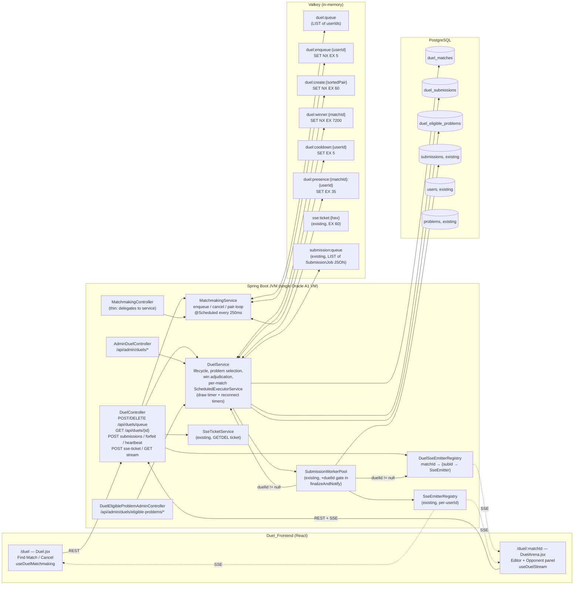
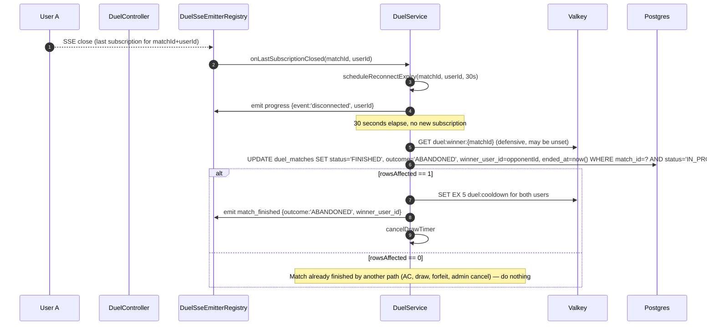
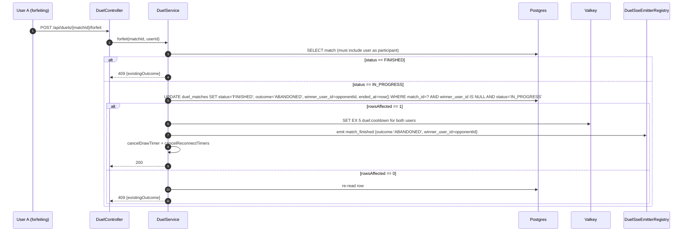

# Design Document — Live Duel Mode

## Overview

Live Duel Mode is a real-time 1v1 competitive coding feature layered on top of the existing CodeCombat platform (Spring Boot 3.5.9 / Java 21 / PostgreSQL / Valkey / SSE + WebSocket on a single Oracle A1 Flex VM with 1 OCPU and 6 GB RAM). It introduces no new transports, no new code-execution path, and no new tables on existing entities. Two participating users are paired from a Valkey-backed matchmaking queue, are served the same problem from a curated pool, and submit code through the existing `SubmissionWorkerPool` with an extra `duelId` tag. Wins, draws, and abandonments are persisted in three new PostgreSQL tables (`duel_matches`, `duel_submissions`, `duel_eligible_problems`). Live presence and verdicts are pushed over a per-`matchId` SSE channel that runs alongside the existing per-`userId` channel.

The design favors correctness primitives that compose well on a single JVM: PostgreSQL partial-unique indexes plus conditional UPDATEs gate the absolute truth of "one active match per user" and "one winner per match", while Valkey `SET NX EX` keys handle short-lived idempotency, cooldown, and presence. Code execution is reused verbatim — duel submissions land on the same `submission:queue` list and run inside the same `bwrap+prlimit` sandbox. The only behavioral fork is in `SubmissionWorkerPool.finalizeAndNotify`, which gates every leaderboard side-effect behind a `job.duelId == null` check and additionally fans the verdict out to the duel-scoped SSE registry.

The feature targets fewer than 500 active users, so single-VM determinism is acceptable: ScheduledExecutorService timers run per-match in process, and a JVM restart is recovered by reading the live `duel_matches` rows back on startup and either reattaching timers or finalizing as `ABANDONED`.

## Architecture

### High-Level Component Diagram



The dashed lines are SSE pushes back to the browser. The browser holds two long-lived SSE connections while in a duel: one on `/api/submissions/stream` (existing per-user verdict feed) and one on `/api/duels/{matchId}/stream` (new per-match room feed). Both are auth-gated by single-use tickets minted via `SseTicketService` so no JWT is leaked into URLs.

### Sequence — Find Match → Pair → Start

```mermaid
sequenceDiagram
    autonumber
    participant U1 as User A (browser)
    participant U2 as User B (browser)
    participant DC as DuelController
    participant MS as MatchmakingService
    participant V as Valkey
    participant DS as DuelService
    participant DB as Postgres
    participant SER as SseEmitterRegistry

    U1->>DC: POST /api/duels/queue
    DC->>MS: enqueue(userIdA)
    MS->>V: SET NX EX 5 duel:enqueue:A
    alt key acquired
        MS->>V: GET duel:cooldown:A (must be nil)
        MS->>DB: SELECT 1 FROM duel_matches WHERE (user_a_id=A OR user_b_id=A) AND status IN ('WAITING','IN_PROGRESS')
        MS->>V: RPUSH duel:queue A; EXPIRE-on-list-elem TTL 180
        MS-->>DC: queueToken
    else key already exists
        MS-->>DC: same queueToken (idempotent)
    end
    DC-->>U1: 200 {queueToken}

    U2->>DC: POST /api/duels/queue
    DC->>MS: enqueue(userIdB)  (same flow)
    MS->>V: RPUSH duel:queue B

    Note over MS: @Scheduled pair-loop (every 250ms)
    MS->>V: LPOP duel:queue → A; LPOP → B
    MS->>V: SET NX EX 60 duel:create:{min(A,B)}_{max(A,B)}
    alt create-lock acquired
        MS->>DS: pairAndStart(A, B)
        DS->>DB: SELECT pid FROM duel_eligible_problems WHERE pid NOT IN (both solved)
        DS->>DB: BEGIN; INSERT duel_matches (... status='WAITING'); COMMIT
        DS->>DB: UPDATE duel_matches SET status='IN_PROGRESS', started_at=now() WHERE match_id=?
        DS->>SER: matched event to A and B
        DS->>DS: scheduleDrawTimer(matchId, 600s)
    else lock contended
        MS->>V: RPUSH duel:queue (push both back)
    end

    SER-->>U1: SSE matched {matchId}
    SER-->>U2: SSE matched {matchId}
    U1->>DC: GET /duel/{matchId} → POST sse-ticket → GET stream
    U2->>DC: GET /duel/{matchId} → POST sse-ticket → GET stream
    DC-->>U1: SSE room_state
    DC-->>U2: SSE room_state
```

### Sequence — Submission Inside Duel → Verdict → Win-Claim

```mermaid
sequenceDiagram
    autonumber
    participant U as User A (winner)
    participant U2 as User B
    participant DC as DuelController
    participant DS as DuelService
    participant DB as Postgres
    participant V as Valkey
    participant SQ as submission:queue
    participant W as SubmissionWorker
    participant SER as SseEmitterRegistry
    participant DSER as DuelSseEmitterRegistry

    U->>DC: POST /api/duels/{matchId}/submissions {code,language}
    DC->>DS: submitForDuel(matchId, userId, code, lang)
    DS->>DB: SELECT match WHERE match_id=? FOR SHARE  (status must be IN_PROGRESS)
    DS->>DB: INSERT submissions (status='PENDING')
    DS->>DB: INSERT duel_submissions (submission_id, match_id, is_first_ac=false)
    DS->>SQ: LPUSH SubmissionJob JSON (with duelId=matchId)
    DS->>DSER: emit progress {event:'submitted', userId, submissionId}
    DC-->>U: 202 {submissionId}

    W->>SQ: LMOVE → SubmissionJob (duelId=matchId)
    W->>W: bwrap sandbox execute (unchanged)
    W->>DB: UPDATE submissions SET status='AC',...
    Note over W: finalizeAndNotify branch on job.duelId
    W->>SER: sendVerdict(userId, ...) per existing path
    W->>DS: onDuelVerdict(matchId, userId, submissionId, status, passed, total)
    DS->>DSER: emit progress {event:'verdict', userId, submissionId, status, passed, total}

    alt status == AC
        DS->>V: SET NX EX 7200 duel:winner:{matchId} userId
        alt SET NX wins
            DS->>DB: UPDATE duel_matches SET winner_user_id=?, outcome=?, status='FINISHED', ended_at=now() WHERE match_id=? AND winner_user_id IS NULL AND status='IN_PROGRESS'
            alt rowsAffected == 1
                DS->>DB: UPDATE duel_submissions SET is_first_ac=TRUE WHERE submission_id=?
                DS->>V: SET EX 5 duel:cooldown:A; SET EX 5 duel:cooldown:B
                DS->>DSER: emit match_finished {outcome, winner_user_id}
                DS->>DS: cancelDrawTimer + cancelReconnectTimers
            else rowsAffected == 0
                DS->>DB: SELECT match_id, winner_user_id, outcome FROM duel_matches WHERE match_id=?
                DS->>DSER: emit match_finished (re-read, do not overwrite)
            end
        else SET NX loses
            DS->>DSER: emit progress only (already-decided)
        end
    end
```

### Sequence — Reconnect Grace Period Expiry



### Sequence — Forfeit



## Components and Interfaces

### Frontend Component Map

```
frontend/src/
├── App.jsx                          # add 2 routes under <UserRoute>
├── pages/
│   ├── Duel.jsx                     # /duel — lobby (Find Match + history)
│   └── DuelArena.jsx                # /duel/:matchId — split-pane arena
├── hooks/
│   ├── useDuelMatchmaking.js        # POST/DELETE /api/duels/queue + matched event listener on /api/submissions/stream
│   └── useDuelStream.js             # SSE ticket + EventSource for /api/duels/{matchId}/stream
└── services/
    └── duelService.js               # axios wrappers for all 15 duel REST endpoints
```

`App.jsx` routing additions (under the existing logged-in sidebar layout):

```jsx
<Route path="/duel"            element={<UserRoute><Duel /></UserRoute>} />
<Route path="/duel/:matchId"   element={<UserRoute><DuelArena /></UserRoute>} />
```

`Duel.jsx` lobby:
- Find Match button → `useDuelMatchmaking.findMatch()` which POSTs `/api/duels/queue`, then opens (or reuses) the existing `/api/submissions/stream` subscription, listens for a `matched` event, and `navigate('/duel/' + matchId)` on receipt.
- Cancel button (visible while `state === 'AWAITING'`) → `DELETE /api/duels/queue` then resets state.
- Recent duel history table — fetched once via `GET /api/user/duel-history?limit=10` (added as part of `DuelService` REST surface).
- A queue-timeout banner appears when `useDuelMatchmaking` receives `queue_timeout` on the per-user SSE channel.

`DuelArena.jsx` live arena:
- Left pane: Monaco editor + language picker + Submit button + duel-scoped submission history list.
- Right pane: opponent username/avatar, live status pill (`typing` / `submitted` / `verdict: AC 4/4` / `disconnected (24s left)`), problem statement, match timer (counts down from 600s).
- `useDuelStream(matchId)` exchanges an SSE ticket via `POST /api/duels/{matchId}/sse-ticket`, opens the `EventSource('/api/duels/{matchId}/stream?ticket=...')`, and dispatches `room_state`, `progress`, and `match_finished` events into local state.
- On `match_finished` it shows a result modal with the outcome name and winner username, and a "Return to lobby" button that `navigate('/duel')`.
- A typing-heartbeat sender debounced to one POST per 1500 ms while the editor has focus and the cursor moved within the last 1500 ms.
- If the participant check fails (i.e. the route param doesn't match a match the user is in), the page renders the "You are not a participant" empty state and **does not** open any SSE / WebSocket — guarded by `GET /api/duels/{matchId}` returning 403 before any stream is opened.

### Backend Components

#### `MatchmakingService`

Responsibilities:
1. Accept enqueue / cancel calls from `MatchmakingController` (and `DuelController` for the convenience aliases at `/api/duels/queue`).
2. Enforce idempotency, cooldown, and one-active-match-per-user gates **before** the user lands on `duel:queue`.
3. Run a Spring `@Scheduled(fixedDelay = 250ms)` pair-loop that drains pairs out of `duel:queue` using `LPOP`+`LPOP` and hands each pair to `DuelService.pairAndStart`.
4. Run a Spring `@Scheduled(fixedDelay = 5000ms)` queue-timeout sweep that iterates `LRANGE duel:queue 0 -1`, looks up each entry's enqueued-at timestamp (stored in a parallel hash `duel:queue:enqueued_at`), drops entries older than 120 s, and emits `queue_timeout` over the per-user SSE channel.

Public surface:

```java
public class MatchmakingService {
    EnqueueResult enqueue(Long userId);   // returns existing token if already in queue
    void cancel(Long userId);             // LREM from duel:queue
    int queueDepth();                     // admin metric
}
```

The pair-loop is deliberately a single-threaded `@Scheduled` method. With < 500 users, a 250 ms tick delivers acceptable pairing latency (mean ≈ 125 ms) without needing Lettuce's reactive `LMOVE` blocking pattern. This keeps the design within "no new transports".

#### `DuelService`

Responsibilities:
1. Match lifecycle: `WAITING → IN_PROGRESS`, `WAITING → FINISHED`, `IN_PROGRESS → FINISHED`. The status transition is always a conditional UPDATE with `WHERE status = <expected>` so out-of-order transitions are dropped at the DB.
2. Problem selection from `duel_eligible_problems`, excluding problems both participants have solved. Falls back to the full pool with a logged warning if every candidate is excluded.
3. Submission entry point for duel-tagged submissions (creates `submissions` and `duel_submissions` rows in one transaction, then enqueues `SubmissionJob` with `duelId` set).
4. Verdict callback from `SubmissionWorkerPool` (new method `onDuelVerdict(matchId, userId, submissionId, status, passed, total)`).
5. Win adjudication using the redundant Valkey + DB gate (Requirement 9.2/9.3).
6. Per-match `ScheduledExecutorService` timers:
   - One **draw timer** scheduled for 600 s after `started_at` that, on fire, runs the `WHERE status='IN_PROGRESS' AND winner_user_id IS NULL` UPDATE that sets `outcome='DRAW'`.
   - Up to two **reconnect-grace timers** (one per participant) scheduled when the last SSE subscription for that user on this match closes. On fire, runs the `WHERE status='IN_PROGRESS' AND winner_user_id IS NULL` UPDATE that sets `outcome='ABANDONED'` and `winner_user_id` to the opponent.
7. Forfeit and admin-cancel paths — same conditional UPDATE pattern.
8. JVM-restart recovery: on `@PostConstruct` (run in a `@DependsOn` chain after `ValkeyConfig` and `DataSource`), scan `SELECT * FROM duel_matches WHERE status = 'IN_PROGRESS'` and either re-attach a draw timer (if `now() - started_at < 600s`) or finalize as `ABANDONED` immediately.

Public surface:

```java
public class DuelService {
    UUID pairAndStart(Long userIdA, Long userIdB);
    DuelMatchView getMatch(UUID matchId, Long requesterId);   // 403 if not a participant
    Long submitForDuel(UUID matchId, Long userId, String code, String language);
    void forfeit(UUID matchId, Long userId);
    void heartbeat(UUID matchId, Long userId);
    void onDuelVerdict(UUID matchId, Long userId, Long submissionId,
                       Submission.SubmissionStatus status, int passed, int total);
    void onSubscriptionOpened(UUID matchId, Long userId);   // cancels reconnect timer
    void onLastSubscriptionClosed(UUID matchId, Long userId);
    // Admin
    DuelMetrics getMetrics();
    Page<DuelMatchView> listMatches(String status, int limit, int offset);
    void adminCancel(UUID matchId);
}
```

All methods that mutate `duel_matches` are `@Transactional(propagation=REQUIRED, isolation=READ_COMMITTED)`. The win-claim UPDATE relies on row-level locking implied by `UPDATE ... WHERE winner_user_id IS NULL` plus the partial unique index — no explicit `FOR UPDATE` is needed.

#### `DuelSseEmitterRegistry`

Mirrors `SseEmitterRegistry` but keyed by `matchId` (UUID) instead of `userId`, and tagged with both `userId` and a `subId` so we can answer "is user X still subscribed?" for the reconnect-grace logic. Stays in its own class to keep its concurrency invariants isolated from the user-scoped registry — there is zero shared state between the two.

```java
public class DuelSseEmitterRegistry {
    SseEmitter register(UUID matchId, Long userId);
    void emit(UUID matchId, String eventName, Object payload);
    void emitTo(UUID matchId, Long userId, String eventName, Object payload);  // typing only-to-opponent
    boolean hasActiveSubscription(UUID matchId, Long userId);
    int connectionCount();    // admin metric
    void sendHeartbeat();     // @Scheduled every 25s alongside the existing one
}
```

The `register` callback chain (`onCompletion`, `onTimeout`, `onError`) calls back into `DuelService.onLastSubscriptionClosed(matchId, userId)` only when the inner `subId → emitter` map for that `(matchId, userId)` is now empty — multi-tab close on one tab does not start the reconnect timer.

#### `DuelController` (REST)

All endpoints under `/api/duels` are `@PreAuthorize("isAuthenticated()")` except `/api/duels/{matchId}/stream`, which is `permitAll()` at the filter level (the SSE ticket is the credential, same pattern as `/api/submissions/stream`). Add to `SecurityConfig`:

```java
.requestMatchers("/api/duels/*/stream").permitAll()
.requestMatchers("/api/admin/duels/**").hasRole("ADMIN")
```

#### `AdminDuelController`

Wraps the admin surface for observability and intervention. All endpoints under `/api/admin/duels/*` inherit the existing `hasRole("ADMIN")` matcher — no new auth code.

#### `DuelEligibleProblemAdminController`

Pure CRUD over `duel_eligible_problems`. Does not own the seed-on-prod migration data (that lives in a manual SQL file run once after V3 — see Deployment notes).

#### `SubmissionWorkerPool` Gate

The only edit to existing code is in `SubmissionWorkerPool.finalizeAndNotify`. The "duel branch" is added as a sibling to the existing leaderboard branch, both gated explicitly:

```java
// PSEUDOCODE — actual diff in tasks
if (job.getDuelId() == null) {
    // Existing behavior: leaderboard, user_problem_solved, total_points
    if (!job.isTestRun() && status == AC && job.getContestId() != null) {
        leaderboard.updateScore(job.getContestId(), job.getUserId(), score);
    }
    // ... other existing leaderboard side effects ...
} else {
    // Duel branch: hand off to DuelService — DuelService is responsible for
    // all duel-side state changes. NO leaderboard, NO user_problem_solved,
    // NO total_points side effects.
    duelService.onDuelVerdict(job.getDuelId(), job.getUserId(),
                              submissionId, status, passed, total);
}
```

`SubmissionJob` gains one nullable field: `private UUID duelId;`. The DTO is backward compatible because Jackson defaults it to `null` for jobs already on the queue at deploy time.

## Data Models

### Flyway Migration `V3__live_duel_mode.sql`

Postgres dialect (matches V1/V2). Drop into `src/main/resources/db/migration/`. Runs strictly after V2 because V2 only drops `scores` and never references the new tables.

```sql
-- ─────────────────────────────────────────────────────────────────────────────
-- V3: Live Duel Mode
--
-- Adds three tables (duel_matches, duel_submissions, duel_eligible_problems)
-- and the partial-unique-index armor that gates "one active duel per user"
-- and "one winner per match" at the database level.
--
-- No existing tables are altered. Submissions are linked to a duel via
-- duel_submissions (FK on submission_id, FK on match_id). Existing
-- submissions are unaffected.
-- ─────────────────────────────────────────────────────────────────────────────

-- ── duel_matches ────────────────────────────────────────────────────────────
CREATE TABLE IF NOT EXISTS public.duel_matches (
    match_id        UUID         NOT NULL,
    user_a_id       BIGINT       NOT NULL,
    user_b_id       BIGINT       NOT NULL,
    problem_id      BIGINT       NOT NULL,
    status          VARCHAR(20)  NOT NULL,
    outcome         VARCHAR(20),
    winner_user_id  BIGINT,
    started_at      TIMESTAMP(6) WITHOUT TIME ZONE,
    ended_at        TIMESTAMP(6) WITHOUT TIME ZONE,
    created_at      TIMESTAMP(6) WITHOUT TIME ZONE NOT NULL DEFAULT now(),
    CONSTRAINT duel_matches_pkey            PRIMARY KEY (match_id),
    CONSTRAINT duel_matches_status_check    CHECK (status IN ('WAITING','IN_PROGRESS','FINISHED')),
    CONSTRAINT duel_matches_outcome_check   CHECK (outcome IS NULL OR outcome IN ('USER_A_WIN','USER_B_WIN','DRAW','ABANDONED')),
    -- Req 2.3 / Req 9: outcome and winner_user_id agree
    CONSTRAINT duel_matches_winner_outcome_consistent CHECK (
        (outcome IS NULL)
        OR (outcome IN ('USER_A_WIN','USER_B_WIN') AND winner_user_id IS NOT NULL)
        OR (outcome IN ('DRAW','ABANDONED')        AND winner_user_id IS NULL)
    ),
    -- Req 2.6: deterministic seat ordering
    CONSTRAINT duel_matches_distinct_users     CHECK (user_a_id < user_b_id),
    -- Req 14.3: ended_at >= started_at when set
    CONSTRAINT duel_matches_time_monotonic    CHECK (
        ended_at IS NULL OR started_at IS NULL OR ended_at >= started_at
    ),
    -- Req 2.4: FINISHED rows must have outcome and ended_at
    CONSTRAINT duel_matches_finished_complete CHECK (
        status <> 'FINISHED' OR (outcome IS NOT NULL AND ended_at IS NOT NULL)
    ),
    -- Winner must be one of the two participants
    CONSTRAINT duel_matches_winner_is_participant CHECK (
        winner_user_id IS NULL
        OR winner_user_id = user_a_id
        OR winner_user_id = user_b_id
    ),
    CONSTRAINT duel_matches_user_a_fk    FOREIGN KEY (user_a_id)      REFERENCES public.users(id),
    CONSTRAINT duel_matches_user_b_fk    FOREIGN KEY (user_b_id)      REFERENCES public.users(id),
    CONSTRAINT duel_matches_problem_fk   FOREIGN KEY (problem_id)     REFERENCES public.problems(id),
    CONSTRAINT duel_matches_winner_fk    FOREIGN KEY (winner_user_id) REFERENCES public.users(id)
);

CREATE INDEX IF NOT EXISTS idx_duel_matches_user_a    ON public.duel_matches (user_a_id);
CREATE INDEX IF NOT EXISTS idx_duel_matches_user_b    ON public.duel_matches (user_b_id);
CREATE INDEX IF NOT EXISTS idx_duel_matches_status    ON public.duel_matches (status);
CREATE INDEX IF NOT EXISTS idx_duel_matches_started   ON public.duel_matches (started_at);

-- Req 10.1: at most one Active_Match per user — partial unique on each seat.
-- These also serve as the gate that backs Req 9.2 (the conditional UPDATE).
CREATE UNIQUE INDEX IF NOT EXISTS ux_duel_active_user_a
    ON public.duel_matches (user_a_id)
    WHERE status IN ('WAITING','IN_PROGRESS');
CREATE UNIQUE INDEX IF NOT EXISTS ux_duel_active_user_b
    ON public.duel_matches (user_b_id)
    WHERE status IN ('WAITING','IN_PROGRESS');

-- Req 9.2 immutability gate: once winner_user_id is set, no UPDATE may change it.
-- Postgres has no built-in column-immutability, so we enforce it with a trigger.
CREATE OR REPLACE FUNCTION public.duel_matches_winner_immutable()
RETURNS TRIGGER AS $fn$
BEGIN
    IF OLD.winner_user_id IS NOT NULL AND NEW.winner_user_id IS DISTINCT FROM OLD.winner_user_id THEN
        RAISE EXCEPTION 'duel_matches.winner_user_id is immutable once set (match_id=%)', OLD.match_id;
    END IF;
    -- Req 2.4 + Req 9.2: once FINISHED, outcome / ended_at are also frozen.
    IF OLD.status = 'FINISHED' THEN
        IF NEW.outcome IS DISTINCT FROM OLD.outcome
           OR NEW.ended_at IS DISTINCT FROM OLD.ended_at
           OR NEW.status  IS DISTINCT FROM OLD.status THEN
            RAISE EXCEPTION 'duel_matches row is frozen after FINISHED (match_id=%)', OLD.match_id;
        END IF;
    END IF;
    RETURN NEW;
END;
$fn$ LANGUAGE plpgsql;

DROP TRIGGER IF EXISTS trg_duel_matches_winner_immutable ON public.duel_matches;
CREATE TRIGGER trg_duel_matches_winner_immutable
    BEFORE UPDATE ON public.duel_matches
    FOR EACH ROW EXECUTE FUNCTION public.duel_matches_winner_immutable();

-- ── duel_submissions ────────────────────────────────────────────────────────
CREATE TABLE IF NOT EXISTS public.duel_submissions (
    submission_id  BIGINT  NOT NULL,
    match_id       UUID    NOT NULL,
    is_first_ac    BOOLEAN NOT NULL DEFAULT FALSE,
    CONSTRAINT duel_submissions_pkey       PRIMARY KEY (submission_id),
    CONSTRAINT duel_submissions_sub_fk     FOREIGN KEY (submission_id) REFERENCES public.submissions(id) ON DELETE CASCADE,
    CONSTRAINT duel_submissions_match_fk   FOREIGN KEY (match_id)      REFERENCES public.duel_matches(match_id)
);

CREATE INDEX IF NOT EXISTS idx_duel_submissions_match ON public.duel_submissions (match_id);

-- Req 6.1 / Req 12.2: at most one is_first_ac per (match, user). We enforce this
-- at the application layer because is_first_ac is per-(match, user) and the
-- user lives on the submissions row, not on duel_submissions. The application
-- guard is the DuelService.onDuelVerdict path which only flips is_first_ac=TRUE
-- on the winning submission (the one whose UPDATE wins the conditional gate).

-- ── duel_eligible_problems ──────────────────────────────────────────────────
CREATE TABLE IF NOT EXISTS public.duel_eligible_problems (
    problem_id  BIGINT       NOT NULL,
    added_at    TIMESTAMP(6) WITHOUT TIME ZONE NOT NULL DEFAULT now(),
    added_by    BIGINT,
    CONSTRAINT duel_eligible_problems_pkey      PRIMARY KEY (problem_id),
    CONSTRAINT duel_eligible_problems_problem_fk FOREIGN KEY (problem_id) REFERENCES public.problems(id) ON DELETE CASCADE,
    CONSTRAINT duel_eligible_problems_added_by_fk FOREIGN KEY (added_by)  REFERENCES public.users(id)
);
```

### Why the trigger

Requirement 9.2 says winner uniqueness must be backed by both Valkey and a SQL gate, and Requirement 2.4 / Requirement 9.2 say the FINISHED record is frozen. The conditional UPDATE (`WHERE winner_user_id IS NULL AND status='IN_PROGRESS'`) covers the racing-AC case at write time, but it does **not** protect against a buggy code path issuing an UPDATE on an already-FINISHED row from outside the duel adjudication path. The trigger provides defense-in-depth that even an admin SQL session cannot accidentally rewrite a winner.

### Valkey Key Map

| Key | Type | TTL / Set | Purpose | Eviction implication |
|-----|------|-----------|---------|----------------------|
| `duel:queue` | LIST (RPUSH/LPOP) | none — pruned by app sweep | The matchmaking queue itself. Each element is the userId as a decimal string. | Eviction = users disappear from queue. App tolerates this (re-enqueue on click). |
| `duel:queue:enqueued_at` | HASH (`userId → epochMs`) | none — pruned in same sweep as `duel:queue` | Companion timestamp for the 120 s queue-timeout sweep. | Eviction = sweep can't fire timeout; user retries. Acceptable. |
| `duel:enqueue:{userId}` | STRING `SET NX EX 5` | 5 s | Idempotency lock for double-clicked Find Match (Req 8.3). | Eviction = idempotency window collapses; worst case one extra `LREM`. Acceptable. |
| `duel:create:{minId}_{maxId}` | STRING `SET NX EX 60` | 60 s | Match-creation idempotency for a sorted user pair (Req 8.4). 60 s is several orders of magnitude longer than pair-loop tick. | Eviction = could re-pair if both stuck in queue. The `ux_duel_active_user_a/b` partial uniques catch the duplicate INSERT. |
| `duel:winner:{matchId}` | STRING `SET NX EX 7200` | 2 h (10× match-time-budget) | First-AC claim flag (Req 6.4 / 9.2). | Eviction is **defended by** the conditional UPDATE on `duel_matches.winner_user_id IS NULL`. Even if Valkey forgets, the SQL gate is authoritative. |
| `duel:cooldown:{userId}` | STRING `SET EX ${DUEL_COOLDOWN_SEC:-5}` | 5 s default | Post-match cooldown (Req 10.3 / 10.4). | Eviction = cooldown collapses; user can re-queue early. Acceptable abuse surface (≤ 5 s loss). |
| `duel:presence:{matchId}:{userId}` | STRING `SET EX 35` | 35 s, refreshed by SSE heartbeat | Coarse "is the user reachable?" signal for admin metrics; **not** the source of truth for reconnect-grace (the source of truth is the `DuelSseEmitterRegistry` map and the in-process timer). | Eviction = admin presence panel shows stale-but-conservative `disconnected`. App behavior unchanged. |
| `submission:queue` | LIST | (existing) | SubmissionJob queue. Duel jobs ride the same lane. | (existing) |
| `sse:ticket:{hex}` | STRING `SET EX 60` | (existing) | SSE auth tickets, reused for duel stream. | (existing) |

Valkey eviction policy on the VM is `noeviction` for the persistence-critical keys. The `duel:winner:{matchId}` 7200-second TTL exists only to clean up keys for matches that finished cleanly; the SQL `winner_user_id IS NULL` gate is the *correctness* guarantee, not the TTL.

### Per-Match Scheduled Timers

Two `ScheduledExecutorService` pools live inside `DuelService`:

| Pool | Threads | Purpose |
|------|---------|---------|
| `drawTimerExec` | 2 (named `duel-draw-*`) | One `schedule(...)` per active match for the 600 s draw timer (`DUEL_DRAW_TIMEOUT_SEC`). |
| `reconnectTimerExec` | 4 (named `duel-reconnect-*`) | Up to two `schedule(...)` calls per active match (one per disconnected participant) for the 30 s grace window (`DUEL_GRACE_PERIOD_SEC`). |

Cancellation: every state-mutating path (AC win, draw, forfeit, reconnected, admin cancel) holds a per-match `ConcurrentHashMap<UUID, ScheduledFuture<?>>` reference and calls `future.cancel(false)` before issuing the conditional UPDATE. If the cancel races a fired timer, the timer's UPDATE is harmless because its `WHERE status='IN_PROGRESS' AND winner_user_id IS NULL` returns 0 rows.

### Concurrency Model

| Operation | Mechanism | Why |
|-----------|-----------|-----|
| Enqueue idempotency | Valkey `SET NX EX 5` | Cross-thread, cross-request without DB chatter. |
| Cooldown gate | Valkey `EXISTS duel:cooldown:{userId}` | Sub-millisecond check on the queue-entry path. |
| Pair-loop atomic LPOP | Valkey `LPOP` x2 inside the `@Scheduled` tick (single-threaded) | Pair-loop runs in one Spring scheduler thread; serial within JVM. |
| Match-creation idempotency | Valkey `SET NX EX 60` on sorted pair + Postgres partial-unique index on `user_a_id` and `user_b_id` filtered to active rows | Two layers: Valkey is the cheap fast path, the partial unique is the truth. |
| `WAITING → IN_PROGRESS` | `@Transactional` UPDATE with `WHERE status='WAITING'` | Conditional transition, drops out-of-order writes. |
| Submission insert + duel-link insert | Single `@Transactional` block in `DuelService.submitForDuel` | Two-row insert, all-or-nothing. |
| First-AC win claim | Valkey `SET NX EX 7200` then conditional UPDATE `WHERE winner_user_id IS NULL AND status='IN_PROGRESS'`, both inside `@Transactional` | Redundant gates per Req 9.2. |
| Winner immutability | Postgres `BEFORE UPDATE` trigger on `duel_matches` | Defense-in-depth. |
| Draw timer | `ScheduledExecutorService.schedule(runnable, 600s)` | In-process timer per match; cheap (<5 active matches expected). |
| Reconnect-grace timer | `ScheduledExecutorService.schedule(runnable, 30s)` | Started on last-subscription-close, cancelled on next subscribe. |
| SSE fan-out | `DuelSseEmitterRegistry` `ConcurrentHashMap<UUID, ConcurrentHashMap<String, SseEmitter>>` | Mirrors existing per-user registry's lock-free pattern. |
| JVM-restart recovery | `@PostConstruct` scan of `IN_PROGRESS` rows + `ABANDONED` finalize / timer rebind | Single-VM target, restart is a rare event. |

### Race-Condition Resolution Table (Requirement 9)

| AC | Failure mode if unprotected | Primary gate | Secondary gate | Observable result |
|----|------------------------------|--------------|----------------|-------------------|
| 9.1 Two AC submissions finalize concurrently | Two `winner_user_id` writes — last-write-wins, possibly the slower AC | `SET NX duel:winner:{matchId}` | `UPDATE ... WHERE winner_user_id IS NULL` (`@Transactional`) | Exactly one `winner_user_id` ever set. |
| 9.2 Valkey + DB redundancy | Either layer alone can fail | Valkey SET NX | Conditional UPDATE returns row count; trigger `duel_matches_winner_immutable` blocks any rewrite | Even if Valkey is flushed mid-match, DB is authoritative. |
| 9.3 Valkey wins but DB UPDATE returns 0 rows | Stale Valkey claim, e.g. after admin cancel committed first | (n/a — winner already decided) | App re-reads `duel_matches`, emits `match_finished` from re-read state | No double `match_finished`; no DB rewrite. |
| 9.4 Loser AC has earlier `submitted_at` | Older timestamp tries to overwrite | The `WHERE winner_user_id IS NULL` clause is the authority — `submitted_at` is **not** consulted at adjudication time | (n/a) | Whoever's `SET NX` arrives first **and** whose UPDATE finds `winner_user_id IS NULL` wins. |
| 9.5 Both AC verdicts within the same millisecond | Two `match_finished` events emitted | `SET NX` is atomic; only one branch reaches the UPDATE | Conditional UPDATE returns 1 for the winner, 0 for the loser; only the rowcount=1 path emits | Exactly one `match_finished`. |
| 8.3 Two enqueues within 1 s | Duplicate queue entry | `SET NX EX 5 duel:enqueue:{userId}` | App `LREM duel:queue 0 userId` before `RPUSH` (defensive) | At most one queue entry. |
| 8.4 Two pair-loop ticks try to pair the same pair | Duplicate `duel_matches` INSERT | `SET NX EX 60 duel:create:{sortedPair}` | Partial unique `ux_duel_active_user_a/b` raises `unique_violation`; transaction rolls back; users re-enqueued | At most one `duel_matches` row. |
| 7.3 Reconnect timer fires for already-finished match | Tries to set `outcome='ABANDONED'` over an existing outcome | `WHERE status='IN_PROGRESS' AND winner_user_id IS NULL` | Trigger blocks if somehow it slips through | UPDATE affects 0 rows; no SSE event emitted. |
| 7.4 Both reconnect timers fire simultaneously | Each tries to set the other as winner | Both UPDATEs race on `winner_user_id IS NULL`; whichever lands first sets `ABANDONED` with one user as winner; the second returns 0 rows | (n/a) | First-fired timer wins — outcome `ABANDONED`. To get `DRAW` per Req 7.4, `DuelService.onLastSubscriptionClosed` schedules **one** combined timer when both are already disconnected, which the app detects via `DuelSseEmitterRegistry.hasActiveSubscription` returning false for both. |
| 6.6 Draw timer fires after a late AC | UPDATE tries to set DRAW after winner is set | `WHERE status='IN_PROGRESS' AND winner_user_id IS NULL` | Trigger | UPDATE affects 0 rows. |
| 11.3 Admin cancel races AC win | Two FINISHED writes | Same conditional UPDATE pattern | Trigger | Whichever path runs the UPDATE first wins; the other gets 0 rows and no-ops. |

## API Contracts

All routes assume `Content-Type: application/json` and return JSON unless noted. Authentication is the existing JWT Bearer flow except where stated.

### `POST /api/duels/queue`

Auth: JWT. Idempotency-Key header optional.

Request body (empty or `{}`).

Response 200:
```json
{ "queueToken": "uuid-v4", "queuedAt": "2025-01-15T12:34:56.789Z" }
```

Errors:
- 401 — JWT missing or invalid.
- 409 `{ "error": "ALREADY_IN_MATCH", "matchId": "..." }` — user already has Active_Match (Req 1.4). Frontend redirects to `/duel/{matchId}`.
- 429 with `Retry-After: <sec>` — cooldown active (Req 10.4). Frontend disables Find Match for that many seconds.
- 503 — Valkey unreachable.

### `DELETE /api/duels/queue`

Auth: JWT.

Response 204 (no body) on success or when user was not in the queue (idempotent).

Errors:
- 401 — JWT missing.

### `GET /api/duels/{matchId}`

Auth: JWT. Used by the arena page to load match details before opening the SSE stream.

Response 200:
```json
{
  "matchId": "uuid",
  "userA": { "id": 1, "username": "alice" },
  "userB": { "id": 2, "username": "bob"   },
  "problemId": 42,
  "problem": { "id": 42, "title": "...", "description": "...", "constraints": "...", "examples": [...] },
  "status": "IN_PROGRESS",
  "outcome": null,
  "winnerUserId": null,
  "startedAt": "...",
  "endedAt": null,
  "elapsedSeconds": 73,
  "remainingSeconds": 527,
  "yourSeat": "A"
}
```

Errors:
- 401 — JWT missing.
- 403 `{ "error": "NOT_A_PARTICIPANT" }` — caller is not user_a_id or user_b_id (Req 4.6 / Req 13.5).
- 404 `{ "error": "MATCH_NOT_FOUND" }`.

### `POST /api/duels/{matchId}/submissions`

Auth: JWT.

Request:
```json
{ "code": "...", "language": "JAVA" }
```

Response 202:
```json
{ "submissionId": 12345 }
```

Errors:
- 401 — JWT missing.
- 403 `NOT_A_PARTICIPANT` — Req 5.4.
- 409 `MATCH_FINISHED` — Req 5.5. Frontend shows result modal.
- 422 `INVALID_LANGUAGE` — language not in the supported set.
- 429 with `Retry-After` — submission rate-limit (reuses `RateLimiterService`).

### `POST /api/duels/{matchId}/forfeit`

Auth: JWT.

Response 200:
```json
{ "outcome": "ABANDONED", "winnerUserId": 2 }
```

Errors:
- 401, 403 `NOT_A_PARTICIPANT`.
- 409 `MATCH_FINISHED` with body `{ "outcome": "..." }` — Req 7.6.

### `POST /api/duels/{matchId}/heartbeat`

Auth: JWT. Body `{ "kind": "typing" }` (currently the only kind).

Response 204. Server enforces the 1-event-per-1500-ms rate to opponents (Req 4.4).

Errors:
- 403 `NOT_A_PARTICIPANT`.
- 409 `MATCH_FINISHED` (returned silently as 204 to avoid spam — opponent panel will already be in finished state).

### `POST /api/duels/{matchId}/sse-ticket`

Auth: JWT.

Response 200:
```json
{ "ticket": "64-char-hex" }
```

Errors:
- 401, 403 `NOT_A_PARTICIPANT`.

### `GET /api/duels/{matchId}/stream?ticket={hex}`

Auth: SSE ticket only (filter-level `permitAll`, ticket consumed via `SseTicketService.consume`).

Response 200 `text/event-stream`. Initial event always `room_state`.

Errors:
- 401 — ticket missing/invalid/used (handled by `SseAuthException` → `GlobalExceptionHandler`, same path as `/api/submissions/stream`).
- 403 — ticket valid but ticket-bound userId is not a participant of `matchId`.

### Admin endpoints (require `ROLE_ADMIN`)

| Method | Path | Behavior |
|--------|------|----------|
| `GET`    | `/api/admin/duels/metrics` | Returns `{ activeMatchCount, queueDepth, matchesFinishedToday, matchesAbandonedToday, sseConnectionCount }` (Req 11.1). |
| `GET`    | `/api/admin/duels?status=&limit=&offset=` | Paginated match list (Req 11.2). |
| `POST`   | `/api/admin/duels/{matchId}/cancel` | Admin cancel — same conditional UPDATE pattern as forfeit, outcome `ABANDONED`, `winner_user_id = NULL` (Req 11.3). |
| `GET`    | `/api/admin/duels/eligible-problems` | Lists `duel_eligible_problems` rows joined with `problems.title`. |
| `POST`   | `/api/admin/duels/eligible-problems/{problemId}` | Inserts row; 409 if already present, 404 if `problemId` not in `problems`. |
| `DELETE` | `/api/admin/duels/eligible-problems/{problemId}` | Removes row; 204 idempotent. |

### SSE Event Schema for `/api/duels/{matchId}/stream`

All events are JSON payloads inside the `data:` line. Event names appear on `event:` lines.

| Event | Payload | When emitted |
|-------|---------|--------------|
| `room_state` | `{ matchId, userA: {id,username,connected}, userB: {id,username,connected}, problemId, status, startedAt, remainingSeconds }` | Immediately on subscribe (Req 4.1). |
| `progress` `{ event: "typing" }` | `{ userId, ts }` | Heartbeat from opponent only (Req 4.4). |
| `progress` `{ event: "submitted" }` | `{ userId, submissionId, ts }` | On `POST submissions` row insert (Req 4.2). |
| `progress` `{ event: "verdict" }` | `{ userId, submissionId, status, testCasesPassed, totalTestCases, ts }` | After `SubmissionWorkerPool` finalize (Req 4.3). |
| `progress` `{ event: "reconnected" }` | `{ userId, ts }` | When grace timer is cancelled (Req 7.2). |
| `progress` `{ event: "disconnected" }` | `{ userId, gracePeriodSec, ts }` | When last subscription closes (Req 7.1). |
| `match_finished` | `{ matchId, outcome, winnerUserId, endedAt }` | On any FINISHED transition. |
| `pairing_failed` | `{ reason: "no_eligible_problem" \| "concurrent_match", ts }` | On match-creation failures (Req 3.4 / Req 10.2). Also delivered on the per-user channel for users not yet in a room. |
| `queue_timeout` | `{ ts }` | When `MatchmakingService` queue sweep evicts a user (Req 1.5). Sent on the per-user `/api/submissions/stream` channel since the user has no room yet. |
| `matched` | `{ matchId, opponentUsername, problemId, startedAt }` | On match creation, sent on the per-user `/api/submissions/stream` channel so the lobby page can navigate (Req 13.2). |
| `ping` | empty | 25 s heartbeat (existing pattern). |

The two events that fire on the per-user channel rather than the per-match channel (`queue_timeout`, `matched`, and `pairing_failed/concurrent_match`) reuse `SseEmitterRegistry.sendVerdict(userId, payload)` with a different `event` name — the registry is generic over event name, only the consumer (the lobby page) cares.

## Error Handling

All errors flow through the existing `GlobalExceptionHandler`. Add three new exception types in `com.example.codecombat2026.exception`:

```java
public class DuelNotFoundException     extends RuntimeException { /* → 404 */ }
public class DuelForbiddenException    extends RuntimeException { /* → 403 */ }
public class DuelStateConflictException extends RuntimeException {
    private final String code; private final Object payload;
    /* → 409 with body { error: code, ...payload } */
}
```

Per-endpoint error matrix and frontend behavior:

| Endpoint | Code | Frontend reaction |
|----------|------|-------------------|
| `POST /api/duels/queue` | 409 `ALREADY_IN_MATCH` | `navigate('/duel/' + matchId)` |
| `POST /api/duels/queue` | 429 + `Retry-After` | Disable button for `Retry-After` seconds, show toast |
| `POST /api/duels/queue` | 503 | Toast "Matchmaking temporarily unavailable" |
| `DELETE /api/duels/queue` | any | Optimistic UI: re-enable Find Match unconditionally |
| `GET /api/duels/{matchId}` | 403 | Render "Not a participant" empty state, do not open SSE |
| `GET /api/duels/{matchId}` | 404 | Toast, `navigate('/duel')` |
| `POST /api/duels/{matchId}/submissions` | 409 `MATCH_FINISHED` | Show result modal |
| `POST /api/duels/{matchId}/submissions` | 422 | Inline editor error |
| `POST /api/duels/{matchId}/submissions` | 429 | Toast "Slow down", disable submit briefly |
| `POST /api/duels/{matchId}/forfeit` | 409 `MATCH_FINISHED` | Show result modal with returned outcome |
| `POST /api/duels/{matchId}/heartbeat` | any | Silently swallowed |
| `POST /api/duels/{matchId}/sse-ticket` | 403 | Render "Not a participant" empty state |
| `GET /api/duels/{matchId}/stream` | 401 | Re-issue ticket and retry once; if still 401, fall back to polling `GET /api/duels/{matchId}` every 3 s |
| `GET /api/duels/{matchId}/stream` | 403 | Render "Not a participant" empty state |
| `POST /api/admin/duels/{matchId}/cancel` | 409 | Toast "Match already finished" |
| `POST /api/admin/duels/eligible-problems/{problemId}` | 409 | Inline "Already in pool" |
| `POST /api/admin/duels/eligible-problems/{problemId}` | 404 | Inline "Problem not found" |

### Worker-side error handling

If `SubmissionWorkerPool.finalizeAndNotify` throws while in the duel branch, the failure is logged but does **not** re-enqueue the job (mirrors existing leaderboard error handling). The arena page detects a missing verdict via the existing polling fallback at `GET /api/submissions/{id}/status`, and the duel still finalizes via the 600 s draw timer.

If `DuelService.onDuelVerdict` throws after a successful AC, the `match_finished` SSE event may not fire even though the row is FINISHED. The arena recovers by polling `GET /api/duels/{matchId}` and detecting `status === 'FINISHED'`.

If the duel branch in `finalizeAndNotify` throws *before* the SQL UPDATE runs, the row stays `IN_PROGRESS` and the draw timer is the safety net — the match will end at 600 s as a draw rather than hanging forever.


## Correctness Properties

*A property is a characteristic or behavior that should hold true across all valid executions of a system — essentially, a formal statement about what the system should do. Properties serve as the bridge between human-readable specifications and machine-verifiable correctness guarantees.*

The properties below are the consolidated invariants that drop out of the design. Each one was derived from the prework analysis on `requirements.md`. Where a single property subsumes multiple acceptance criteria, the `Validates` line lists every requirement clause it covers.

### Property 1: Enqueue idempotency

*For any* authenticated user and *any* interleaving of two `POST /api/duels/queue` requests issued within the idempotency window (5 s), the matchmaking queue contains exactly one entry for that user, and both responses carry the same `queueToken`.

**Validates: Requirements 1.2, 1.7, 8.1, 8.2, 8.3**

### Property 2: Enqueue / cancel round-trip

*For any* matchmaking queue pre-state Q and *any* user u not in Q, after `POST /api/duels/queue` followed by `DELETE /api/duels/queue` the queue equals Q (modulo other concurrent activity).

**Validates: Requirements 1.1, 1.3**

### Property 3: One active match per user

*For any* user with a `duel_matches` row whose `status IN ('WAITING','IN_PROGRESS')`, an attempt to insert a second active row for the same user as `user_a_id` or `user_b_id` raises a unique-constraint violation, and a concurrent `POST /api/duels/queue` from that user receives HTTP 409 with the existing `matchId`.

**Validates: Requirements 1.4, 10.1, 10.2, 12.6**

### Property 4: Cooldown gate

*For any* user with the Valkey key `duel:cooldown:{userId}` set, `POST /api/duels/queue` returns HTTP 429 with a `Retry-After` header equal to the remaining TTL; and *for any* `duel_matches` row that transitions to `FINISHED`, both participants' cooldown keys are set with TTL equal to `DUEL_COOLDOWN_SEC` immediately upon transition.

**Validates: Requirements 10.3, 10.4, 10.5**

### Property 5: Pairing produces a single match with a same-problem pair

*For any* two distinct users A and B both present in the queue, neither in cooldown, neither already in an active match, after one execution of the pair-loop tick: exactly one new `duel_matches` row exists with `{user_a_id, user_b_id} = {min(A,B), max(A,B)}`, status `IN_PROGRESS`, `started_at` non-null, and a single `problem_id` such that `GET /api/duels/{matchId}` from either participant's perspective reports the same `problemId`.

**Validates: Requirements 2.1, 2.6, 3.1, 8.4**

### Property 6: Problem selection avoids both-solved

*For any* pair (A, B) and *any* state of `user_problem_solved`, the problem selected for the new match is not in the set `{p : (A,p) ∈ solved ∧ (B,p) ∈ solved}` whenever that set's complement within `duel_eligible_problems` is non-empty; if the complement is empty and the pool is non-empty, the selector returns a problem from the full pool and emits `duel.problem_pool.exhausted`.

**Validates: Requirements 3.2, 3.3, 3.5**

### Property 7: Lifecycle transitions are restricted and FINISHED rows are frozen

*For any* `duel_matches` row in status S and *any* attempted update to status S′, the update succeeds only if `(S, S′) ∈ {(WAITING, IN_PROGRESS), (WAITING, FINISHED), (IN_PROGRESS, FINISHED)}`. *For any* row already in `FINISHED`, no subsequent UPDATE may change `outcome`, `winner_user_id`, or `ended_at`; the trigger `duel_matches_winner_immutable` raises an exception. Furthermore, *for any* row with `winner_user_id` set non-null, no UPDATE may change `winner_user_id` regardless of status.

**Validates: Requirements 2.2, 2.3, 2.4, 3.6, 6.5, 12.1, 12.6**

### Property 8: First-AC-wins is uniquely decided

*For any* `duel_matches` row and *any* finite sequence of duel-tagged submission verdicts (any subset of which are AC) finalized in *any* temporal interleaving, after all verdicts are processed: the row has at most one `winner_user_id`, and if it is non-null then the corresponding submission's `submitted_at` is less-than-or-equal to the other AC submission's `submitted_at` (with `submissions.id` as a deterministic tiebreaker for exact ties), and a single `match_finished` SSE event is delivered to the room.

**Validates: Requirements 6.1, 6.2, 6.3, 6.4, 9.1, 9.2, 9.3, 9.4, 9.5**

### Property 9: 600-second draw fires when no AC has been recorded

*For any* `duel_matches` row whose `started_at + DUEL_DRAW_TIMEOUT_SEC` has elapsed and whose `winner_user_id` is still NULL when the draw timer fires, the row transitions to `FINISHED` with `outcome = 'DRAW'` and `winner_user_id = NULL`. *For any* such row that is no longer `IN_PROGRESS` at the moment the timer fires, the timer's UPDATE returns 0 rows and emits no SSE event.

**Validates: Requirements 2.5, 6.6**

### Property 10: Reconnect grace expiry abandons the match

*For any* participant whose last SSE subscription on a match closes at time T, and *for any* state of subscriptions at time T + `DUEL_GRACE_PERIOD_SEC`: if the participant has zero subscriptions and the match is still `IN_PROGRESS` and `winner_user_id IS NULL`, the row transitions to `FINISHED` with `outcome = 'ABANDONED'` and `winner_user_id` set to the opponent; otherwise no state change occurs. Re-subscribing within the window cancels the timer and emits exactly one `progress {event: 'reconnected'}` SSE event.

**Validates: Requirements 7.1, 7.2, 7.3**

### Property 11: Forfeit produces ABANDONED with the opponent as winner

*For any* `IN_PROGRESS` match and *any* participant calling `POST /api/duels/{matchId}/forfeit`, the row transitions to `FINISHED` with `outcome = 'ABANDONED'` and `winner_user_id` equal to the non-forfeiting participant; *for any* `FINISHED` match the same call returns HTTP 409 with the existing outcome and the row is unchanged.

**Validates: Requirements 7.5, 7.6**

### Property 12: Submission rows for a duel are unique and bounded by the match window

*For any* duel-tagged submission, exactly one row exists in `submissions` and exactly one row exists in `duel_submissions` linking it to the match; a second insertion with the same `submission_id` raises the primary-key violation on `duel_submissions`. Furthermore, *for any* row in `duel_submissions` whose match is `FINISHED`, the linked `submissions.submitted_at` lies in the closed interval `[duel_matches.started_at, duel_matches.ended_at]`, and `duel_matches.ended_at >= duel_matches.started_at`.

**Validates: Requirements 5.1, 5.3, 12.4, 14.1, 14.2, 14.3, 14.4**

### Property 13: Duel verdicts produce zero leaderboard side-effects

*For any* duel-tagged `SubmissionJob` (i.e. `job.duelId != null`) finalized with *any* status, after `SubmissionWorkerPool.finalizeAndNotify` returns: no call has been made to `LeaderboardCacheService.updateScore` (or any future leaderboard service registered as a Spring bean), no row has been inserted or updated in `user_problem_solved`, and `users.total_points` for both participants is unchanged from its pre-finalize value.

**Validates: Requirements 5.7**

### Property 14: Verdict fan-out reaches both registries

*For any* duel-tagged submission verdict, `SubmissionWorkerPool.finalizeAndNotify` invokes both `SseEmitterRegistry.sendVerdict(userId, …)` (per-user channel) and triggers a `progress {event: 'verdict'}` emit on `DuelSseEmitterRegistry` for the match.

**Validates: Requirements 4.3, 5.6**

### Property 15: SSE channel is participant-only

*For any* `matchId` and *any* user not in `{user_a_id, user_b_id}`, every duel endpoint that requires participant identity (`GET /api/duels/{matchId}`, `POST /api/duels/{matchId}/submissions`, `POST /api/duels/{matchId}/forfeit`, `POST /api/duels/{matchId}/heartbeat`, `POST /api/duels/{matchId}/sse-ticket`, `GET /api/duels/{matchId}/stream`) returns HTTP 403 and never establishes an SSE subscription.

**Validates: Requirements 4.6, 5.4, 13.5**

### Property 16: Typing heartbeat is rate-limited per user

*For any* sequence of `POST /api/duels/{matchId}/heartbeat` calls from one user, the number of `progress {event: 'typing'}` events delivered to the opponent's subscriptions is at most `floor(elapsed_ms / 1500) + 1`.

**Validates: Requirements 4.4**

### Property 17: Late progress events are dropped post-ended_at

*For any* progress event whose generation timestamp exceeds the match's `ended_at`, the event is not delivered to any `DuelSseEmitterRegistry` subscription, and a `duel.event.late_drop` log entry is emitted.

**Validates: Requirements 14.5**

### Property 18: SSE auth never leaks JWTs into URLs

*For any* SSE subscription opened by the duel frontend, the URL passed to `EventSource` contains a `?ticket=…` parameter whose value is a 64-character hex string and contains no substring matching a JWT shape (`eyJ…`).

**Validates: Requirements 13.7**

## Testing Strategy

### Test layers

| Layer | Library | What it covers |
|-------|---------|----------------|
| Unit | JUnit 5 + Mockito | Pure helpers (`SeatAssigner.seatFor(userA, userB)`, `WinAdjudicator.decide(t1, id1, t2, id2)`, problem-selector excluding solved set, cooldown TTL math). |
| Property | jqwik (Java property-based test framework, already a dependency-free addition) | Properties 1–18 above. Each property test is configured with `@Property(tries = 200)` (≥ 100 iterations, well above the workflow minimum). |
| Integration | Spring `@SpringBootTest` with Testcontainers Postgres + an in-process Valkey via `embedded-redis` (or `redis` Testcontainer if available) | End-to-end flows that touch real DB, real Valkey, real `SubmissionWorkerPool` (with `DockerJudgeService` stubbed to return canned `ExecutionResult`s). |
| SSE / MVC | `@WebMvcTest` + `MockMvc` against `DuelController` and `AdminDuelController` | Auth gates, error codes, ticket→stream handshake. |
| Frontend | Vitest + React Testing Library | Lobby state machine (idle / awaiting / matched / cooldown), arena `useDuelStream` reducer, "not a participant" empty state. |

### Property → Layer Mapping

| Property | Unit | jqwik | Integration |
|----------|:----:|:----:|:----------:|
| 1 — Enqueue idempotency | ✓ | ✓ | ✓ |
| 2 — Enqueue / cancel round-trip | | ✓ | ✓ |
| 3 — One active match per user | | ✓ (DB) | ✓ |
| 4 — Cooldown gate | ✓ | ✓ | ✓ |
| 5 — Pairing produces a single match | | ✓ | ✓ |
| 6 — Problem selection avoids both-solved | ✓ | ✓ | |
| 7 — Lifecycle restricted + FINISHED frozen | | ✓ (DB) | ✓ |
| 8 — First-AC-wins uniquely decided | ✓ | ✓ (concurrency) | ✓ |
| 9 — 600 s draw timer | ✓ | ✓ | |
| 10 — Reconnect grace expiry | ✓ | ✓ | ✓ |
| 11 — Forfeit | ✓ | ✓ | ✓ |
| 12 — Submission uniqueness + time bounds | | ✓ | ✓ |
| 13 — Zero leaderboard side-effects | | ✓ | ✓ |
| 14 — Verdict fan-out reaches both registries | ✓ | | ✓ |
| 15 — SSE participant-only | | ✓ | ✓ |
| 16 — Typing rate limit | ✓ | ✓ | |
| 17 — Late progress events dropped | ✓ | ✓ | |
| 18 — No JWT in SSE URLs | | ✓ (frontend) | |
| (Smoke) Cooldown TTL == DUEL_COOLDOWN_SEC | | | ✓ |
| (Smoke) ROLE_ADMIN gate on `/api/admin/duels/**` | | | ✓ |

### Property test conventions

- Every jqwik test is tagged at the top with a comment: `// Feature: live-duel-mode, Property N: <text>` so failures trace back to the design document.
- Every test runs at least 200 iterations (`@Property(tries = 200)`).
- Concurrency-sensitive properties (1, 3, 5, 8) use jqwik `@Property` with a parameterized harness that spawns two `Thread`s contending for the same key/row, and asserts the post-condition under any thread schedule. We do not implement a custom scheduler; we rely on the OS scheduler and the redundant Valkey + DB gates to make the property hold under any interleaving.
- DB-integration properties run against a per-test transaction that is rolled back at the end (`@Transactional` on the test method) except for properties that require committed state to observe trigger behavior — those use Testcontainers' truncate-between-tests pattern.

### Out-of-scope for PBT

- Latency targets (200 ms enqueue, 100 ms progress, 200 ms verdict, 300 ms metrics, 500 ms pairing) — these are operational SLOs, not properties. Covered by load tests and existing benchmarks (`bench_full.sh`).
- UI rendering (lobby button states, arena layout, result modal) — covered by Vitest example tests.
- Admin dashboard panel rendering (Req 11.5) — Vitest example test.
- Statistical uniformity of problem selection (Req 3.5) — covered by an edge-case test that asserts non-zero counts over 10,000 selections; not framed as a universal property.

## Deployment Notes

### Environment Variables

Add to `.env.production-vm` and `.env.example`:

```
# Duel mode tuning
DUEL_COOLDOWN_SEC=5
DUEL_QUEUE_TIMEOUT_SEC=120
DUEL_GRACE_PERIOD_SEC=30
DUEL_DRAW_TIMEOUT_SEC=600
```

All four are read at startup with `@Value("${DUEL_X:default}")` defaults that mirror the spec values, so a missing env var still produces the documented behavior.

### Flyway Migration Ordering

`V3__live_duel_mode.sql` runs strictly after `V2__drop_dead_scores.sql`. Existing baselined deployments (where Flyway recorded V1 as `BASELINE`) will execute V2 then V3 on the next boot. Fresh installs run V1 → V2 → V3 in order.

The migration is idempotent under `IF NOT EXISTS` for tables, indexes, and the trigger function (`CREATE OR REPLACE FUNCTION` + `DROP TRIGGER IF EXISTS` + `CREATE TRIGGER`), so re-running it after a partial failure is safe.

`spring.jpa.hibernate.ddl-auto=validate` continues to hold: every column on the new entities (`DuelMatch`, `DuelSubmission`, `DuelEligibleProblem`) maps exactly to a column in V3.

### Seeding the Initial Duel-Eligible Pool

The migration intentionally does **not** seed `duel_eligible_problems` rows. The pool is curated by admins. To bootstrap production, run this one-shot SQL after V3 has applied:

```sql
-- Seed: pick 20 active problems of mixed difficulty for the initial duel pool.
-- Run as a one-shot after V3 ships. Idempotent due to ON CONFLICT.
INSERT INTO duel_eligible_problems (problem_id, added_at, added_by)
SELECT id, now(), NULL
FROM problems
WHERE active = TRUE
  AND id IN (
    SELECT id FROM problems WHERE active = TRUE AND level = 'EASY'   ORDER BY id LIMIT 8
    UNION
    SELECT id FROM problems WHERE active = TRUE AND level = 'MEDIUM' ORDER BY id LIMIT 8
    UNION
    SELECT id FROM problems WHERE active = TRUE AND level = 'HARD'   ORDER BY id LIMIT 4
  )
ON CONFLICT (problem_id) DO NOTHING;
```

After this seed, admins can manage the pool through `POST/DELETE /api/admin/duels/eligible-problems/{problemId}` (the panel embedded in `/admin/dashboard`).

### SecurityConfig Update

Add to `SecurityConfig.authorizeHttpRequests`:

```java
.requestMatchers("/api/duels/*/stream").permitAll()
// /api/admin/duels/** is already covered by the existing
// .requestMatchers("/api/admin/**").hasRole("ADMIN") matcher.
```

The participant check is performed inside `DuelController.streamRoom(...)` after consuming the SSE ticket — same defense-in-depth pattern as `/api/submissions/stream`.

### Operational Runbook (cheat sheet)

| Symptom | Likely cause | Action |
|---------|--------------|--------|
| All matches stuck in `IN_PROGRESS` past 10 min | `drawTimerExec` died or JVM restart skipped recovery | Restart the app — `@PostConstruct` recovery scans `IN_PROGRESS` rows. |
| Spike in `pairing_failed:concurrent_match` | Stale `duel_matches` rows with active partial-unique entries | `SELECT * FROM duel_matches WHERE status IN ('WAITING','IN_PROGRESS') AND created_at < now() - interval '20 minutes'` and `UPDATE … SET status='FINISHED', outcome='ABANDONED', ended_at=now() WHERE …`. |
| Cooldown not respected | `DUEL_COOLDOWN_SEC` env var unset *and* default omitted | Verify `@Value("${DUEL_COOLDOWN_SEC:5}")` in `MatchmakingService`. |
| SSE drops on duel arena | nginx buffering | Confirm `X-Accel-Buffering: no` is set on `/api/duels/*/stream` (already set, mirrors `/api/submissions/stream`). |

### Capacity & Resource Budget

- Memory: each active match holds two `SseEmitter` instances (~5 KB) + one `ScheduledFuture` + one `ConcurrentHashMap` entry — under 50 KB per match. At an expected peak of 50 concurrent matches that's 2.5 MB. Safe on a 6 GB VM.
- CPU: matchmaking pair-loop runs every 250 ms but is no-op when the queue is empty (an `LRANGE` of length 0). Heartbeat sweep runs every 25 s. Both are negligible.
- Valkey: peak key count under load ≈ 100 active match keys + 50 cooldown keys + < 200 enqueue locks. Well within the existing 20-connection pool.
