# Implementation Plan: Live Duel Mode

## Overview

This plan operationalizes the Live Duel Mode design. Tasks are ordered to minimize coupling: Flyway V3 schema first (because `spring.jpa.hibernate.ddl-auto=validate` will refuse to start otherwise), then JPA entities + repositories, then the helper / registry / service layer, then the `SubmissionWorkerPool.finalizeAndNotify` gate edit, then the REST surface, then the React frontend, then the property-based test suite (one task per Property 1–18), then integration tests, and finally the smoke deploy/verification task.

Implementation language is **Java 21 / Spring Boot 3.5.9** for the backend and **React (Vite + JSX)** for the frontend, both per the existing repo. Property-based tests use **jqwik** (`net.jqwik:jqwik:1.9.x`, scope `test`) which must be added to `pom.xml` in the first PBT task before any property test compiles.

Tasks marked with `*` in the checkbox (e.g. `- [ ]* 6.1`) are optional in the sense that the workflow defines them as test tasks; in this plan they are still required for correctness validation, but the orchestrator may skip them for a fast MVP. The smoke-deploy task is **not** optional.

## Tasks

- [x] 1. Add Flyway V3 migration introducing duel schema
  - Create `src/main/resources/db/migration/V3__live_duel_mode.sql` with the `duel_matches`, `duel_submissions`, and `duel_eligible_problems` tables exactly as specified in the design's "Flyway Migration V3" section.
  - Include all CHECK constraints: `duel_matches_status_check`, `duel_matches_outcome_check`, `duel_matches_winner_outcome_consistent`, `duel_matches_distinct_users` (`user_a_id < user_b_id`), `duel_matches_time_monotonic`, `duel_matches_finished_complete`, `duel_matches_winner_is_participant`.
  - Include all foreign keys to `users` and `problems`, and the `ON DELETE CASCADE` on `duel_submissions.submission_id → submissions(id)`.
  - Create indexes `idx_duel_matches_user_a/_user_b/_status/_started`, `idx_duel_submissions_match`, and the partial uniques `ux_duel_active_user_a` and `ux_duel_active_user_b` filtered to `WHERE status IN ('WAITING','IN_PROGRESS')`.
  - Create the `duel_matches_winner_immutable()` PL/pgSQL function and the `BEFORE UPDATE` trigger `trg_duel_matches_winner_immutable` that enforces winner immutability and FINISHED-row freeze.
  - Use `IF NOT EXISTS` / `CREATE OR REPLACE FUNCTION` / `DROP TRIGGER IF EXISTS` so the migration is safely re-runnable.
  - This task MUST land before any entity task because `ddl-auto=validate` would refuse boot otherwise.
  - _Requirements: 2.3, 2.4, 6.5, 9.2, 10.1, 12.1, 12.2, 12.3, 12.5, 12.6, 14.3_
  - _Properties: 3, 7, 12_

- [ ] 2. Implement persistence layer (entities and repositories)

  - [x] 2.1 Create `DuelMatch` JPA entity
    - File: `src/main/java/com/example/codecombat2026/entity/DuelMatch.java`.
    - Map to `duel_matches`. Use `@Id @Column(name="match_id") private UUID matchId;` (no `@GeneratedValue` — assigned by the application as `UUID.randomUUID()` inside `DuelService.pairAndStart`).
    - Columns: `userAId`, `userBId`, `problemId`, `status` (`@Enumerated(EnumType.STRING)`), `outcome` (`@Enumerated(EnumType.STRING)`, nullable), `winnerUserId` (nullable), `startedAt`, `endedAt`, `createdAt`.
    - Add nested enums `Status { WAITING, IN_PROGRESS, FINISHED }` and `Outcome { USER_A_WIN, USER_B_WIN, DRAW, ABANDONED }`.
    - Verify Hibernate `validate` agrees with the V3 column types (varchar(20), bigint, timestamp(6) without time zone, uuid).
    - Depends on task 1.
    - _Requirements: 12.1, 12.5, 2.6_
    - _Properties: 3, 7_

  - [x] 2.2 Create `DuelSubmission` JPA entity
    - File: `src/main/java/com/example/codecombat2026/entity/DuelSubmission.java`.
    - Map to `duel_submissions`. PK is `submissionId` (BIGINT, no auto-generation — equals `submissions.id`).
    - Fields: `submissionId`, `matchId` (UUID), `firstAc` (mapped to column `is_first_ac`, default false).
    - Use `@MapsId`-style or explicit `@OneToOne` to `Submission` is unnecessary; keep it as flat columns with `@JoinColumn` only if needed for query convenience.
    - Depends on task 1.
    - _Requirements: 12.2, 5.3_
    - _Properties: 12_

  - [x] 2.3 Create `DuelEligibleProblem` JPA entity
    - File: `src/main/java/com/example/codecombat2026/entity/DuelEligibleProblem.java`.
    - Map to `duel_eligible_problems`. PK is `problemId` (BIGINT).
    - Fields: `problemId`, `addedAt`, `addedBy` (nullable).
    - Depends on task 1.
    - _Requirements: 12.3_

  - [x] 2.4 Create `DuelMatchRepository`
    - File: `src/main/java/com/example/codecombat2026/repository/DuelMatchRepository.java`.
    - Extend `JpaRepository<DuelMatch, UUID>`.
    - Add custom queries:
      - `Optional<DuelMatch> findActiveByUser(Long userId)` — `@Query` selecting where `(user_a_id = :u OR user_b_id = :u) AND status IN ('WAITING','IN_PROGRESS')` LIMIT 1.
      - `List<DuelMatch> findAllInProgress()` — used by JVM-restart recovery.
      - `int finalizeIfActive(UUID matchId, Long winnerUserId, Outcome outcome, LocalDateTime endedAt)` — `@Modifying @Query` with `WHERE match_id = ?1 AND status = 'IN_PROGRESS' AND winner_user_id IS NULL`. Return value MUST be checked by caller.
      - `int adminCancelIfActive(UUID matchId, LocalDateTime endedAt)` — same pattern with outcome `ABANDONED` and `winner_user_id = NULL`.
      - `Page<DuelMatch> findByStatus(Status status, Pageable pageable)` — for admin list endpoint.
      - Aggregate metric queries: `long countByStatusIn(...)`, `long countFinishedToday()`, `long countAbandonedToday()`.
    - Depends on task 2.1.
    - _Requirements: 9.2, 9.3, 9.4, 11.1, 11.2, 11.3_
    - _Properties: 3, 7, 8, 9, 10, 11_

  - [x] 2.5 Create `DuelSubmissionRepository`
    - File: `src/main/java/com/example/codecombat2026/repository/DuelSubmissionRepository.java`.
    - Extend `JpaRepository<DuelSubmission, Long>`.
    - Add: `List<DuelSubmission> findByMatchId(UUID matchId)`, `Optional<DuelSubmission> findFirstByMatchIdAndFirstAcTrue(UUID matchId)`, `int markFirstAc(Long submissionId)` (`@Modifying`).
    - Depends on task 2.2.
    - _Requirements: 12.2, 6.1_
    - _Properties: 12_

  - [x] 2.6 Create `DuelEligibleProblemRepository`
    - File: `src/main/java/com/example/codecombat2026/repository/DuelEligibleProblemRepository.java`.
    - Extend `JpaRepository<DuelEligibleProblem, Long>`.
    - Add: `List<Long> findEligibleNotBothSolved(Long userA, Long userB)` — JPQL/native that excludes problems present in `user_problem_solved` for **both** users.
    - Depends on task 2.3.
    - _Requirements: 3.1, 3.2, 3.3, 3.5_
    - _Properties: 6_

  - [x] 2.7 Add `duelId` field to `SubmissionJob` DTO
    - File: `src/main/java/com/example/codecombat2026/dto/SubmissionJob.java`.
    - Add `private UUID duelId;` with getter/setter (Lombok `@Data` already on the class).
    - Default value is `null` so jobs already on `submission:queue` at deploy time deserialize cleanly.
    - This task is independent of tasks 2.1–2.6 and may run in parallel with them.
    - _Requirements: 5.1, 5.2, 5.6, 5.7_
    - _Properties: 13, 14_

- [x] 3. Implement helper classes and shared infrastructure

  - [x] 3.1 Create `SeatAssigner` helper
    - File: `src/main/java/com/example/codecombat2026/duel/SeatAssigner.java`.
    - Pure function `static Seat seatFor(long userA, long userB, long me)` returning `Seat.A` if `me == min(userA, userB)`, `Seat.B` if `me == max`, throws otherwise.
    - Plus `static long[] orderedPair(long u1, long u2)` returning `{min, max}`.
    - No Spring dependencies — keeps the unit testable.
    - _Requirements: 2.6_
    - _Properties: 5_

  - [x] 3.2 Create `WinAdjudicator` helper
    - File: `src/main/java/com/example/codecombat2026/duel/WinAdjudicator.java`.
    - Pure function `static long decide(LocalDateTime tA, long submissionIdA, LocalDateTime tB, long submissionIdB, long userA, long userB)` implementing the tiebreak: earlier `submitted_at` wins; on exact tie the lower `submissionId` wins.
    - Returns the userId of the winner.
    - _Requirements: 6.3_
    - _Properties: 8_

  - [x] 3.3 Create duel exception classes and global handler hook
    - Files: `src/main/java/com/example/codecombat2026/exception/DuelNotFoundException.java`, `DuelForbiddenException.java`, `DuelStateConflictException.java`.
    - `DuelStateConflictException` carries a `String code` and `Object payload` so `GlobalExceptionHandler` can return `409 { "error": code, ...payload }`.
    - Add `@ExceptionHandler` blocks for each in `GlobalExceptionHandler` that map to 404 / 403 / 409 respectively.
    - Independent of tasks 3.1 and 3.2 — may run in parallel.
    - _Requirements: 1.4, 4.6, 5.4, 5.5, 7.6, 13.5, 11.4_

  - [x] 3.4 Create `DuelSseEmitterRegistry`
    - File: `src/main/java/com/example/codecombat2026/service/DuelSseEmitterRegistry.java`.
    - Mirrors the structure of `SseEmitterRegistry` but keyed by `(matchId, userId, subId)`.
    - Inner shape: `ConcurrentHashMap<UUID, ConcurrentHashMap<Long, ConcurrentHashMap<String, SseEmitter>>>`.
    - Public surface: `register(matchId, userId)`, `emit(matchId, eventName, payload)`, `emitTo(matchId, userId, eventName, payload)`, `hasActiveSubscription(matchId, userId)`, `connectionCount()`, `sendHeartbeat()`.
    - Drop late events: every `emit*` call MUST check the match's `endedAt` (passed in by `DuelService` or queried) and silently drop + log `duel.event.late_drop` if `now > endedAt`.
    - Callback chain on `SseEmitter` close MUST invoke `DuelService.onLastSubscriptionClosed(matchId, userId)` only when the inner `subId → emitter` map for that `(matchId, userId)` becomes empty (multi-tab close on one tab does not start the reconnect timer).
    - Add `@Scheduled(fixedRate = 25000)` heartbeat alongside the existing one in `SseEmitterRegistry`.
    - _Requirements: 4.1, 4.2, 4.3, 4.4, 4.5, 4.6, 5.6, 14.5_
    - _Properties: 14, 15, 17_

  - [x] 3.5 Implement `MatchmakingService`
    - File: `src/main/java/com/example/codecombat2026/service/MatchmakingService.java`.
    - Public surface: `EnqueueResult enqueue(Long userId)`, `void cancel(Long userId)`, `int queueDepth()`.
    - `enqueue` flow: `SET NX EX 5 duel:enqueue:{userId}` → `EXISTS duel:cooldown:{userId}` (HTTP 429 with `Retry-After` if present) → `DuelMatchRepository.findActiveByUser` (HTTP 409 `ALREADY_IN_MATCH` if present) → `LREM duel:queue 0 userId` defensively → `RPUSH duel:queue {userId}` → `HSET duel:queue:enqueued_at {userId} {epochMs}` → return queueToken.
    - On idempotency-key already present: re-read existing token from `duel:enqueue:{userId}:token` companion key and return the same payload (Req 1.2 / 8.1).
    - `cancel`: `LREM duel:queue 0 userId`, `HDEL duel:queue:enqueued_at userId`, `DEL duel:enqueue:{userId}` and companion token.
    - `@Scheduled(fixedDelay = 250)` `pairLoopTick()`: while at least 2 entries in `duel:queue`, `LPOP` two userIds, sort to `(min, max)`, `SET NX EX 60 duel:create:{min}_{max}`, then call `DuelService.pairAndStart(min, max)`. On `DataIntegrityViolationException` (unique-violation from partial-unique indexes), `RPUSH` both back and emit `pairing_failed { reason: "concurrent_match" }` over the per-user SSE channel via `SseEmitterRegistry.sendVerdict`.
    - `@Scheduled(fixedDelay = 5000)` `queueTimeoutSweep()`: `LRANGE duel:queue 0 -1`, look up each entry's `enqueued_at`, drop any older than `DUEL_QUEUE_TIMEOUT_SEC` (default 120), emit `queue_timeout` over the per-user SSE channel.
    - _Requirements: 1.1, 1.2, 1.3, 1.4, 1.5, 1.6, 1.7, 8.1, 8.2, 8.3, 8.4, 10.2, 10.4_
    - _Properties: 1, 2, 3, 4, 5_

  - [x] 3.6 Implement `DuelService`
    - File: `src/main/java/com/example/codecombat2026/service/DuelService.java`.
    - Public surface exactly as specified in the design (`pairAndStart`, `getMatch`, `submitForDuel`, `forfeit`, `heartbeat`, `onDuelVerdict`, `onSubscriptionOpened`, `onLastSubscriptionClosed`, `getMetrics`, `listMatches`, `adminCancel`).
    - `pairAndStart`:
      1. `DuelEligibleProblemRepository.findEligibleNotBothSolved(userA, userB)`; on empty fall back to full pool with `log.warn("duel.problem_pool.exhausted")` and emit `pairing_failed { reason: "no_eligible_problem" }` if pool is also empty.
      2. Insert `duel_matches` row with `status='WAITING'`, then conditional UPDATE to `IN_PROGRESS` with `started_at = now()`. Catch `DataIntegrityViolationException` from the partial-unique indexes and rethrow as `DuelStateConflictException("CONCURRENT_MATCH")`.
      3. Emit `matched` to both users on the per-user SSE channel.
      4. Schedule the 600 s draw timer in `drawTimerExec`.
    - `submitForDuel` (`@Transactional`): SELECT match (must be `IN_PROGRESS`, caller must be participant), INSERT `submissions` (status=`PENDING`), INSERT `duel_submissions(submission_id, match_id, is_first_ac=false)`, `LPUSH submission:queue` with `SubmissionJob` JSON carrying `duelId`, emit `progress {event:'submitted'}`.
    - `onDuelVerdict`: emit `progress {event:'verdict'}`. If status is `AC`, do `SET NX EX 7200 duel:winner:{matchId}`; on win, run conditional UPDATE via `DuelMatchRepository.finalizeIfActive`; on rowsAffected==1 mark `is_first_ac`, set cooldown keys for both users, emit `match_finished`, cancel timers; on rowsAffected==0 re-read row and emit `match_finished` from re-read state (no DB rewrite).
    - `forfeit`: same conditional-UPDATE pattern with outcome `ABANDONED` and `winner_user_id = opponentId`. Return existing outcome if 0 rows affected.
    - `heartbeat`: rate-limit to 1 per 1500 ms per user via in-memory `ConcurrentHashMap<Long, AtomicLong>` of last-emit timestamps; only emit `progress {event:'typing'}` to the opponent's subscriptions via `emitTo`.
    - Maintain `ConcurrentHashMap<UUID, ScheduledFuture<?>>` for draw timers and `ConcurrentHashMap<Pair<UUID,Long>, ScheduledFuture<?>>` for reconnect timers. Two `ScheduledExecutorService`s: `drawTimerExec` (2 threads) and `reconnectTimerExec` (4 threads).
    - `onLastSubscriptionClosed`: if the opponent is also disconnected, schedule a single combined timer that finalizes as `DRAW` on expiry (Req 7.4). Otherwise schedule a single-user 30 s reconnect-grace timer.
    - `@PostConstruct` recovery: scan `findAllInProgress`, for each row either reschedule the draw timer (if `now() - started_at < DUEL_DRAW_TIMEOUT_SEC`) or finalize as `ABANDONED` immediately.
    - _Requirements: 2.1, 2.2, 2.3, 2.4, 2.5, 2.6, 3.1, 3.2, 3.3, 3.4, 3.5, 3.6, 4.1, 4.2, 4.3, 4.4, 4.5, 5.1, 5.3, 5.4, 5.5, 6.1, 6.2, 6.3, 6.4, 6.5, 6.6, 7.1, 7.2, 7.3, 7.4, 7.5, 7.6, 8.4, 9.1, 9.2, 9.3, 9.4, 9.5, 10.3, 11.1, 11.2, 11.3, 14.5_
    - _Properties: 5, 6, 7, 8, 9, 10, 11, 12, 14, 16, 17_

- [x] 4. Wire duel verdicts into `SubmissionWorkerPool.finalizeAndNotify`
  - File: `src/main/java/com/example/codecombat2026/service/SubmissionWorkerPool.java`.
  - `@Autowired` the new `DuelService` (use `@Lazy` to break the cycle since `DuelService` depends on the worker pool's queue indirectly).
  - In `finalizeAndNotify`, replace the leaderboard-update block with the explicit `if (job.getDuelId() == null) { /* existing leaderboard logic */ } else { duelService.onDuelVerdict(...); }` pattern from the design.
  - Gate every leaderboard / `user_problem_solved` / `users.total_points` side-effect (current and any future ones added via Spring beans) behind `job.getDuelId() == null`. Move the SSE per-user `sendVerdict` call so it runs in **both** branches (Req 5.6 / Property 14).
  - This task MUST come after 3.6 (so `DuelService.onDuelVerdict` exists) and BEFORE any integration test that exercises end-to-end duel verdict fan-out (task 8.2).
  - _Requirements: 4.3, 5.2, 5.6, 5.7, 6.1_
  - _Properties: 13, 14_

- [x] 5. Implement REST controllers and security wiring

  - [x] 5.1 Create duel DTOs
    - Files under `src/main/java/com/example/codecombat2026/dto/duel/`: `EnqueueResult.java`, `DuelMatchView.java`, `DuelMetrics.java`, `ProgressEvent.java`, `RoomStateEvent.java`, `MatchFinishedEvent.java`, `PairingFailedEvent.java`, `SubmitDuelRequest.java`, `HeartbeatRequest.java`.
    - Use Lombok `@Data` / `@Builder`.
    - _Requirements: 1.1, 4.1, 4.2, 4.3, 11.1, 11.2_

  - [x] 5.2 Create `DuelController`
    - File: `src/main/java/com/example/codecombat2026/controller/DuelController.java`. Base path `/api/duels`.
    - Endpoints: `POST /queue`, `DELETE /queue`, `GET /{matchId}`, `POST /{matchId}/submissions`, `POST /{matchId}/forfeit`, `POST /{matchId}/heartbeat`, `POST /{matchId}/sse-ticket`, `GET /{matchId}/stream`.
    - All endpoints except `/stream` use `@PreAuthorize("isAuthenticated()")`. `/stream` is filter-level `permitAll` and consumes an SSE ticket via `SseTicketService.consume`, and additionally verifies the ticket-bound userId is a participant of the requested `matchId` (returns 403 via `DuelForbiddenException` otherwise).
    - SSE ticket endpoint reuses `SseTicketService.issue(userId)` — the same 64-char hex ticket flow as `/api/submissions/sse-ticket` (Req 13.7 / Property 18).
    - _Requirements: 1.1, 1.3, 1.4, 4.6, 5.1, 5.4, 5.5, 7.5, 7.6, 13.7_
    - _Properties: 1, 2, 11, 15, 16, 18_

  - [x] 5.3 Create `AdminDuelController`
    - File: `src/main/java/com/example/codecombat2026/controller/AdminDuelController.java`. Base path `/api/admin/duels`.
    - Endpoints: `GET /metrics`, `GET ?status=&limit=&offset=`, `POST /{matchId}/cancel`.
    - Class-level `@PreAuthorize("hasRole('ADMIN')")`.
    - _Requirements: 11.1, 11.2, 11.3, 11.4_
    - _Properties: 7_

  - [x] 5.4 Create `DuelEligibleProblemAdminController`
    - File: `src/main/java/com/example/codecombat2026/controller/DuelEligibleProblemAdminController.java`. Base path `/api/admin/duels/eligible-problems`.
    - Endpoints: `GET /`, `POST /{problemId}` (409 if already present, 404 if `problemId` not in `problems`), `DELETE /{problemId}` (204 idempotent).
    - Class-level `@PreAuthorize("hasRole('ADMIN')")`.
    - _Requirements: 11.4, 12.3_

  - [x] 5.5 Update `SecurityConfig` to permit duel SSE and gate admin duels
    - File: `src/main/java/com/example/codecombat2026/security/SecurityConfig.java`.
    - Add `requestMatchers("/api/duels/*/stream").permitAll()` (ticket-authenticated, same pattern as existing `/api/submissions/stream`).
    - Add `requestMatchers("/api/admin/duels/**").hasRole("ADMIN")`.
    - Verify CORS allowed-origins still apply (no separate config needed).
    - _Requirements: 11.4, 13.7_
    - _Properties: 15, 18_

- [x] 6. Checkpoint — backend compiles and `mvn test -Dtest=…SmokeTest` passes
  - Ensure all tests pass, ask the user if questions arise.

- [x] 7. Implement React frontend

  - [x] 7.1 Create `duelService.js` axios wrappers
    - File: `frontend/src/services/duelService.js`.
    - Functions: `enqueue()`, `cancel()`, `getMatch(matchId)`, `submitDuelCode(matchId, body)`, `forfeit(matchId)`, `heartbeat(matchId)`, `getDuelHistory(limit)`, admin: `getMetrics()`, `listMatches(params)`, `adminCancel(matchId)`, `listEligible()`, `addEligible(problemId)`, `removeEligible(problemId)`. SSE ticket helper `issueDuelTicket(matchId)`.
    - All wrappers use the existing `api` axios instance which already injects the JWT.
    - _Requirements: 1.1, 1.3, 4.6, 5.1, 7.5, 11.1, 11.2, 11.3, 13.7_
    - _Properties: 18_

  - [x] 7.2 Create `useDuelMatchmaking` React hook
    - File: `frontend/src/hooks/useDuelMatchmaking.js`.
    - State machine: `IDLE → AWAITING → MATCHED` and `IDLE → COOLDOWN(seconds)`.
    - On `findMatch()`: POST `/api/duels/queue`, open (or reuse) the existing `/api/submissions/stream` EventSource via the existing ticket flow, listen for `matched` and `queue_timeout` events.
    - Returns `{ state, queueToken, matchId, cooldownSeconds, findMatch, cancel, error }`.
    - On 409 `ALREADY_IN_MATCH`, call `navigate('/duel/' + matchId)` from the consumer.
    - _Requirements: 1.1, 1.2, 1.3, 1.5, 13.2, 13.3_
    - _Properties: 1, 2, 4_

  - [x] 7.3 Create `useDuelStream` React hook
    - File: `frontend/src/hooks/useDuelStream.js`.
    - Calls `POST /api/duels/{matchId}/sse-ticket`, opens `EventSource('/api/duels/' + matchId + '/stream?ticket=' + ticket)`.
    - Reducer dispatches `room_state`, `progress` (sub-events typing/submitted/verdict/disconnected/reconnected), `match_finished`.
    - Re-issue ticket and retry once on 401; on second 401 fall back to polling `GET /api/duels/{matchId}` every 3 s.
    - The URL passed to `EventSource` MUST contain only the 64-char hex ticket and never the JWT.
    - _Requirements: 4.1, 4.2, 4.3, 4.4, 4.5, 4.6, 13.7_
    - _Properties: 14, 17, 18_

  - [x] 7.4 Create `Duel.jsx` lobby page
    - File: `frontend/src/pages/Duel.jsx`.
    - Renders Find Match button (disabled while `state !== 'IDLE'` or in cooldown), Cancel button (visible while `AWAITING`), recent duel history table fed by `getDuelHistory(10)`.
    - Shows queue-timeout banner when a `queue_timeout` event fires.
    - On `matched`, `navigate('/duel/' + matchId)`.
    - _Requirements: 13.1, 13.2, 13.3_
    - _Properties: 4_

  - [x] 7.5 Create `DuelArena.jsx` live arena page
    - File: `frontend/src/pages/DuelArena.jsx`.
    - Split pane: left = Monaco editor + language picker + Submit + duel-scoped submission history; right = problem statement, opponent panel (username / avatar / live status pill), match countdown timer derived from `room_state.remainingSeconds`.
    - Wires `useDuelStream(matchId)`. Calls `getMatch(matchId)` first; on 403 renders "You are not a participant of this match" empty state and does NOT open SSE/WebSocket (Req 13.5).
    - Sends typing heartbeat at most every 1500 ms while editor has focus.
    - On `match_finished` shows result modal with outcome and winner username, "Return to lobby" button.
    - _Requirements: 4.1, 4.4, 4.5, 13.4, 13.5, 13.6, 13.7_
    - _Properties: 14, 15, 16, 17, 18_

  - [x] 7.6 Wire duel routes into `App.jsx`
    - File: `frontend/src/App.jsx`.
    - Add `<Route path="/duel" element={<UserRoute><Duel /></UserRoute>} />` and `<Route path="/duel/:matchId" element={<UserRoute><DuelArena /></UserRoute>} />` inside the existing logged-in layout block.
    - Lazy-import `Duel` and `DuelArena` to keep the home-page bundle small.
    - _Requirements: 13.1, 13.4, 13.5_

  - [x] 7.7 Add duel metrics panel to `AdminDashboard.jsx`
    - File: `frontend/src/pages/AdminDashboard.jsx`.
    - New card titled "Live Duels" that polls `GET /api/admin/duels/metrics` every 5 s and shows `activeMatchCount`, `queueDepth`, `matchesFinishedToday`, `matchesAbandonedToday`.
    - Link to a new `/admin/duels` listing page if/when desired (out of scope; this task is the panel only).
    - _Requirements: 11.5_

- [x] 8. Property-based tests (jqwik) — one task per Property 1–18

  - [x] 8.0 Add jqwik dependency and base test harness
    - Add `<dependency>net.jqwik:jqwik:1.9.x:test</dependency>` to `pom.xml`.
    - Create `src/test/java/com/example/codecombat2026/duel/DuelPbtSupport.java` holding shared `Arbitrary` providers (random `userId`, random `matchId`, random `submitted_at` in window, etc.).
    - All subsequent PBT tasks (8.1–8.18) depend on this.
    - _Requirements: (none — test infrastructure)_

  - [x] 8.1 [PBT] Property 1 — Enqueue idempotency
    - File: `src/test/java/com/example/codecombat2026/duel/EnqueueIdempotencyPbt.java`.
    - **Property 1: Enqueue idempotency.** Two concurrent `MatchmakingService.enqueue(userId)` calls within the 5 s window result in exactly one entry on `duel:queue` and identical `queueToken`s.
    - Use a `Provide`d arbitrary `userId` and a two-thread harness against an embedded Valkey (Testcontainers redis or `embedded-redis`).
    - **Validates: Requirements 1.2, 1.7, 8.1, 8.2, 8.3**
    - _Properties: 1_

  - [x] 8.2 [PBT] Property 2 — Enqueue / cancel round-trip
    - File: `src/test/java/com/example/codecombat2026/duel/EnqueueCancelRoundTripPbt.java`.
    - **Property 2: Enqueue / cancel round-trip.** For any pre-state Q and user u not in Q, `enqueue` then `cancel` returns the queue to Q.
    - **Validates: Requirements 1.1, 1.3**
    - _Properties: 2_

  - [x] 8.3 [PBT] Property 3 — One active match per user
    - File: `src/test/java/com/example/codecombat2026/duel/OneActiveMatchPbt.java`.
    - **Property 3: One active match per user.** Two concurrent `pairAndStart` calls that would each insert an active row for the same user produce exactly one row; the other raises `DataIntegrityViolationException`. A concurrent `enqueue` from that user receives 409.
    - Runs against Testcontainers Postgres so the partial-unique indexes are real.
    - **Validates: Requirements 1.4, 10.1, 10.2, 12.6**
    - _Properties: 3_

  - [x] 8.4 [PBT] Property 4 — Cooldown gate
    - File: `src/test/java/com/example/codecombat2026/duel/CooldownPbt.java`.
    - **Property 4: Cooldown gate.** While `duel:cooldown:{userId}` exists, `enqueue` returns 429 with `Retry-After` equal to the remaining TTL; on FINISHED transition both participants' cooldown keys are set to `DUEL_COOLDOWN_SEC`.
    - **Validates: Requirements 10.3, 10.4, 10.5**
    - _Properties: 4_

  - [x] 8.5 [PBT] Property 5 — Pairing produces a single match with a same-problem pair
    - File: `src/test/java/com/example/codecombat2026/duel/PairingProducesSingleMatchPbt.java`.
    - **Property 5: Pairing produces a single match.** For any two distinct queued users not in cooldown / not in active match, one tick of the pair-loop creates exactly one row with `{user_a_id, user_b_id} = {min, max}`, status `IN_PROGRESS`, and a single `problem_id` reported to both participants.
    - **Validates: Requirements 2.1, 2.6, 3.1, 8.4**
    - _Properties: 5_

  - [x] 8.6 [PBT] Property 6 — Problem selection avoids both-solved
    - File: `src/test/java/com/example/codecombat2026/duel/ProblemSelectionPbt.java`.
    - **Property 6: Problem selection avoids both-solved.** For arbitrary state of `user_problem_solved`, the chosen problem is not in the both-solved intersection unless the complement within the eligible pool is empty; in that case the selector returns a problem from the full pool and emits `duel.problem_pool.exhausted`.
    - **Validates: Requirements 3.2, 3.3, 3.5**
    - _Properties: 6_

  - [x] 8.7 [PBT] Property 7 — Lifecycle restricted and FINISHED rows frozen
    - File: `src/test/java/com/example/codecombat2026/duel/LifecycleFrozenPbt.java`.
    - **Property 7: Lifecycle transitions are restricted and FINISHED rows are frozen.** Any UPDATE that would violate the directed-edge set or rewrite a FINISHED row's `outcome`/`winner_user_id`/`ended_at` is rejected by the trigger. Tested against Testcontainers Postgres.
    - **Validates: Requirements 2.2, 2.3, 2.4, 3.6, 6.5, 12.1, 12.6**
    - _Properties: 7_

  - [x] 8.8 [PBT] Property 8 — First-AC-wins is uniquely decided
    - File: `src/test/java/com/example/codecombat2026/duel/FirstAcWinsPbt.java`.
    - **Property 8: First-AC-wins is uniquely decided.** For any finite sequence of duel-tagged AC verdicts in any temporal interleaving, exactly one `winner_user_id` is set, it is the one with the smaller `(submitted_at, submission_id)`, and exactly one `match_finished` SSE event fires.
    - Concurrency harness: spawn two threads each calling `onDuelVerdict` for a different participant under the same `matchId`, run 200 iterations.
    - **Validates: Requirements 6.1, 6.2, 6.3, 6.4, 9.1, 9.2, 9.3, 9.4, 9.5**
    - _Properties: 8_

  - [x] 8.9 [PBT] Property 9 — 600-second draw fires when no AC has been recorded
    - File: `src/test/java/com/example/codecombat2026/duel/DrawTimerPbt.java`.
    - **Property 9: Draw timer.** With `DUEL_DRAW_TIMEOUT_SEC` shrunk to a small test value, an `IN_PROGRESS` match with no AC submissions transitions to `FINISHED` / `DRAW` / `winner_user_id = NULL` exactly once at the boundary; if the row is no longer `IN_PROGRESS` at fire time the UPDATE returns 0 rows and no SSE fires.
    - **Validates: Requirements 2.5, 6.6**
    - _Properties: 9_

  - [x] 8.10 [PBT] Property 10 — Reconnect grace expiry abandons the match
    - File: `src/test/java/com/example/codecombat2026/duel/ReconnectGracePbt.java`.
    - **Property 10: Reconnect grace.** With `DUEL_GRACE_PERIOD_SEC` shrunk to a small test value, expiry on a still-`IN_PROGRESS`/`winner_user_id=NULL` match yields `ABANDONED` with the opponent as winner; re-subscribe within the window cancels the timer and emits exactly one `progress {event:'reconnected'}`.
    - **Validates: Requirements 7.1, 7.2, 7.3**
    - _Properties: 10_

  - [x] 8.11 [PBT] Property 11 — Forfeit
    - File: `src/test/java/com/example/codecombat2026/duel/ForfeitPbt.java`.
    - **Property 11: Forfeit.** On any `IN_PROGRESS` match a forfeit produces `ABANDONED` with the non-forfeiting user as winner; on `FINISHED` the call returns 409 with the existing outcome and the row is unchanged.
    - **Validates: Requirements 7.5, 7.6**
    - _Properties: 11_

  - [x] 8.12 [PBT] Property 12 — Submission rows for a duel are unique and bounded by the match window
    - File: `src/test/java/com/example/codecombat2026/duel/DuelSubmissionUniquenessPbt.java`.
    - **Property 12: Submission uniqueness + time bounds.** Exactly one row in `submissions` and one in `duel_submissions` per duel-tagged submission; second insertion with same `submission_id` raises PK violation; for FINISHED matches every linked `submitted_at` lies in `[started_at, ended_at]` and `ended_at >= started_at`.
    - **Validates: Requirements 5.1, 5.3, 12.4, 14.1, 14.2, 14.3, 14.4**
    - _Properties: 12_

  - [x] 8.13 [PBT] Property 13 — Duel verdicts produce zero leaderboard side-effects
    - File: `src/test/java/com/example/codecombat2026/duel/NoLeaderboardLeakPbt.java`.
    - **Property 13: Zero leaderboard side-effects.** For any duel-tagged `SubmissionJob` with any final status, `LeaderboardCacheService.updateScore` is never called, no row is inserted/updated in `user_problem_solved`, and `users.total_points` is unchanged. Use Mockito spy on `LeaderboardCacheService` and snapshot/diff `user_problem_solved` rows + `users.total_points` before/after.
    - **Validates: Requirements 5.7**
    - _Properties: 13_

  - [x] 8.14 [PBT] Property 14 — Verdict fan-out reaches both registries
    - File: `src/test/java/com/example/codecombat2026/duel/VerdictFanOutPbt.java`.
    - **Property 14: Verdict fan-out.** For any duel-tagged verdict, both `SseEmitterRegistry.sendVerdict(userId, …)` and `DuelSseEmitterRegistry.emit(matchId, "progress", …)` are invoked exactly once.
    - **Validates: Requirements 4.3, 5.6**
    - _Properties: 14_

  - [x] 8.15 [PBT] Property 15 — SSE channel is participant-only
    - File: `src/test/java/com/example/codecombat2026/duel/ParticipantOnlyAccessPbt.java`.
    - **Property 15: Participant-only access.** For any `matchId` and any `userId` not in `{user_a_id, user_b_id}`, every duel endpoint requiring participant identity returns 403 and never establishes an SSE subscription. Test with `@WebMvcTest` + `MockMvc` against `DuelController`.
    - **Validates: Requirements 4.6, 5.4, 13.5**
    - _Properties: 15_

  - [x] 8.16 [PBT] Property 16 — Typing heartbeat is rate-limited per user
    - File: `src/test/java/com/example/codecombat2026/duel/TypingRateLimitPbt.java`.
    - **Property 16: Typing rate limit.** For any sequence of heartbeat calls from one user, the number of typing events delivered to the opponent is at most `floor(elapsed_ms / 1500) + 1`.
    - **Validates: Requirements 4.4**
    - _Properties: 16_

  - [x] 8.17 [PBT] Property 17 — Late progress events are dropped post-`ended_at`
    - File: `src/test/java/com/example/codecombat2026/duel/LateEventDropPbt.java`.
    - **Property 17: Late event drop.** For any progress event whose generation timestamp exceeds `ended_at`, the event is not delivered and a `duel.event.late_drop` log entry is emitted (use `LogCaptor` or `OutputCaptureExtension`).
    - **Validates: Requirements 14.5**
    - _Properties: 17_

  - [x] 8.18 [PBT] Property 18 — SSE auth never leaks JWTs into URLs
    - File: `frontend/src/hooks/__tests__/useDuelStream.pbt.test.js` (Vitest + fast-check, the JS PBT analogue of jqwik).
    - **Property 18: No JWT in SSE URLs.** For any subscription opened by the duel frontend, the URL passed to `EventSource` contains a `?ticket=…` parameter whose value is a 64-char hex string and never matches a JWT shape (`eyJ…`).
    - Add `fast-check` as a frontend dev-dependency in this task if it is not already present.
    - **Validates: Requirements 13.7**
    - _Properties: 18_

- [x] 9. Integration tests (Spring `@SpringBootTest` with Testcontainers + MockMvc)

  - [x] 9.1 Pairing → matched event end-to-end
    - File: `src/test/java/com/example/codecombat2026/duel/PairingIntegrationTest.java`.
    - Two simulated users `enqueue`, the pair-loop tick runs, both receive a `matched` event on `/api/submissions/stream` carrying the same `matchId`.
    - _Requirements: 1.1, 2.1, 13.2_
    - _Properties: 5_

  - [x] 9.2 Submission → verdict fan-out end-to-end
    - File: `src/test/java/com/example/codecombat2026/duel/DuelVerdictIntegrationTest.java`.
    - Simulate an `IN_PROGRESS` match, post a duel submission, drive `SubmissionWorkerPool` with a stubbed `DockerJudgeService` returning AC, assert: `match_finished` arrives on the duel SSE channel, the personal `verdict` arrives on `/api/submissions/stream`, `LeaderboardCacheService.updateScore` is never called, `users.total_points` unchanged.
    - This task MUST run after task 4 (the worker-pool gate edit).
    - _Requirements: 4.3, 5.6, 5.7, 6.1, 6.2_
    - _Properties: 8, 13, 14_

  - [x] 9.3 Forfeit + admin cancel + reconnect grace integration
    - File: `src/test/java/com/example/codecombat2026/duel/AbandonmentIntegrationTest.java`.
    - Three scenarios in one file: forfeit, admin cancel via `POST /api/admin/duels/{matchId}/cancel`, and reconnect-grace expiry (with `DUEL_GRACE_PERIOD_SEC` shrunk).
    - _Requirements: 7.3, 7.5, 7.6, 11.3_
    - _Properties: 10, 11_

  - [x] 9.4 Admin metrics + eligible-problems CRUD
    - File: `src/test/java/com/example/codecombat2026/duel/AdminDuelIntegrationTest.java`.
    - Hit `/api/admin/duels/metrics` and CRUD on `/api/admin/duels/eligible-problems/*`. Verify a non-admin user receives 403 on every endpoint.
    - _Requirements: 11.1, 11.2, 11.3, 11.4, 12.3_

  - [x] 9.5 SSE ticket smoke test
    - File: `src/test/java/com/example/codecombat2026/duel/DuelSseTicketTest.java`.
    - Verify the `POST /api/duels/{matchId}/sse-ticket` → `GET /api/duels/{matchId}/stream?ticket=…` handshake; missing/invalid/used ticket yields 401; ticket from a non-participant yields 403.
    - _Requirements: 13.7_
    - _Properties: 18_

- [x] 10. Checkpoint — full backend + frontend test suite passes
  - Ensure all tests pass, ask the user if questions arise.

- [x] 11. Deployment hooks

  - [x] 11.1 Add `DUEL_*` environment variables to env templates
    - Files: `.env.example`, `.env.production-vm`.
    - Add `DUEL_COOLDOWN_SEC=5`, `DUEL_QUEUE_TIMEOUT_SEC=120`, `DUEL_GRACE_PERIOD_SEC=30`, `DUEL_DRAW_TIMEOUT_SEC=600`.
    - All four are read at boot via `@Value("${DUEL_X:default}")` so missing env vars still produce documented behavior.
    - _Requirements: 10.5_

  - [x] 11.2 Update `DEPLOYMENT_CHANGES.md` with V3 migration notes and rollback plan
    - File: `DEPLOYMENT_CHANGES.md`.
    - Note that V3 is idempotent under `IF NOT EXISTS` and the trigger uses `CREATE OR REPLACE`.
    - Document the rollback: `DROP TRIGGER trg_duel_matches_winner_immutable; DROP FUNCTION duel_matches_winner_immutable(); DROP TABLE duel_submissions, duel_eligible_problems, duel_matches;` then `DELETE FROM flyway_schema_history WHERE version = '3';`. Note the rollback is data-destructive for any duel data already collected.
    - _Requirements: 12.6_

- [-] 12. Smoke deploy and live verification
  - Build the production WAR: `./mvnw clean package -DskipTests`.
  - Push the WAR and updated frontend bundle to the Oracle A1 VM (existing deploy script).
  - Restart the Spring Boot service. Flyway will apply `V3__live_duel_mode.sql` automatically.
  - Tail logs and confirm the migration ran cleanly (`Successfully applied 1 migration to schema "public", now at version v3`).
  - Hit `GET /api/admin/duels/metrics` with an admin JWT and assert HTTP 200 with a JSON body containing `activeMatchCount`, `queueDepth`, `matchesFinishedToday`, `matchesAbandonedToday`.
  - Hit `GET /api/admin/duels/eligible-problems` and assert HTTP 200 with an empty list (pool not seeded yet).
  - Hit `POST /api/duels/queue` from one test account and `DELETE /api/duels/queue` immediately after, confirming the round-trip works against live Valkey.
  - This task is the final task and is **not** optional.
  - _Requirements: 11.1, 11.4, 12.1, 12.2, 12.3_

## Notes

- Tasks marked with `*` are property-based and integration tests. They are not optional for production correctness, but the orchestrator may skip them when running a fast MVP.
- Each task references the granular sub-requirement clauses it implements (e.g. `_Requirements: 6.1, 6.4, 9.2_`) and the design Properties it validates (e.g. `_Properties: 8_`).
- Property-based tests use **jqwik** for the JVM and **fast-check** for the one frontend property (Property 18). Each `@Property` runs ≥ 200 iterations.
- `SubmissionWorkerPool.finalizeAndNotify` is the only existing-code edit; everything else is new files. The duel branch in that method is gated by `job.getDuelId() == null` so future leaderboard side-effects added by other features do not silently leak into duels (Property 13).
- The Flyway V3 migration is idempotent under `IF NOT EXISTS` / `CREATE OR REPLACE`, so a partial-failure replay is safe.
- The smoke deploy task is the canonical end-to-end "feature is live" check; it does not exercise pairing or judging (those are covered by integration tests against Testcontainers).

## Task Dependency Graph

The Mermaid graph below shows the explicit dependencies; tasks at the same horizontal layer are independent and may run in parallel.

```mermaid
flowchart TD
    T1["1. V3 migration"]

    T1 --> T21["2.1 DuelMatch entity"]
    T1 --> T22["2.2 DuelSubmission entity"]
    T1 --> T23["2.3 DuelEligibleProblem entity"]
    T27["2.7 SubmissionJob.duelId"]

    T21 --> T24["2.4 DuelMatchRepository"]
    T22 --> T25["2.5 DuelSubmissionRepository"]
    T23 --> T26["2.6 DuelEligibleProblemRepository"]

    T31["3.1 SeatAssigner"]
    T32["3.2 WinAdjudicator"]
    T33["3.3 Duel exceptions"]
    T24 --> T34["3.4 DuelSseEmitterRegistry"]

    T24 --> T35["3.5 MatchmakingService"]
    T26 --> T35
    T33 --> T35
    T34 --> T35

    T24 --> T36["3.6 DuelService"]
    T25 --> T36
    T26 --> T36
    T31 --> T36
    T32 --> T36
    T33 --> T36
    T34 --> T36
    T27 --> T36

    T36 --> T4["4. SubmissionWorkerPool gate"]

    T34 --> T51["5.1 Duel DTOs"]
    T36 --> T52["5.2 DuelController"]
    T35 --> T52
    T51 --> T52
    T36 --> T53["5.3 AdminDuelController"]
    T51 --> T53
    T26 --> T54["5.4 EligibleProblemAdminController"]
    T52 --> T55["5.5 SecurityConfig update"]
    T53 --> T55
    T54 --> T55

    T55 --> T6["6. Backend checkpoint"]
    T4 --> T6

    T6 --> T71["7.1 duelService.js"]
    T71 --> T72["7.2 useDuelMatchmaking"]
    T71 --> T73["7.3 useDuelStream"]
    T72 --> T74["7.4 Duel.jsx lobby"]
    T73 --> T75["7.5 DuelArena.jsx"]
    T74 --> T76["7.6 App.jsx routes"]
    T75 --> T76
    T71 --> T77["7.7 AdminDashboard panel"]

    T6 --> T80["8.0 jqwik harness"]

    T80 --> T81["8.1 [PBT] P1 Enqueue idempotency"]
    T80 --> T82["8.2 [PBT] P2 Enqueue/cancel"]
    T80 --> T83["8.3 [PBT] P3 One active match"]
    T80 --> T84["8.4 [PBT] P4 Cooldown"]
    T80 --> T85["8.5 [PBT] P5 Pairing"]
    T80 --> T86["8.6 [PBT] P6 Problem selection"]
    T80 --> T87["8.7 [PBT] P7 Lifecycle frozen"]
    T80 --> T88["8.8 [PBT] P8 First-AC wins"]
    T80 --> T89["8.9 [PBT] P9 Draw timer"]
    T80 --> T810["8.10 [PBT] P10 Reconnect"]
    T80 --> T811["8.11 [PBT] P11 Forfeit"]
    T80 --> T812["8.12 [PBT] P12 Submission uniqueness"]
    T4 --> T813["8.13 [PBT] P13 No leaderboard leak"]
    T80 --> T813
    T4 --> T814["8.14 [PBT] P14 Fan-out"]
    T80 --> T814
    T80 --> T815["8.15 [PBT] P15 Participant-only"]
    T80 --> T816["8.16 [PBT] P16 Typing rate limit"]
    T80 --> T817["8.17 [PBT] P17 Late event drop"]
    T76 --> T818["8.18 [PBT] P18 No JWT in URL"]

    T55 --> T91["9.1 Pairing integration"]
    T4  --> T92["9.2 Verdict fan-out integration"]
    T55 --> T93["9.3 Forfeit/cancel/reconnect integration"]
    T55 --> T94["9.4 Admin metrics integration"]
    T55 --> T95["9.5 SSE ticket integration"]

    T81 --> T10["10. Test-suite checkpoint"]
    T82 --> T10
    T83 --> T10
    T84 --> T10
    T85 --> T10
    T86 --> T10
    T87 --> T10
    T88 --> T10
    T89 --> T10
    T810 --> T10
    T811 --> T10
    T812 --> T10
    T813 --> T10
    T814 --> T10
    T815 --> T10
    T816 --> T10
    T817 --> T10
    T818 --> T10
    T91 --> T10
    T92 --> T10
    T93 --> T10
    T94 --> T10
    T95 --> T10
    T76 --> T10
    T77 --> T10

    T10 --> T111["11.1 Env vars"]
    T10 --> T112["11.2 Deployment notes"]

    T111 --> T12["12. Smoke deploy"]
    T112 --> T12
```



The orchestrator-friendly wave schedule (independent tasks in the same wave run in parallel; later waves depend on earlier ones):

```json
{
  "waves": [
    { "id": 0, "tasks": ["1", "2.7", "3.1", "3.2", "3.3"] },
    { "id": 1, "tasks": ["2.1", "2.2", "2.3"] },
    { "id": 2, "tasks": ["2.4", "2.5", "2.6"] },
    { "id": 3, "tasks": ["3.4"] },
    { "id": 4, "tasks": ["3.5", "3.6"] },
    { "id": 5, "tasks": ["4", "5.1", "5.4"] },
    { "id": 6, "tasks": ["5.2", "5.3"] },
    { "id": 7, "tasks": ["5.5"] },
    { "id": 8, "tasks": ["7.1", "8.0", "9.1", "9.3", "9.4", "9.5"] },
    { "id": 9, "tasks": ["7.2", "7.3", "7.7", "8.1", "8.2", "8.3", "8.4", "8.5", "8.6", "8.7", "8.8", "8.9", "8.10", "8.11", "8.12", "8.13", "8.14", "8.15", "8.16", "8.17", "9.2"] },
    { "id": 10, "tasks": ["7.4", "7.5"] },
    { "id": 11, "tasks": ["7.6"] },
    { "id": 12, "tasks": ["8.18"] },
    { "id": 13, "tasks": ["11.1", "11.2"] },
    { "id": 14, "tasks": ["12"] }
  ]
}
```

Notes on the wave schedule:
- Wave 0 includes the V3 migration plus pure helpers and the `SubmissionJob.duelId` field — all are leaf changes that do not depend on each other.
- Wave 5 contains the `SubmissionWorkerPool` gate edit (task 4) alongside parallel-safe controller scaffolding (5.1, 5.4) — task 4 must complete before task 9.2 (verdict fan-out integration) and tasks 8.13/8.14 in later waves.
- Property tests are clustered in waves 8–9 and 12 to allow maximum parallel execution after their dependencies are satisfied. Property 18 is in wave 12 because it depends on the frontend route wiring being complete (task 7.6).
- The smoke deploy (task 12) is the singleton final wave and depends transitively on every other task.
