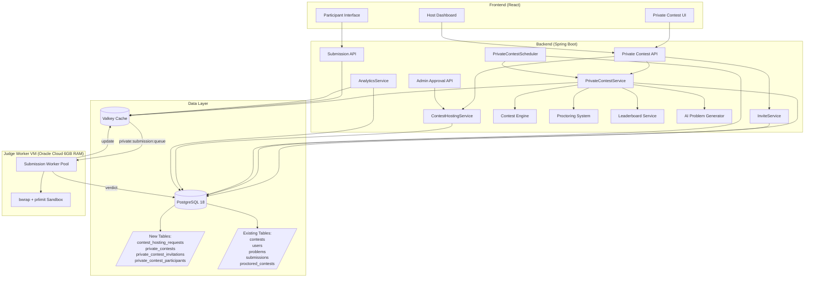
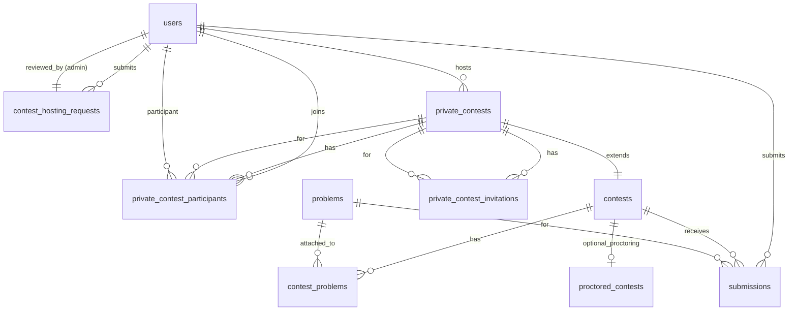
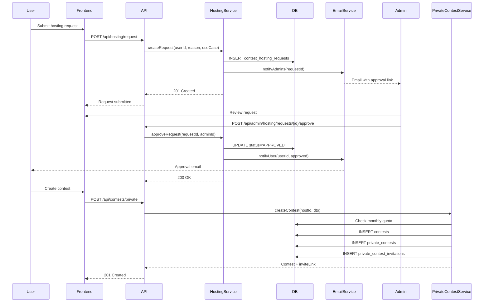

# Design Document: Private Contest Hosting

## Table of Contents
1. [Overview](#overview)
2. [High-Level Architecture](#high-level-architecture)
3. [Database Schema](#database-schema)
4. [API Endpoints](#api-endpoints)
5. [Package Structure](#package-structure)
6. [Sequence Diagrams](#sequence-diagrams)
7. [Cache Strategy](#cache-strategy)
8. [Judge Worker Integration](#judge-worker-integration)
9. [Security & Validation](#security--validation)
10. [Scheduler Integration](#scheduler-integration)
11. [Proctoring Integration](#proctoring-integration)
12. [Problem Management Flow](#problem-management-flow)
13. [Future Scope](#future-scope)

---

## Overview

Private Contest Hosting enables verified users to create and manage their own private coding contests within the CodeCoder platform. The feature seamlessly integrates with the existing Spring Boot architecture, reusing:

- **Contest Engine**: Contest lifecycle management, status transitions, problem attachments
- **Judge System**: Same Valkey queue (`private:submission:queue`), dedicated Judge Worker VM, sandboxed execution
- **Proctoring Infrastructure**: Optional proctoring for high-stakes assessments
- **Leaderboard**: Real-time ZSET-based leaderboard with `private:leaderboard:{contestId}` prefix
- **Problem Bank**: Reuse existing problems or generate new ones via AI Problem Generator
- **Authentication**: JWT-based Spring Security integration

### Key Business Rules

- **Monthly Quota**: 2 private contests per Contest_Host per calendar month (UTC boundaries)
- **Participant Limit**: Maximum 100 participants per private contest
- **Duration Limit**: Maximum 5 hours (300 minutes) per contest
- **Overlap Check**: No time window overlap for a Contest_Host's active private contests
- **Visibility Isolation**: Private contests NOT visible in public contest lists
- **Access Control**: Only Contest_Host and invited Participants can access

### Technology Stack
- **Backend**: Java 21 + Spring Boot 3
- **Database**: PostgreSQL 18 (managed by Flyway)
- **Cache**: Valkey 7 (Redis-compatible)
- **Judge Worker**: Oracle Cloud VM (6GB RAM) - same VM as public contests
- **Authentication**: JWT via Spring Security
- **Naming Conventions**: snake_case (database), camelCase (Java)
- **Annotations**: Lombok `@Data`, `@Autowired` field injection

---

## High-Level Architecture



### Integration Points

| Component | Integration Type | Notes |
|-----------|------------------|-------|
| Contest Engine | Direct reuse | Private contests create rows in `contests` table + `private_contests` extension |
| Judge Queue | Separate queue | `private:submission:queue` vs `submission:queue` |
| Leaderboard | Cache prefix | `private:leaderboard:{contestId}` vs `leaderboard:{contestId}` |
| Proctoring | Optional enable | Row in `proctored_contests` if `enable_proctoring=true` |
| Problem Bank | Browse + attach | Many-to-many via existing `contest_problems` junction table |
| AI Generator | API call | Rate-limited (5/day per Contest_Host) |
| Scheduler | Extend existing | Reuse `ContestStatusScheduler` with private contest awareness |
| Authentication | JWT + role check | `ROLE_USER` + approved hosting request = Contest_Host |

---

## Database Schema

### Entity Relationship Diagram



### Table Definitions

#### 1. `contest_hosting_requests`

Tracks user requests to become Contest_Hosts, requiring Admin approval.

```sql
CREATE TABLE contest_hosting_requests (
    id BIGSERIAL PRIMARY KEY,
    user_id BIGINT NOT NULL REFERENCES users(id) ON DELETE CASCADE,
    
    -- Request details
    reason TEXT,
    intended_use_case VARCHAR(50) NOT NULL CHECK (intended_use_case IN ('EDUCATION', 'RECRUITMENT', 'COMMUNITY', 'INTERNAL_TRAINING', 'OTHER')),
    
    -- Status tracking
    status VARCHAR(20) NOT NULL DEFAULT 'PENDING' CHECK (status IN ('PENDING', 'APPROVED', 'REJECTED', 'REVOKED')),
    submitted_at TIMESTAMP NOT NULL DEFAULT CURRENT_TIMESTAMP,
    
    -- Admin review
    reviewed_by BIGINT REFERENCES users(id) ON DELETE SET NULL,
    reviewed_at TIMESTAMP,
    admin_notes TEXT,
    
    -- Audit
    created_at TIMESTAMP NOT NULL DEFAULT CURRENT_TIMESTAMP,
    updated_at TIMESTAMP NOT NULL DEFAULT CURRENT_TIMESTAMP,
    
    CONSTRAINT uq_active_request_per_user UNIQUE (user_id, status)
);


CREATE INDEX idx_hosting_requests_status ON contest_hosting_requests(status);
CREATE INDEX idx_hosting_requests_user ON contest_hosting_requests(user_id);
```

**Key Design Decisions**:
- `status` tracks approval workflow: `PENDING` → `APPROVED`/`REJECTED`/`REVOKED`
- Unique constraint `uq_active_request_per_user` prevents duplicate pending requests
- Soft delete via `ON DELETE SET NULL` for `reviewed_by` (preserves audit trail if admin deleted)
- Hard delete cascade for `user_id` (if user deleted, remove all their hosting requests)

---

#### 2. `private_contests`

Extension table linking a `contests` row to its Contest_Host and hosting metadata.

```sql
CREATE TABLE private_contests (
    id BIGSERIAL PRIMARY KEY,
    contest_id BIGINT NOT NULL UNIQUE REFERENCES contests(id) ON DELETE CASCADE,
    host_user_id BIGINT NOT NULL REFERENCES users(id) ON DELETE CASCADE,
    
    -- Business rules
    enable_proctoring BOOLEAN NOT NULL DEFAULT FALSE,
    cancelled BOOLEAN NOT NULL DEFAULT FALSE,
    cancelled_at TIMESTAMP,
    cancellation_reason TEXT,
    
    -- Tracking
    created_at TIMESTAMP NOT NULL DEFAULT CURRENT_TIMESTAMP,
    
    CONSTRAINT fk_private_contest_contest FOREIGN KEY (contest_id) REFERENCES contests(id),
    CONSTRAINT fk_private_contest_host FOREIGN KEY (host_user_id) REFERENCES users(id)
);


CREATE INDEX idx_private_contests_host ON private_contests(host_user_id);
CREATE INDEX idx_private_contests_contest ON private_contests(contest_id);
CREATE INDEX idx_private_contests_created ON private_contests(created_at);
```

**Key Design Decisions**:
- **1:1 relationship** with `contests` table via `contest_id` unique constraint
- `host_user_id` identifies the Contest_Host (must have approved `contest_hosting_requests` row)
- `enable_proctoring` flag triggers creation of `proctored_contests` row
- `cancelled` allows Contest_Host to cancel before contest starts (still counts toward monthly quota)
- Cascade delete: if `contest` deleted, remove `private_contests` row; if host deleted, cascade

---

#### 3. `private_contest_invitations`

Stores unique, time-limited invite tokens for each private contest.

```sql
CREATE TABLE private_contest_invitations (
    id BIGSERIAL PRIMARY KEY,
    contest_id BIGINT NOT NULL REFERENCES private_contests(contest_id) ON DELETE CASCADE,
    
    -- Token
    token VARCHAR(64) NOT NULL UNIQUE,
    
    -- Lifecycle
    created_at TIMESTAMP NOT NULL DEFAULT CURRENT_TIMESTAMP,
    expires_at TIMESTAMP NOT NULL,
    invalidated BOOLEAN NOT NULL DEFAULT FALSE,
    
    CONSTRAINT fk_invitation_contest FOREIGN KEY (contest_id) REFERENCES contests(id)
);


CREATE INDEX idx_invitations_token ON private_contest_invitations(token);
CREATE INDEX idx_invitations_contest ON private_contest_invitations(contest_id);
CREATE INDEX idx_invitations_expires ON private_contest_invitations(expires_at);
```

**Key Design Decisions**:
- `token`: Cryptographically random (32 bytes, base64url-encoded) → 64-char VARCHAR
- `expires_at`: Default 30 days from creation, customizable by Contest_Host
- `invalidated`: Set `TRUE` when Contest_Host regenerates token (keeps audit trail)
- Unique constraint on `token` prevents collisions
- Cascade delete: if contest deleted, remove all invitations

**Token Generation** (Java):
```java
SecureRandom secureRandom = new SecureRandom();
byte[] tokenBytes = new byte[32];
secureRandom.nextBytes(tokenBytes);
String token = Base64.getUrlEncoder().withoutPadding().encodeToString(tokenBytes);
```

**Invite Link Format**:
```
https://codecoder.in/contest/private/join?token={token}
```

---

#### 4. `private_contest_participants`

Tracks which users have accepted invitations and joined a private contest.

```sql
CREATE TABLE private_contest_participants (
    id BIGSERIAL PRIMARY KEY,
    contest_id BIGINT NOT NULL REFERENCES contests(id) ON DELETE CASCADE,
    user_id BIGINT NOT NULL REFERENCES users(id) ON DELETE CASCADE,
    
    joined_at TIMESTAMP NOT NULL DEFAULT CURRENT_TIMESTAMP,
    
    CONSTRAINT uq_participant_per_contest UNIQUE (contest_id, user_id),
    CONSTRAINT fk_participant_contest FOREIGN KEY (contest_id) REFERENCES contests(id),
    CONSTRAINT fk_participant_user FOREIGN KEY (user_id) REFERENCES users(id)
);


CREATE INDEX idx_participants_contest ON private_contest_participants(contest_id);
CREATE INDEX idx_participants_user ON private_contest_participants(user_id);
CREATE INDEX idx_participants_joined ON private_contest_participants(joined_at);
```

**Key Design Decisions**:
- Unique constraint `uq_participant_per_contest` prevents duplicate joins
- Participant limit (100) enforced at application layer during join
- Cascade delete: if contest or user deleted, remove participation records

---

### Flyway Migration Scripts

**V8__create_private_contest_tables.sql**:

```sql
-- Migration: Private Contest Hosting Tables
-- Version: V8
-- Description: Creates tables for private contest hosting feature

-- Hosting requests
CREATE TABLE contest_hosting_requests (
    id BIGSERIAL PRIMARY KEY,
    user_id BIGINT NOT NULL REFERENCES users(id) ON DELETE CASCADE,
    reason TEXT,
    intended_use_case VARCHAR(50) NOT NULL CHECK (intended_use_case IN ('EDUCATION', 'RECRUITMENT', 'COMMUNITY', 'INTERNAL_TRAINING', 'OTHER')),
    status VARCHAR(20) NOT NULL DEFAULT 'PENDING' CHECK (status IN ('PENDING', 'APPROVED', 'REJECTED', 'REVOKED')),
    submitted_at TIMESTAMP NOT NULL DEFAULT CURRENT_TIMESTAMP,
    reviewed_by BIGINT REFERENCES users(id) ON DELETE SET NULL,
    reviewed_at TIMESTAMP,
    admin_notes TEXT,
    created_at TIMESTAMP NOT NULL DEFAULT CURRENT_TIMESTAMP,
    updated_at TIMESTAMP NOT NULL DEFAULT CURRENT_TIMESTAMP
);

CREATE INDEX idx_hosting_requests_status ON contest_hosting_requests(status);
CREATE INDEX idx_hosting_requests_user ON contest_hosting_requests(user_id);


-- Private contests extension
CREATE TABLE private_contests (
    id BIGSERIAL PRIMARY KEY,
    contest_id BIGINT NOT NULL UNIQUE REFERENCES contests(id) ON DELETE CASCADE,
    host_user_id BIGINT NOT NULL REFERENCES users(id) ON DELETE CASCADE,
    enable_proctoring BOOLEAN NOT NULL DEFAULT FALSE,
    cancelled BOOLEAN NOT NULL DEFAULT FALSE,
    cancelled_at TIMESTAMP,
    cancellation_reason TEXT,
    created_at TIMESTAMP NOT NULL DEFAULT CURRENT_TIMESTAMP
);

CREATE INDEX idx_private_contests_host ON private_contests(host_user_id);
CREATE INDEX idx_private_contests_contest ON private_contests(contest_id);
CREATE INDEX idx_private_contests_created ON private_contests(created_at);

-- Invitations
CREATE TABLE private_contest_invitations (
    id BIGSERIAL PRIMARY KEY,
    contest_id BIGINT NOT NULL REFERENCES contests(id) ON DELETE CASCADE,
    token VARCHAR(64) NOT NULL UNIQUE,
    created_at TIMESTAMP NOT NULL DEFAULT CURRENT_TIMESTAMP,
    expires_at TIMESTAMP NOT NULL,
    invalidated BOOLEAN NOT NULL DEFAULT FALSE
);

CREATE INDEX idx_invitations_token ON private_contest_invitations(token);
CREATE INDEX idx_invitations_contest ON private_contest_invitations(contest_id);
CREATE INDEX idx_invitations_expires ON private_contest_invitations(expires_at);

-- Participants
CREATE TABLE private_contest_participants (
    id BIGSERIAL PRIMARY KEY,
    contest_id BIGINT NOT NULL REFERENCES contests(id) ON DELETE CASCADE,
    user_id BIGINT NOT NULL REFERENCES users(id) ON DELETE CASCADE,
    joined_at TIMESTAMP NOT NULL DEFAULT CURRENT_TIMESTAMP,
    CONSTRAINT uq_participant_per_contest UNIQUE (contest_id, user_id)
);


CREATE INDEX idx_participants_contest ON private_contest_participants(contest_id);
CREATE INDEX idx_participants_user ON private_contest_participants(user_id);
CREATE INDEX idx_participants_joined ON private_contest_participants(joined_at);
```

---

## API Endpoints

### Base Path: `/api/contests/private`

All endpoints require JWT authentication. Role-based authorization enforced per endpoint.

---

### 1. Host Request APIs

#### `POST /api/hosting/request`

Submit a request to become a Contest_Host.

**Authentication**: Required (`ROLE_USER`)  
**Request Body**:
```json
{
  "reason": "I teach a university course and want to create coding assessments for my students.",
  "intendedUseCase": "EDUCATION"
}
```

**Response** (201 Created):
```json
{
  "id": 1,
  "userId": 42,
  "status": "PENDING",
  "submittedAt": "2026-01-15T10:30:00Z",
  "reason": "I teach a university course...",
  "intendedUseCase": "EDUCATION"
}
```

**Errors**:
- `409 Conflict`: Already have a pending or approved request
- `400 Bad Request`: Invalid `intendedUseCase` or missing fields

---

#### `GET /api/hosting/request/status`

Get the current user's hosting request status.

**Authentication**: Required (`ROLE_USER`)  
**Response** (200 OK):
```json
{
  "hasRequest": true,
  "status": "APPROVED",
  "submittedAt": "2026-01-15T10:30:00Z",
  "reviewedAt": "2026-01-16T14:00:00Z",
  "canCreateContests": true
}
```


---

### 2. Admin Approval APIs

#### `GET /api/admin/hosting/requests`

List all pending hosting requests (Admin dashboard).

**Authentication**: Required (`ROLE_ADMIN`)  
**Query Parameters**:
- `status` (optional): Filter by `PENDING`, `APPROVED`, `REJECTED`, `REVOKED`
- `page` (default: 0), `size` (default: 20)

**Response** (200 OK):
```json
{
  "content": [
    {
      "id": 1,
      "userId": 42,
      "username": "john_doe",
      "email": "john@example.com",
      "fullName": "John Doe",
      "reason": "I teach a university course...",
      "intendedUseCase": "EDUCATION",
      "status": "PENDING",
      "submittedAt": "2026-01-15T10:30:00Z"
    }
  ],
  "totalElements": 15,
  "totalPages": 1,
  "number": 0,
  "size": 20
}
```

---

#### `POST /api/admin/hosting/requests/{requestId}/approve`

Approve a hosting request.

**Authentication**: Required (`ROLE_ADMIN`)  
**Path Variable**: `requestId` (Long)  
**Request Body**:
```json
{
  "adminNotes": "Verified educational institution email. Approved."
}
```

**Response** (200 OK):
```json
{
  "id": 1,
  "status": "APPROVED",
  "reviewedBy": 1,
  "reviewedAt": "2026-01-16T14:00:00Z",
  "adminNotes": "Verified educational institution email. Approved."
}
```


**Errors**:
- `404 Not Found`: Request ID doesn't exist
- `409 Conflict`: Request not in `PENDING` status

---

#### `POST /api/admin/hosting/requests/{requestId}/reject`

Reject a hosting request.

**Authentication**: Required (`ROLE_ADMIN`)  
**Request Body**:
```json
{
  "adminNotes": "Email domain does not match stated organization."
}
```

**Response** (200 OK):
```json
{
  "id": 1,
  "status": "REJECTED",
  "reviewedBy": 1,
  "reviewedAt": "2026-01-16T14:05:00Z",
  "adminNotes": "Email domain does not match stated organization."
}
```

---

#### `POST /api/admin/hosting/requests/{requestId}/revoke`

Revoke an approved Contest_Host's privileges.

**Authentication**: Required (`ROLE_ADMIN`)  
**Request Body**:
```json
{
  "reason": "Policy violation: inappropriate contest content."
}
```

**Response** (200 OK):
```json
{
  "id": 1,
  "status": "REVOKED",
  "reviewedBy": 1,
  "reviewedAt": "2026-02-10T09:00:00Z",
  "adminNotes": "Policy violation: inappropriate contest content."
}
```

---

### 3. Contest Creation APIs

#### `POST /api/contests/private`

Create a new private contest.

**Authentication**: Required (Approved Contest_Host)  
**Request Body**:
```json
{
  "name": "CS101 Midterm Exam",
  "description": "Data structures and algorithms assessment for Spring 2026 cohort.",
  "startTime": "2026-02-01T14:00:00Z",
  "endTime": "2026-02-01T17:00:00Z",
  "enableProctoring": true
}
```


**Response** (201 Created):
```json
{
  "id": 101,
  "contestId": 501,
  "name": "CS101 Midterm Exam",
  "description": "Data structures and algorithms assessment...",
  "startTime": "2026-02-01T14:00:00Z",
  "endTime": "2026-02-01T17:00:00Z",
  "status": "UPCOMING",
  "enableProctoring": true,
  "hostUserId": 42,
  "inviteLink": "https://codecoder.in/contest/private/join?token=Xy9aB...",
  "inviteLinkExpiresAt": "2026-03-03T14:00:00Z",
  "createdAt": "2026-01-15T10:00:00Z"
}
```

**Errors**:
- `429 Too Many Requests`: Monthly quota (2) exceeded
- `400 Bad Request`: Duration > 5 hours
- `409 Conflict`: Time overlap with host's existing contest
- `403 Forbidden`: User not an approved Contest_Host

**Validation Logic**:
```java
// 1. Check monthly quota
int contestsThisMonth = privateContestRepository.countByHostAndMonth(hostUserId, year, month);
if (contestsThisMonth >= 2) throw new TooManyRequestsException("Monthly limit reached");

// 2. Check duration
long durationMinutes = ChronoUnit.MINUTES.between(startTime, endTime);
if (durationMinutes > 300) throw new BadRequestException("Duration cannot exceed 5 hours");

// 3. Check overlap
List<PrivateContest> hostContests = privateContestRepository.findByHostUserId(hostUserId);
for (PrivateContest existing : hostContests) {
    if (timesOverlap(startTime, endTime, existing.getContest().getStartTime(), existing.getContest().getEndTime())) {
        throw new ConflictException("Overlaps with: " + existing.getContest().getName());
    }
}
```

---

#### `GET /api/contests/private/my-contests`

Get all contests created by the current Contest_Host.

**Authentication**: Required (Contest_Host)  
**Query Parameters**:
- `status` (optional): Filter by `UPCOMING`, `LIVE`, `ENDED`
- `page`, `size`

**Response** (200 OK):
```json
{
  "content": [
    {
      "id": 101,
      "contestId": 501,
      "name": "CS101 Midterm Exam",
      "startTime": "2026-02-01T14:00:00Z",
      "endTime": "2026-02-01T17:00:00Z",
      "status": "UPCOMING",
      "participantCount": 35,
      "cancelled": false,
      "createdAt": "2026-01-15T10:00:00Z"
    }
  ],
  "totalElements": 1,
  "totalPages": 1
}
```


---

#### `GET /api/contests/private/{contestId}`

Get private contest details.

**Authentication**: Required (Contest_Host or Participant)  
**Path Variable**: `contestId` (Long)  
**Response** (200 OK):
```json
{
  "id": 101,
  "contestId": 501,
  "name": "CS101 Midterm Exam",
  "description": "Data structures and algorithms assessment...",
  "startTime": "2026-02-01T14:00:00Z",
  "endTime": "2026-02-01T17:00:00Z",
  "status": "UPCOMING",
  "hostUserId": 42,
  "hostUsername": "prof_smith",
  "enableProctoring": true,
  "participantCount": 35,
  "problems": [
    {"id": 10, "title": "Two Sum", "difficulty": "EASY"},
    {"id": 25, "title": "Binary Search Tree", "difficulty": "MEDIUM"}
  ]
}
```

**Errors**:
- `403 Forbidden`: User is neither host nor participant
- `404 Not Found`: Contest doesn't exist

---

#### `PUT /api/contests/private/{contestId}/cancel`

Cancel a private contest (only before it starts).

**Authentication**: Required (Contest_Host)  
**Request Body**:
```json
{
  "reason": "Rescheduling due to holiday conflict."
}
```

**Response** (200 OK):
```json
{
  "id": 101,
  "cancelled": true,
  "cancelledAt": "2026-01-25T08:00:00Z",
  "cancellationReason": "Rescheduling due to holiday conflict."
}
```

**Errors**:
- `409 Conflict`: Contest already started (status `LIVE` or `ENDED`)
- `403 Forbidden`: User is not the host

---

### 4. Invitation APIs

#### `POST /api/contests/private/{contestId}/invite/regenerate`

Regenerate the invite token (invalidates old one).

**Authentication**: Required (Contest_Host)  
**Response** (200 OK):
```json
{
  "inviteLink": "https://codecoder.in/contest/private/join?token=NewT0ken...",
  "expiresAt": "2026-03-15T14:00:00Z"
}
```

---

#### `GET /api/contests/private/join`

Get contest details from invite token (preview before joining).

**Authentication**: Optional (public endpoint)  
**Query Parameter**: `token` (String)  
**Response** (200 OK):
```json
{
  "contestName": "CS101 Midterm Exam",
  "contestDescription": "Data structures...",
  "startTime": "2026-02-01T14:00:00Z",
  "endTime": "2026-02-01T17:00:00Z",
  "hostUsername": "prof_smith",
  "participantCount": 35,
  "maxParticipants": 100,
  "tokenValid": true,
  "tokenExpiresAt": "2026-03-03T14:00:00Z"
}
```


**Errors**:
- `404 Not Found`: Token invalid, expired, or invalidated

---

#### `POST /api/contests/private/join`

Accept invitation and join contest.

**Authentication**: Required (`ROLE_USER`)  
**Request Body**:
```json
{
  "token": "Xy9aB..."
}
```

**Response** (201 Created):
```json
{
  "contestId": 501,
  "userId": 55,
  "joinedAt": "2026-01-20T09:00:00Z",
  "redirectUrl": "/contest/501"
}
```

**Errors**:
- `404 Not Found`: Invalid/expired token
- `429 Too Many Requests`: Contest full (100 participants)
- `409 Conflict`: Already joined this contest

---

### 5. Participant Management APIs

#### `GET /api/contests/private/{contestId}/participants`

List all participants (Contest_Host only).

**Authentication**: Required (Contest_Host)  
**Query Parameters**: `page`, `size`  
**Response** (200 OK):
```json
{
  "content": [
    {
      "userId": 55,
      "username": "alice_dev",
      "email": "alice@example.com",
      "fullName": "Alice Johnson",
      "joinedAt": "2026-01-20T09:00:00Z"
    }
  ],
  "totalElements": 35,
  "totalPages": 2
}
```

---

#### `DELETE /api/contests/private/{contestId}/participants/{userId}`

Remove a participant (Contest_Host only, before contest starts).

**Authentication**: Required (Contest_Host)  
**Response** (204 No Content)

**Errors**:
- `409 Conflict`: Contest already started
- `404 Not Found`: User not a participant

---

### 6. Problem Management APIs

#### `GET /api/contests/private/{contestId}/problems/available`

Browse available problems for attachment.

**Authentication**: Required (Contest_Host)  
**Query Parameters**:
- `difficulty` (optional): `EASY`, `MEDIUM`, `HARD`
- `search` (optional): Title search
- `page`, `size`

**Response** (200 OK):
```json
{
  "content": [
    {
      "id": 10,
      "title": "Two Sum",
      "difficulty": "EASY",
      "visibility": "PUBLIC"
    }
  ],
  "totalElements": 150
}
```


---

#### `POST /api/contests/private/{contestId}/problems`

Attach problems to private contest.

**Authentication**: Required (Contest_Host)  
**Request Body**:
```json
{
  "problemIds": [10, 25, 42]
}
```

**Response** (200 OK):
```json
{
  "attachedCount": 3,
  "problems": [
    {"id": 10, "title": "Two Sum", "displayOrder": 1},
    {"id": 25, "title": "Binary Search Tree", "displayOrder": 2},
    {"id": 42, "title": "Longest Palindrome", "displayOrder": 3}
  ]
}
```

**Errors**:
- `409 Conflict`: Contest already started
- `400 Bad Request`: Problem ID doesn't exist or not available

---

#### `POST /api/contests/private/{contestId}/problems/generate`

Generate new problem using AI.

**Authentication**: Required (Contest_Host)  
**Request Body**:
```json
{
  "prompt": "Create a medium-level problem about dynamic programming on trees",
  "difficulty": "MEDIUM",
  "topic": "Dynamic Programming"
}
```

**Response** (201 Created):
```json
{
  "problemId": 201,
  "title": "Tree DP: Max Path Sum",
  "description": "Given a binary tree...",
  "difficulty": "MEDIUM",
  "sampleTestCases": ["..."],
  "hiddenTestCases": ["..."]
}
```

**Errors**:
- `429 Too Many Requests`: Rate limit (5/day) exceeded

**Rate Limiting**:
```java
String rateLimitKey = "ai:problem:gen:user:" + userId;
Long count = redis.opsForValue().increment(rateLimitKey);
if (count == 1) {
    redis.expire(rateLimitKey, Duration.ofDays(1));
}
if (count > 5) {
    throw new TooManyRequestsException("Daily limit of 5 AI generations exceeded");
}
```

---

### 7. Submission APIs

#### `POST /api/contests/private/{contestId}/submit`

Submit code for a private contest problem.

**Authentication**: Required (Participant)  
**Request Body**:
```json
{
  "problemId": 10,
  "code": "class Solution { ... }",
  "language": "JAVA"
}
```

**Response** (201 Created):
```json
{
  "submissionId": 5001,
  "status": "PENDING",
  "submittedAt": "2026-02-01T14:30:00Z"
}
```


**Errors**:
- `403 Forbidden`: User not a participant
- `409 Conflict`: Contest not `LIVE`

**Flow**:
1. Create `submissions` row with `contest_id`, `user_id`, `problem_id`, `code`, `language`, `status=PENDING`
2. Push `SubmissionJob` to `private:submission:queue` (Valkey)
3. Return submission ID immediately
4. Judge Worker processes asynchronously
5. Verdict pushed via SSE to user's open connection

---

#### `GET /api/contests/private/{contestId}/submissions`

Get all submissions for a contest (Contest_Host only).

**Authentication**: Required (Contest_Host)  
**Query Parameters**:
- `userId` (optional): Filter by participant
- `problemId` (optional): Filter by problem
- `status` (optional): Filter by verdict
- `page`, `size`

**Response** (200 OK):
```json
{
  "content": [
    {
      "submissionId": 5001,
      "userId": 55,
      "username": "alice_dev",
      "problemId": 10,
      "problemTitle": "Two Sum",
      "status": "AC",
      "score": 100,
      "submittedAt": "2026-02-01T14:30:00Z"
    }
  ],
  "totalElements": 120
}
```

---

### 8. Leaderboard APIs


#### `GET /api/contests/private/{contestId}/leaderboard`

Get real-time leaderboard.

**Authentication**: Required (Participant or Contest_Host)  
**Response** (200 OK):
```json
{
  "contestId": 501,
  "lastUpdated": "2026-02-01T15:45:00Z",
  "rankings": [
    {
      "rank": 1,
      "userId": 55,
      "username": "alice_dev",
      "score": 300,
      "penalty": 0,
      "lastSubmissionTime": "2026-02-01T14:45:00Z",
      "problemsSolved": 3
    }
  ]
}
```

---

### 9. Analytics APIs

#### `GET /api/contests/private/{contestId}/analytics`

Get contest analytics (Contest_Host only).

**Authentication**: Required (Contest_Host)  
**Response** (200 OK):
```json
{
  "contestId": 501,
  "totalParticipants": 35,
  "activeParticipants": 32,
  "totalSubmissions": 120,
  "problemStats": [
    {
      "problemId": 10,
      "problemTitle": "Two Sum",
      "totalSubmissions": 35,
      "acceptedSubmissions": 28,
      "acceptanceRate": 80.0,
      "avgSolveTimeMinutes": 12.5
    }
  ],
  "engagementTimeline": [
    {"timestamp": "2026-02-01T14:00:00Z", "submissionCount": 15},
    {"timestamp": "2026-02-01T14:15:00Z", "submissionCount": 22}
  ]
}
```

---

#### `GET /api/contests/private/{contestId}/analytics/export`

Export analytics as CSV.

**Authentication**: Required (Contest_Host)  
**Response**: CSV file download

---

### 10. Admin Oversight APIs

#### `GET /api/admin/private-contests`

List all private contests (Admin dashboard).

**Authentication**: Required (`ROLE_ADMIN`)  
**Query Parameters**: `status`, `hostUserId`, `page`, `size`  
**Response** (200 OK):
```json
{
  "content": [
    {
      "id": 101,
      "contestId": 501,
      "name": "CS101 Midterm Exam",
      "hostUserId": 42,
      "hostUsername": "prof_smith",
      "status": "LIVE",
      "participantCount": 35,
      "startTime": "2026-02-01T14:00:00Z",
      "createdAt": "2026-01-15T10:00:00Z"
    }
  ]
}
```

---

#### `DELETE /api/admin/private-contests/{contestId}`

Delete a private contest (Admin only).

**Authentication**: Required (`ROLE_ADMIN`)  
**Response** (204 No Content)

---

## Package Structure

Following existing CodeCoder patterns:

```
com.example.codecombat2026/
├── entity/
│   ├── Contest.java (existing)
│   ├── User.java (existing)
│   ├── Problem.java (existing)
│   ├── Submission.java (existing)
│   ├── ContestHostingRequest.java (NEW)
│   ├── PrivateContest.java (NEW)
│   ├── PrivateContestInvitation.java (NEW)
│   └── PrivateContestParticipant.java (NEW)
├── repository/
│   ├── ContestHostingRequestRepository.java (NEW)
│   ├── PrivateContestRepository.java (NEW)
│   ├── PrivateContestInvitationRepository.java (NEW)
│   └── PrivateContestParticipantRepository.java (NEW)
├── service/
│   ├── ContestHostingService.java (NEW)
│   ├── PrivateContestService.java (NEW)
│   ├── PrivateInviteService.java (NEW)
│   ├── PrivateContestAnalyticsService.java (NEW)
│   ├── PrivateContestScheduler.java (NEW)
│   └── SubmissionWorkerPool.java (EXTEND)
├── controller/
│   ├── ContestHostingController.java (NEW)
│   ├── PrivateContestController.java (NEW)
│   ├── PrivateContestInviteController.java (NEW)
│   └── PrivateContestAdminController.java (NEW)
└── dto/
    ├── CreatePrivateContestRequest.java (NEW)
    ├── HostingRequestDTO.java (NEW)
    ├── PrivateContestDTO.java (NEW)
    ├── InviteLinkDTO.java (NEW)
    └── PrivateContestAnalyticsDTO.java (NEW)
```

---

## Sequence Diagrams

### 1. Host Request → Admin Approval → Create Contest Flow




---

### 2. Invite Link → Registration → Participate Flow

```mermaid
sequenceDiagram
    participant Participant
    participant Frontend
    participant API
    participant InviteService
    participant DB
    participant Valkey
    
    Participant->>Frontend: Click invite link
    Frontend->>API: GET /api/contests/private/join?token=...
    API->>InviteService: validateToken(token)
    InviteService->>DB: SELECT from private_contest_invitations
    InviteService->>DB: Check token validity, expiry
    InviteService-->>API: Contest preview
    API-->>Frontend: Display contest details
    
    Participant->>Frontend: Click "Accept Invitation"
    Frontend->>API: POST /api/contests/private/join
    API->>InviteService: acceptInvite(userId, token)
    InviteService->>DB: Check participant count < 100
    InviteService->>DB: INSERT private_contest_participants
    InviteService-->>API: 201 Created
    API-->>Frontend: Redirect to /contest/{id}
    
    Note over Frontend,Valkey: Contest starts (scheduler transitions status)
    
    Participant->>Frontend: Navigate to contest
    Frontend->>API: GET /api/contests/private/{id}
    API->>DB: Verify participant access
    API-->>Frontend: Contest + problems
    
    Participant->>Frontend: Submit code
    Frontend->>API: POST /api/contests/private/{id}/submit
    API->>DB: INSERT submissions (status=PENDING)
    API->>Valkey: LPUSH private:submission:queue
    API-->>Frontend: Submission ID
    
    Note over Valkey: Judge Worker polls queue
```

---

### 3. Submit Code → Judge → Leaderboard Update Flow

```mermaid
sequenceDiagram
    participant Participant
    participant API
    participant DB
    participant Valkey
    participant JudgeWorker
    participant Sandbox
    participant SSE
    
    Participant->>API: POST /api/contests/private/{id}/submit
    API->>DB: INSERT submissions (status=PENDING)
    API->>Valkey: LPUSH private:submission:queue<br/>{submissionId, code, contestId, problemId}
    API-->>Participant: 201 Created (submissionId)
    
    JudgeWorker->>Valkey: LMOVE private:submission:queue → processing:{workerId}
    JudgeWorker->>DB: UPDATE status=JUDGING
    JudgeWorker->>Sandbox: execute(code, timeLimit, memoryLimit)
    Sandbox-->>JudgeWorker: {exitCode, stdout, stderr, timeTaken}
    
    JudgeWorker->>JudgeWorker: parseTestCases(stdout)
    JudgeWorker->>DB: UPDATE submissions (status, score, details)
    
    JudgeWorker->>Valkey: Read prev score: private:score:{contestId}:{userId}:{problemId}
    JudgeWorker->>Valkey: Calculate delta (newScore - prevScore)
    JudgeWorker->>Valkey: ZINCRBY private:leaderboard:{contestId} delta userId
    JudgeWorker->>Valkey: SET private:score:{contestId}:{userId}:{problemId} newScore
    
    JudgeWorker->>SSE: sendVerdict(userId, {submissionId, status, score})
    SSE-->>Participant: Real-time verdict push
    
    JudgeWorker->>Valkey: LREM processing:{workerId} jobJson
```

---

### 4. Proctoring Integration Flow

```mermaid
sequenceDiagram
    participant Host
    participant API
    participant PrivateContestService
    participant DB
    participant ProctoringSystem
    participant Participant
    
    Host->>API: POST /api/contests/private {enableProctoring: true}
    API->>PrivateContestService: createContest(dto)
    PrivateContestService->>DB: INSERT contests
    PrivateContestService->>DB: INSERT private_contests (enable_proctoring=true)
    PrivateContestService->>DB: INSERT proctored_contests (contest_id)
    PrivateContestService-->>API: Contest created
    
    Note over Participant: Contest starts
    
    Participant->>API: GET /api/contests/private/{id}
    API->>DB: Check if proctored
    API-->>Participant: {isProctored: true, consentVersion}
    
    Participant->>ProctoringSystem: POST /api/proctoring/consent
    ProctoringSystem->>DB: INSERT proctoring_sessions
    ProctoringSystem-->>Participant: Session started
    
    Participant->>ProctoringSystem: WebSocket connect /proctoring/events
    ProctoringSystem-->>Participant: Heartbeat, face detection, screenshots
    
    Host->>API: GET /api/contests/private/{id}/proctoring/dashboard
    API->>ProctoringSystem: getSessionsForContest(contestId)
    ProctoringSystem->>DB: SELECT proctoring_sessions WHERE contest_id
    ProctoringSystem-->>API: Sessions + risk scores
    API-->>Host: Proctoring dashboard
```

---

## Cache Strategy

### Valkey Key Patterns

| Key Pattern | Type | TTL | Purpose |
|-------------|------|-----|---------|
| `private:submission:queue` | LIST | None | Pending submissions for private contests |
| `private:submission:processing:{instance}:{worker}` | LIST | None | In-flight submissions (reclaimed by janitor) |
| `private:leaderboard:{contestId}` | ZSET | 26h | Real-time leaderboard (score as value, userId as member) |
| `private:score:{contestId}:{userId}:{problemId}` | STRING | 26h | Per-problem score for delta calculation |
| `private:contest:quota:{userId}:{year}:{month}` | STRING | 32d | Monthly contest count (2 max) |
| `private:contest:{contestId}` | HASH | 6h | Contest metadata cache |
| `private:participants:{contestId}` | SET | 6h | Participant user IDs (fast membership check) |
| `ai:problem:gen:user:{userId}` | STRING | 24h | Rate limit counter (5/day) |
| `private:analytics:{contestId}` | HASH | 24h | Cached analytics for ENDED contests |

---

### Cache Invalidation Rules

1. **Contest Creation**: No cache (new contest)
2. **Participant Join**: `DEL private:participants:{contestId}`, `DEL private:contest:{contestId}`
3. **Submission Verdict**: Update `private:leaderboard:{contestId}`, `ZINCRBY` with score delta
4. **Contest Status Change**: `DEL private:contest:{contestId}`
5. **Contest Cancel**: `DEL private:contest:{contestId}`, `DEL private:participants:{contestId}`
6. **Problem Attach**: `DEL private:contest:{contestId}`

---

### Leaderboard ZSET Structure

**Key**: `private:leaderboard:{contestId}`  
**Score**: Total contest score (sum of per-problem scores)  
**Member**: `userId`

**Operations**:
```java
// Initialize leaderboard on contest start
redis.delete("private:leaderboard:" + contestId);

// Update score on verdict (delta approach)
String scoreKey = "private:score:" + contestId + ":" + userId + ":" + problemId;
Integer prevScore = redis.opsForValue().get(scoreKey);
if (prevScore == null) prevScore = 0;
int delta = newScore - prevScore;

redis.opsForValue().set(scoreKey, newScore, Duration.ofHours(26));
redis.opsForZSet().incrementScore("private:leaderboard:" + contestId, userId.toString(), delta);

// Get leaderboard
Set<ZSetOperations.TypedTuple<String>> rankings = redis.opsForZSet()
    .reverseRangeWithScores("private:leaderboard:" + contestId, 0, -1);
```

---

## Judge Worker Integration

### Dedicated Judge Worker VM

**VM**: Oracle Cloud, 6GB RAM, same VM as public contests  
**Location**: VM2 (140.245.4.112) per DEPLOYMENT.md  
**Workers**: `JUDGE_WORKERS=6` (configured in `.env`)

### Queue Separation

**Public Contests**: `submission:queue`  
**Private Contests**: `private:submission:queue`

**Worker Polling Strategy** (fair round-robin):
```java
@Component
public class UnifiedSubmissionWorkerPool {
    
    private void workerLoop(int workerIdx) {
        String[] queues = {"submission:queue", "private:submission:queue"};
        int queueIdx = 0;
        
        while (!shuttingDown) {
            String currentQueue = queues[queueIdx % queues.length];
            queueIdx++;
            
            String jobJson = workerRedis.opsForList().move(
                currentQueue, Direction.RIGHT,
                processingKey(workerIdx), Direction.LEFT,
                Duration.ofSeconds(1)
            );
            
            if (jobJson != null) {
                processJob(jobJson);
            }
        }
    }
}
```

### SubmissionJob DTO Extension

```java
@Data
public class SubmissionJob {
    private Long submissionId;
    private Long userId;
    private Long contestId;
    private Long problemId;
    private String code;
    private String language;
    private Double timeLimit;
    private Integer memoryLimit;
    private boolean testRun;
    private Long duelId; // existing field
    private boolean privateContest; // NEW: flag for cache key routing
}
```

### Verdict Callback Flow

```java
void finalizeAndNotify(SubmissionJob job, ...) {
    // 1. Update DB
    submissionRepository.updateResult(submissionId, status, ...);
    
    // 2. Leaderboard update (conditional on privateContest flag)
    if (job.isPrivateContest()) {
        String leaderboardKey = "private:leaderboard:" + job.getContestId();
        String scoreKey = "private:score:" + job.getContestId() + ":" + job.getUserId() + ":" + job.getProblemId();
        
        Integer prevScore = redis.opsForValue().get(scoreKey);
        int delta = score - (prevScore != null ? prevScore : 0);
        
        redis.opsForValue().set(scoreKey, score, Duration.ofHours(26));
        redis.opsForZSet().incrementScore(leaderboardKey, job.getUserId().toString(), delta);
    } else {
        // Existing public contest leaderboard logic
        leaderboard.updateScore(job.getContestId(), job.getUserId(), score);
    }
    
    // 3. SSE verdict push
    sseRegistry.sendVerdict(job.getUserId(), new VerdictEvent(...));
}
```

---

## Security & Validation

### Authentication & Authorization

#### JWT Integration

Reuse existing Spring Security JWT filter chain. All private contest endpoints require `Authentication` header:

```
Authorization: Bearer <JWT_TOKEN>
```

#### Role-Based Access Control

| Endpoint | Required Role | Additional Check |
|----------|---------------|------------------|
| `POST /api/hosting/request` | `ROLE_USER` | User must be `enabled=true` |
| `POST /api/admin/hosting/requests/{id}/approve` | `ROLE_ADMIN` | None |
| `POST /api/contests/private` | `ROLE_USER` | Must have approved `contest_hosting_requests` row |
| `GET /api/contests/private/{id}` | `ROLE_USER` | Must be Contest_Host OR Participant |
| `POST /api/contests/private/{id}/submit` | `ROLE_USER` | Must be Participant + contest status=LIVE |
| `GET /api/contests/private/{id}/participants` | `ROLE_USER` | Must be Contest_Host |
| `DELETE /api/admin/private-contests/{id}` | `ROLE_ADMIN` | None |

#### Ownership Validation

```java
@Service
public class PrivateContestAccessValidator {
    
    @Autowired
    private PrivateContestRepository privateContestRepo;
    
    @Autowired
    private PrivateContestParticipantRepository participantRepo;
    
    public boolean isHost(Long contestId, Long userId) {
        return privateContestRepo.existsByContestIdAndHostUserId(contestId, userId);
    }
    
    public boolean isParticipant(Long contestId, Long userId) {
        return participantRepo.existsByContestIdAndUserId(contestId, userId);
    }
    
    public boolean canAccess(Long contestId, Long userId) {
        return isHost(contestId, userId) || isParticipant(contestId, userId);
    }
}
```

### Business Rule Validation

#### Monthly Quota Check

```java
public void validateMonthlyQuota(Long hostUserId) {
    YearMonth currentMonth = YearMonth.now(ZoneOffset.UTC);
    int year = currentMonth.getYear();
    int month = currentMonth.getMonthValue();
    
    int count = privateContestRepository.countByHostUserIdAndCreatedAtBetween(
        hostUserId,
        LocalDateTime.of(year, month, 1, 0, 0),
        LocalDateTime.of(year, month, currentMonth.lengthOfMonth(), 23, 59, 59)
    );
    
    if (count >= 2) {
        throw new TooManyRequestsException("Monthly limit of 2 private contests exceeded");
    }
}
```

#### Duration Validation

```java
public void validateDuration(LocalDateTime startTime, LocalDateTime endTime) {
    long minutes = ChronoUnit.MINUTES.between(startTime, endTime);
    if (minutes > 300) {
        throw new BadRequestException("Contest duration cannot exceed 5 hours (300 minutes)");
    }
    if (minutes <= 0) {
        throw new BadRequestException("End time must be after start time");
    }
}
```

#### Overlap Check

```java
public void validateNoOverlap(Long hostUserId, LocalDateTime startTime, LocalDateTime endTime) {
    List<PrivateContest> hostContests = privateContestRepository.findByHostUserId(hostUserId);
    
    for (PrivateContest existing : hostContests) {
        Contest contest = existing.getContest();
        if (contest.getStatus() == Contest.ContestStatus.ENDED) continue;
        if (existing.getCancelled()) continue;
        
        LocalDateTime existingStart = contest.getStartTime();
        LocalDateTime existingEnd = contest.getEndTime();
        
        // Check for overlap: [start1, end1) overlaps [start2, end2) if start1 < end2 AND start2 < end1
        if (startTime.isBefore(existingEnd) && existingStart.isBefore(endTime)) {
            throw new ConflictException("Time overlap with existing contest: " + contest.getName());
        }
    }
}
```

#### Participant Limit Check

```java
public void validateParticipantLimit(Long contestId) {
    int count = participantRepository.countByContestId(contestId);
    if (count >= 100) {
        throw new TooManyRequestsException("Contest has reached maximum capacity of 100 participants");
    }
}
```

### Signed Invite Links

Invite tokens are cryptographically random and stored in the database. No HMAC signing needed (database lookup validates authenticity).

**Token Validation**:
```java
public boolean isValidToken(String token) {
    PrivateContestInvitation invitation = invitationRepository.findByToken(token)
        .orElseThrow(() -> new NotFoundException("Invalid invitation token"));
    
    if (invitation.getInvalidated()) {
        throw new NotFoundException("Invitation link has been invalidated");
    }
    
    if (invitation.getExpiresAt().isBefore(LocalDateTime.now())) {
        throw new NotFoundException("Invitation link has expired");
    }
    
    PrivateContest privateContest = privateContestRepository.findByContestId(invitation.getContestId())
        .orElseThrow(() -> new NotFoundException("Contest not found"));
    
    Contest contest = privateContest.getContest();
    if (contest.getStatus() == Contest.ContestStatus.ENDED) {
        throw new ConflictException("Contest has already ended");
    }
    
    return true;
}
```

### Rate Limiting

#### AI Problem Generation

**Limit**: 5 requests per user per day (UTC boundaries)

```java
@Service
public class AIProblemGeneratorService {
    
    @Autowired
    private StringRedisTemplate redis;
    
    public void checkRateLimit(Long userId) {
        String key = "ai:problem:gen:user:" + userId;
        Long count = redis.opsForValue().increment(key);
        
        if (count == 1) {
            redis.expire(key, Duration.ofDays(1));
        }
        
        if (count > 5) {
            throw new TooManyRequestsException("Daily limit of 5 AI problem generations exceeded");
        }
    }
}
```

---

## Scheduler Integration

Reuse existing `ContestStatusScheduler` with private contest awareness.

### ContestStatusScheduler Extension

```java
@Component
public class ContestStatusScheduler {
    
    @Autowired
    private ContestRepository contestRepository;
    
    @Autowired
    private PrivateContestRepository privateContestRepository;
    
    @Autowired
    private StringRedisTemplate redis;
    
    @Scheduled(fixedDelay = 60000) // Every minute
    public void updateContestStatuses() {
        LocalDateTime now = TimeUtil.now();
        
        // Transition UPCOMING → LIVE
        List<Contest> upcomingContests = contestRepository.findByStatusAndStartTimeBefore(
            Contest.ContestStatus.UPCOMING, now
        );
        for (Contest contest : upcomingContests) {
            contest.setStatus(Contest.ContestStatus.LIVE);
            contestRepository.save(contest);
            
            // Initialize leaderboard (public or private)
            if (privateContestRepository.existsByContestId(contest.getId())) {
                redis.delete("private:leaderboard:" + contest.getId());
            } else {
                redis.delete("leaderboard:" + contest.getId());
            }
            
            log.info("Contest {} transitioned to LIVE", contest.getId());
        }
        
        // Transition LIVE → ENDED
        List<Contest> liveContests = contestRepository.findByStatusAndEndTimeBefore(
            Contest.ContestStatus.LIVE, now
        );
        for (Contest contest : liveContests) {
            contest.setStatus(Contest.ContestStatus.ENDED);
            contestRepository.save(contest);
            
            // Persist final leaderboard to DB
            persistLeaderboard(contest.getId());
            
            log.info("Contest {} transitioned to ENDED", contest.getId());
        }
    }
    
    @Scheduled(cron = "0 0 2 * * ?") // Daily at 2 AM UTC
    public void cleanupExpiredInvitations() {
        LocalDateTime cutoff = LocalDateTime.now().minusDays(30);
        int deleted = privateContestInvitationRepository.deleteByExpiresAtBefore(cutoff);
        log.info("Deleted {} expired invitation tokens", deleted);
    }
}
```

---

## Proctoring Integration

When `enable_proctoring=true` is set during private contest creation:

1. **Create `proctored_contests` row**:
```java
@Service
public class PrivateContestService {
    
    @Autowired
    private ProctoredContestRepository proctoredContestRepository;
    
    public PrivateContest createContest(CreatePrivateContestRequest dto, Long hostUserId) {
        // ... validation ...
        
        Contest contest = new Contest();
        contest.setName(dto.getName());
        contest.setDescription(dto.getDescription());
        contest.setStartTime(dto.getStartTime());
        contest.setEndTime(dto.getEndTime());
        contest.setStatus(Contest.ContestStatus.UPCOMING);
        contest = contestRepository.save(contest);
        
        PrivateContest privateContest = new PrivateContest();
        privateContest.setContestId(contest.getId());
        privateContest.setHostUserId(hostUserId);
        privateContest.setEnableProctoring(dto.getEnableProctoring());
        privateContest.setCreatedAt(LocalDateTime.now());
        privateContest = privateContestRepository.save(privateContest);
        
        // Create proctored contest marker
        if (dto.getEnableProctoring()) {
            ProctoredContest proctoredContest = new ProctoredContest();
            proctoredContest.setContestId(contest.getId());
            proctoredContest.setCreatedAt(LocalDateTime.now());
            proctoredContest.setConsentVersion(1); // Default consent version
            proctoredContestRepository.save(proctoredContest);
        }
        
        // Generate invite token
        String token = generateInviteToken();
        PrivateContestInvitation invitation = new PrivateContestInvitation();
        invitation.setContestId(contest.getId());
        invitation.setToken(token);
        invitation.setCreatedAt(LocalDateTime.now());
        invitation.setExpiresAt(LocalDateTime.now().plusDays(30));
        invitationRepository.save(invitation);
        
        return privateContest;
    }
}
```

2. **Participant Entry Flow**:
   - When participant navigates to contest, API checks if `proctored_contests` row exists
   - If yes, redirect to consent screen (existing proctoring flow)
   - After consent, create `proctoring_sessions` row
   - Enable WebSocket connection for heartbeat, face detection, screenshots

3. **Contest_Host Dashboard**:
   - Extend `/api/proctoring/admin/sessions` to filter by `contest_id`
   - Contest_Host can view sessions for ONLY their private contests
   - Access control: `if (!isHost(contestId, userId)) throw 403 Forbidden`

```java
@GetMapping("/api/contests/private/{contestId}/proctoring/sessions")
public ResponseEntity<List<ProctoringSessionDTO>> getProctoringS sessions(@PathVariable Long contestId, Authentication auth) {
    Long userId = getUserIdFromAuth(auth);
    
    if (!accessValidator.isHost(contestId, userId)) {
        throw new ForbiddenException("Only contest host can view proctoring data");
    }
    
    List<ProctoringSession> sessions = proctoringSessionRepository.findByContestId(contestId);
    return ResponseEntity.ok(sessions.stream().map(this::toDTO).collect(Collectors.toList()));
}
```

---

## Problem Management Flow

### 1. Browse Existing Problems

**Endpoint**: `GET /api/contests/private/{contestId}/problems/available`

**Query**:
```sql
SELECT * FROM problems
WHERE visibility IN ('PUBLIC', 'PRIVATE_AVAILABLE')
  AND active = TRUE
ORDER BY title;
```

**Visibility Enum**:
- `PUBLIC`: Available for all contests
- `PRIVATE_AVAILABLE`: Available for private contests only
- `ADMIN_ONLY`: Not available for Contest_Hosts
- `PRIVATE_OWNED`: Created by Contest_Host via AI, only visible to them

---

### 2. Attach Problems to Contest

**Endpoint**: `POST /api/contests/private/{contestId}/problems`

**Flow**:
1. Validate Contest_Host ownership
2. Validate contest not started (`status != LIVE` and `status != ENDED`)
3. For each `problemId`:
   - Verify problem exists and is available
   - Insert into `contest_problems` junction table
   - Set `display_order` sequentially

```java
@Transactional
public void attachProblems(Long contestId, List<Long> problemIds, Long hostUserId) {
    PrivateContest privateContest = privateContestRepository.findByContestId(contestId)
        .orElseThrow(() -> new NotFoundException("Private contest not found"));
    
    if (!privateContest.getHostUserId().equals(hostUserId)) {
        throw new ForbiddenException("Only contest host can attach problems");
    }
    
    Contest contest = privateContest.getContest();
    if (contest.getStatus() != Contest.ContestStatus.UPCOMING) {
        throw new ConflictException("Cannot modify problems after contest starts");
    }
    
    int displayOrder = 1;
    for (Long problemId : problemIds) {
        Problem problem = problemRepository.findById(problemId)
            .orElseThrow(() -> new NotFoundException("Problem " + problemId + " not found"));
        
        if (!problem.getVisibility().equals("PUBLIC") && !problem.getVisibility().equals("PRIVATE_AVAILABLE")) {
            throw new ForbiddenException("Problem " + problemId + " not available");
        }
        
        ContestProblem cp = new ContestProblem();
        cp.setContestId(contestId);
        cp.setProblemId(problemId);
        cp.setDisplayOrder(displayOrder++);
        contestProblemRepository.save(cp);
    }
    
    redis.delete("private:contest:" + contestId); // Invalidate cache
}
```

---

### 3. AI Problem Generation

**Endpoint**: `POST /api/contests/private/{contestId}/problems/generate`

**Flow**:
1. Check rate limit (5/day)
2. Call AI Problem Generator service
3. Create `problems` row with `visibility=PRIVATE_OWNED`, `created_by=hostUserId`
4. Return problem for preview/edit
5. Auto-attach to contest when Contest_Host confirms

```java
@Service
public class AIProblemGeneratorService {
    
    @Autowired
    private StringRedisTemplate redis;
    
    @Autowired
    private ProblemRepository problemRepository;
    
    @Autowired
    private OpenAIClient openAIClient; // Hypothetical AI client
    
    public Problem generateProblem(String prompt, String difficulty, String topic, Long hostUserId) {
        checkRateLimit(hostUserId);
        
        // Call OpenAI/Claude/Gemini API
        GeneratedProblemDTO aiResponse = openAIClient.generateProblem(prompt, difficulty, topic);
        
        // Create problem entity
        Problem problem = new Problem();
        problem.setTitle(aiResponse.getTitle());
        problem.setDescription(aiResponse.getDescription());
        problem.setInputFormat(aiResponse.getInputFormat());
        problem.setOutputFormat(aiResponse.getOutputFormat());
        problem.setConstraints(aiResponse.getConstraints());
        problem.setTimeLimit(2.0); // Default 2s
        problem.setMemoryLimit(256); // Default 256MB
        problem.setLevel(difficulty);
        problem.setVisibility("PRIVATE_OWNED");
        problem.setCreatedBy(hostUserId);
        problem.setActive(true);
        
        problem = problemRepository.save(problem);
        
        // Create test cases (sample + hidden)
        for (TestCaseDTO tc : aiResponse.getSampleTestCases()) {
            // Insert into test_cases table or code snippets
        }
        
        return problem;
    }
}
```

---

## Future Scope

### Payment Integration

**Premium Hosting Tier**:
- Quota increase: 10 contests/month
- Participant limit: 500 per contest
- Duration limit: 12 hours
- Custom branding (logo, colors)
- Advanced analytics (heatmaps, time-series graphs)
- Priority judge queue (faster verdicts)

**Implementation**:
- Integrate Stripe/Razorpay for subscriptions
- Add `hosting_tier` column to `contest_hosting_requests` (`FREE`, `PREMIUM`)
- Check tier during quota validation

---

### Custom Branding

**Features**:
- Upload contest logo
- Custom color palette
- Custom domain (e.g., `contest.company.com`)

**Tables**:
```sql
CREATE TABLE private_contest_branding (
    id BIGSERIAL PRIMARY KEY,
    contest_id BIGINT NOT NULL UNIQUE REFERENCES contests(id),
    logo_url TEXT,
    primary_color VARCHAR(7), -- Hex color
    secondary_color VARCHAR(7),
    custom_domain VARCHAR(255)
);
```

---

### Advanced Analytics

**Features**:
- Submission heatmap (time vs. participant)
- Problem difficulty correlation (solve rate vs. time)
- Cheating detection (code similarity matrix)
- Engagement metrics (avg time per problem)

**Endpoints**:
- `GET /api/contests/private/{id}/analytics/heatmap`
- `GET /api/contests/private/{id}/analytics/similarity`

---

### Team Contests

**Features**:
- Participants form teams (2-5 members)
- Shared leaderboard per team
- Team submission permissions

**Tables**:
```sql
CREATE TABLE private_contest_teams (
    id BIGSERIAL PRIMARY KEY,
    contest_id BIGINT NOT NULL REFERENCES contests(id),
    team_name VARCHAR(100) NOT NULL,
    created_by BIGINT NOT NULL REFERENCES users(id),
    created_at TIMESTAMP NOT NULL DEFAULT CURRENT_TIMESTAMP
);

CREATE TABLE private_contest_team_members (
    id BIGSERIAL PRIMARY KEY,
    team_id BIGINT NOT NULL REFERENCES private_contest_teams(id),
    user_id BIGINT NOT NULL REFERENCES users(id),
    joined_at TIMESTAMP NOT NULL DEFAULT CURRENT_TIMESTAMP,
    CONSTRAINT uq_team_member UNIQUE (team_id, user_id)
);
```

---

## Summary

This design document provides a **complete technical blueprint** for the Private Contest Hosting feature, including:

✅ **High-level architecture** with Mermaid diagrams showing integration with existing CodeCoder components  
✅ **Database schema** with 4 new tables, full column definitions, indexes, foreign keys, and ER diagram  
✅ **API endpoints** with complete REST contracts (10 endpoint groups, 25+ endpoints)  
✅ **Package structure** following existing Spring Boot patterns  
✅ **Sequence diagrams** for 4 key flows (host request, invite, submission, proctoring)  
✅ **Cache strategy** with 9 Valkey key patterns, TTLs, and invalidation rules  
✅ **Judge worker integration** with dedicated queue (`private:submission:queue`), fair polling, verdict callbacks  
✅ **Security & validation** with JWT auth, role checks, ownership validation, business rule enforcement  
✅ **Scheduler integration** for contest status transitions, invite token cleanup  
✅ **Proctoring integration** with optional enable flag, session management, Contest_Host dashboard  
✅ **Problem management flow** with browse/attach/AI-generate workflows  
✅ **Future scope** with payment, branding, analytics, team contests

**Next Steps**: Proceed to task creation phase in `.kiro/specs/private-contest-hosting/tasks.md`.

---

**Document Version**: 1.0  
**Last Updated**: 2026-01-15  
**Author**: Kiro AI Agent (design-first workflow)
