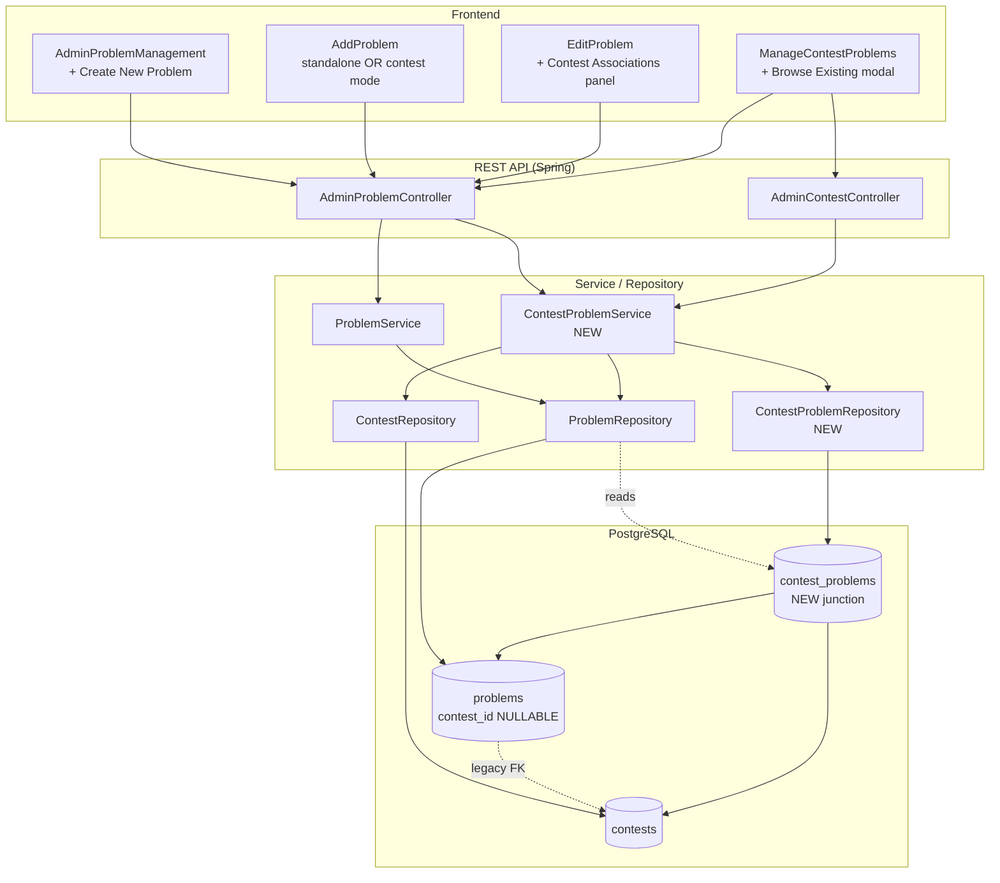
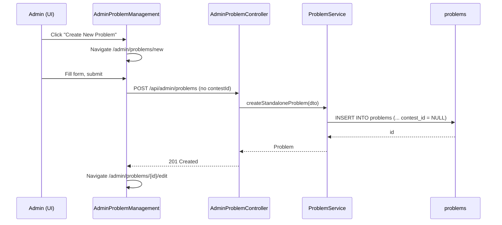
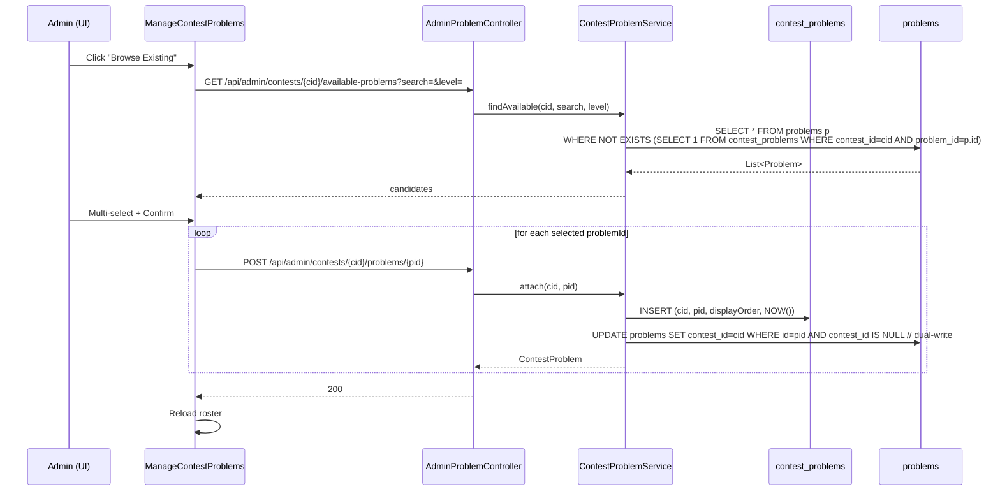
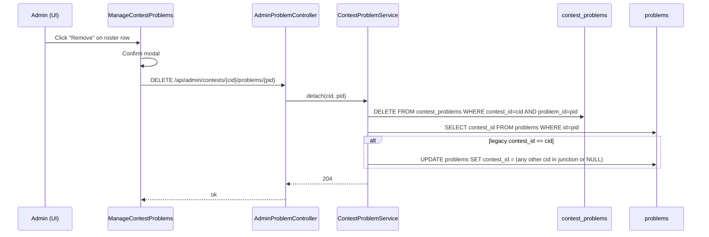
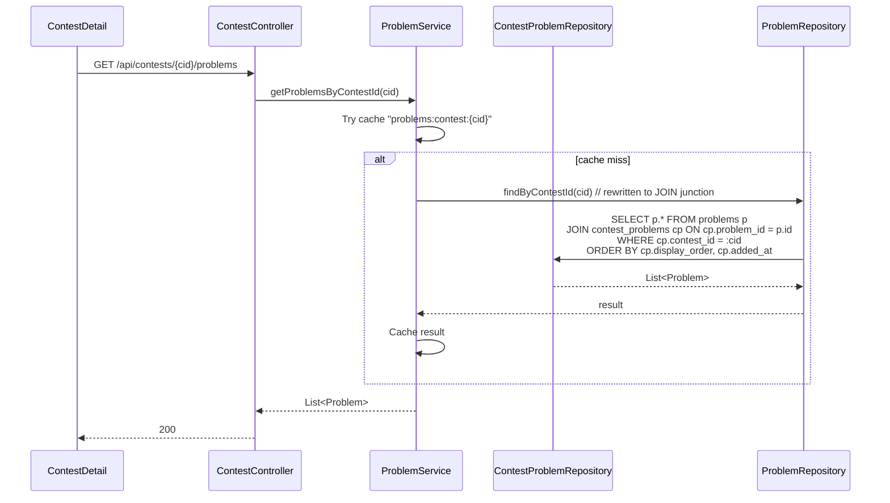

# Design Document: Problem ↔ Contest Many-to-Many Refactor

## Overview

Today every `Problem` is hard-bound to exactly one `Contest` via the not-null
`problems.contest_id` foreign key. Admins can only create a problem from inside
a contest ("Add to contest" flow), and the same problem cannot be reused across
events. This refactor turns the relationship into a true many-to-many: problems
become first-class entities that live in a standalone library, and a contest is
just a curated selection of existing problems.

The change is shipped as a production-safe, online migration. A new junction
table `contest_problems` is introduced, the existing `contest_id` column is
backfilled into it, the column is made nullable, and the application enters a
**dual-write transition window**: every new attachment is written to both the
junction and the legacy column. Reads always go through the junction. After a
stability period a follow-up migration drops `problems.contest_id` entirely.

The refactor is invisible to existing UI flows (Add Problem inside a contest,
Edit Problem, Manage Contest Problems) — they keep working unchanged — and
opens up three new admin capabilities: standalone problem creation, attaching
existing problems to a contest, and viewing which contests a problem belongs
to.

## Architecture



## Sequence Diagrams

### Flow 1: Standalone problem creation (new path)



### Flow 2: Attach existing problem to contest



### Flow 3: Detach problem from contest (does NOT delete the problem)



### Flow 4: Read problems for contest detail page (always via junction)



## Components and Interfaces

### Component 1: ContestProblem entity (new)

**Purpose**: JPA representation of the junction row. Carries display order and
audit timestamp, modeled as an explicit `@Entity` (not just `@JoinTable`)
because the junction has its own payload columns and is queried directly.

**Interface**:

```java
@Entity
@Table(name = "contest_problems")
@IdClass(ContestProblemId.class)
@Data
@NoArgsConstructor
@AllArgsConstructor
public class ContestProblem {
    @Id
    @Column(name = "contest_id")
    private Long contestId;

    @Id
    @Column(name = "problem_id")
    private Long problemId;

    @Column(name = "display_order", nullable = false)
    private Integer displayOrder = 0;

    @Column(name = "added_at", nullable = false)
    private LocalDateTime addedAt;

    @ManyToOne(fetch = FetchType.LAZY)
    @JoinColumn(name = "contest_id", insertable = false, updatable = false)
    @JsonIgnore
    private Contest contest;

    @ManyToOne(fetch = FetchType.LAZY)
    @JoinColumn(name = "problem_id", insertable = false, updatable = false)
    @JsonIgnore
    private Problem problem;
}
```

`ContestProblemId` is a tiny `Serializable` composite-key class (two `Long`
fields, equals/hashCode), placed alongside the entity.

**Responsibilities**:
- Persistent record of a (contest, problem) pair.
- Hold per-attachment metadata (`displayOrder`, `addedAt`).
- Provide a queryable handle for "list problems in contest X" and "list
  contests of problem Y".

### Component 2: Problem entity (modified)

**Purpose**: Same domain object, but contest membership becomes M:N. The legacy
`contestId`/`contest` mapping is preserved (nullable) for the dual-write
transition; it MUST NOT be read by application code after this refactor.

**Interface** (additions only — rest of the entity unchanged):

```java
@Entity
@Table(name = "problems")
public class Problem {
    // ... existing columns unchanged ...

    // LEGACY — kept nullable during transition, dual-written, never read
    @ManyToOne(fetch = FetchType.LAZY)
    @JoinColumn(name = "contest_id")
    @JsonIgnore
    private Contest contest;

    @Column(name = "contest_id", insertable = false, updatable = false)
    private Long contestId;

    // NEW — canonical relation
    @ManyToMany(fetch = FetchType.LAZY)
    @JoinTable(
        name = "contest_problems",
        joinColumns        = @JoinColumn(name = "problem_id"),
        inverseJoinColumns = @JoinColumn(name = "contest_id"))
    @JsonIgnore
    private List<Contest> contests = new ArrayList<>();
}
```

**Responsibilities**:
- Continues to own all problem metadata (title, description, level, snippets,
  test cases).
- Exposes `contests` for callers that want every contest the problem belongs
  to (used by `EditProblem` "Contest Associations" panel).

### Component 3: Contest entity (modified)

**Purpose**: Add the inverse of the M:N so JPA round-trips work, but real
mutation goes through `ContestProblemService` to keep dual-write logic in one
place.

**Interface** (additions only):

```java
@Entity
@Table(name = "contests")
public class Contest {
    // ... existing fields unchanged ...

    @ManyToMany(mappedBy = "contests", fetch = FetchType.LAZY)
    @JsonIgnore
    private List<Problem> problems = new ArrayList<>();
}
```

**Responsibilities**:
- Inverse navigation only. Code MUST NOT call `contest.getProblems().add(...)`
  for attachment — it bypasses dual-write.

### Component 4: ContestProblemRepository (new)

**Purpose**: Direct CRUD on the junction.

**Interface**:

```java
@Repository
public interface ContestProblemRepository extends JpaRepository<ContestProblem, ContestProblemId> {

    List<ContestProblem> findByContestIdOrderByDisplayOrderAscAddedAtAsc(Long contestId);

    List<ContestProblem> findByProblemId(Long problemId);

    boolean existsByContestIdAndProblemId(Long contestId, Long problemId);

    @Modifying
    @Query("DELETE FROM ContestProblem cp WHERE cp.contestId = :cid AND cp.problemId = :pid")
    int deleteByContestIdAndProblemId(@Param("cid") Long cid, @Param("pid") Long pid);

    long countByContestId(Long contestId);
}
```

**Responsibilities**:
- Read/write single junction rows.
- Used by `ContestProblemService` and (read-only) by `ProblemRepository`'s
  rewritten `findByContestId`.

### Component 5: ProblemRepository (modified)

**Purpose**: All callers of `findByContestId` must continue to work without
changes, but the query now resolves through the junction.

**Interface**:

```java
@Repository
public interface ProblemRepository extends JpaRepository<Problem, Long> {

    /**
     * Reads through contest_problems (M:N junction).
     * The legacy problems.contest_id column is intentionally NOT consulted here.
     */
    @Query("""
        SELECT p FROM Problem p
        JOIN ContestProblem cp ON cp.problemId = p.id
        WHERE cp.contestId = :contestId
        ORDER BY cp.displayOrder ASC, cp.addedAt ASC
        """)
    List<Problem> findByContestId(@Param("contestId") Long contestId);

    /**
     * Standalone-pool query for the "Browse Existing Problems" modal.
     * Returns problems NOT yet attached to the given contest, optionally
     * filtered by title (case-insensitive) and level.
     */
    @Query("""
        SELECT p FROM Problem p
        WHERE p.id NOT IN (
            SELECT cp.problemId FROM ContestProblem cp WHERE cp.contestId = :contestId
        )
        AND (:level  IS NULL OR p.level = :level)
        AND (:search IS NULL OR LOWER(p.title) LIKE LOWER(CONCAT('%', :search, '%')))
        ORDER BY p.id DESC
        """)
    List<Problem> findAvailableForContest(
        @Param("contestId") Long contestId,
        @Param("search")    String search,
        @Param("level")     String level
    );
}
```

**Responsibilities**:
- Backwards-compatible API surface; only the implementation changes.
- New `findAvailableForContest` powers the picker UI.

### Component 6: ContestProblemService (new)

**Purpose**: Single owner of attach/detach business logic and dual-write
bookkeeping.

**Interface**:

```java
@Service
public class ContestProblemService {

    /**
     * Attach an existing problem to a contest.
     * Idempotent: returns existing row if already attached.
     * Dual-writes to legacy problems.contest_id when that column is currently NULL.
     */
    @Transactional
    public ContestProblem attach(Long contestId, Long problemId);

    /**
     * Bulk attach. Atomic — either all succeed or none.
     */
    @Transactional
    public List<ContestProblem> attachMany(Long contestId, List<Long> problemIds);

    /**
     * Detach a problem from a contest. Does NOT delete the problem.
     * If legacy problems.contest_id == contestId, repoint it to any remaining
     * contest in the junction, or NULL if none remain.
     */
    @Transactional
    public void detach(Long contestId, Long problemId);

    /** Problems currently attached to the contest, ordered. */
    public List<Problem> listProblemsForContest(Long contestId);

    /** Contests a problem currently belongs to. */
    public List<Contest> listContestsForProblem(Long problemId);

    /** Pool of problems NOT yet attached to the contest, with filters. */
    public List<Problem> findAvailable(Long contestId, String search, String level);
}
```

**Responsibilities**:
- Enforces "attach existing" semantics (problem must already exist).
- Maintains dual-write invariant during the transition window.
- Triggers cache eviction (`problems:contest:{cid}` and per-problem caches).

### Component 7: ProblemService (modified)

**Purpose**: Adds standalone creation. Reads of `getProblemsByContestId` are
unchanged at the API level — they automatically pick up the new junction-backed
`findByContestId`.

**Interface** (additions / changes only):

```java
public class ProblemService {
    /** Create a problem with no contest binding. contest_id is left NULL. */
    @Transactional
    public Problem createStandaloneProblem(Problem problem);

    /** Existing method retained, now goes through junction transparently. */
    public List<Problem> getProblemsByContestId(Long contestId); // unchanged signature
}
```

### Component 8: AdminProblemController (modified)

**Purpose**: Owns the new endpoints. Existing endpoints keep working with
identical semantics.

**Interface**:

```java
@RestController
@RequestMapping("/api/admin/problems")
@PreAuthorize("hasRole('ADMIN')")
public class AdminProblemController {

    // ── EXISTING (unchanged behavior) ──────────────────────────────────────
    @GetMapping                              List<Problem>  getAllProblems();
    @GetMapping("/contest/{contestId}")      List<Problem>  getProblemsByContest(@PathVariable Long contestId);
    @PostMapping("/contest/{contestId}")     Problem        createProblem(@PathVariable Long contestId, @RequestBody Problem p);  // dual-writes junction
    @PutMapping("/{id}")                     Problem        updateProblem(@PathVariable Long id, @RequestBody Problem p);
    @PatchMapping("/{id}/toggle-active")     Problem        toggleActive(@PathVariable Long id);
    @DeleteMapping("/{id}")                  ResponseEntity<?> deleteProblem(@PathVariable Long id);  // junction rows cascade

    // ── NEW ────────────────────────────────────────────────────────────────
    /** Standalone create — no contest binding. */
    @PostMapping
    Problem createStandaloneProblem(@RequestBody Problem problem);

    /** List contests a given problem belongs to (powers EditProblem panel). */
    @GetMapping("/{problemId}/contests")
    List<Contest> getContestsForProblem(@PathVariable Long problemId);
}
```

### Component 9: AdminContestController (modified)

**Interface** (additions only):

```java
@RestController
@RequestMapping("/api/admin/contests")
@PreAuthorize("hasRole('ADMIN')")
public class AdminContestController {

    // ── NEW ────────────────────────────────────────────────────────────────
    /** Attach an existing problem to this contest (idempotent). */
    @PostMapping("/{contestId}/problems/{problemId}")
    ContestProblem attachProblem(@PathVariable Long contestId, @PathVariable Long problemId);

    /** Detach without deleting the problem. */
    @DeleteMapping("/{contestId}/problems/{problemId}")
    ResponseEntity<?> detachProblem(@PathVariable Long contestId, @PathVariable Long problemId);

    /** Pool of problems NOT in this contest, with optional search/level filters. */
    @GetMapping("/{contestId}/available-problems")
    List<Problem> getAvailableProblems(
        @PathVariable Long contestId,
        @RequestParam(required = false) String search,
        @RequestParam(required = false) String level
    );
}
```

### Component 10: Frontend pages (modified)

| Page                              | Change                                                                                                  |
| --------------------------------- | ------------------------------------------------------------------------------------------------------- |
| `AdminProblemManagement.jsx`      | Add "Create New Problem" button → navigates `/admin/problems/new`.                                      |
| `AddProblem.jsx`                  | Detect missing `contestId` from `useParams()`; in standalone mode, call `POST /api/admin/problems` and redirect to `/admin/problems/{id}/edit`. Header label switches from "Contest CC-XXXX" to "New Standalone Problem". |
| `EditProblem.jsx`                 | Add "Contest Associations" panel: lists contests via `GET /api/admin/problems/{id}/contests`; provides Detach buttons; provides "Add to Contest" select that calls `POST /api/admin/contests/{cid}/problems/{pid}`. |
| `ManageContestProblems.jsx`       | Add "Browse Existing Problems" button next to "+ Add Problem". Opens a modal with search/level filters powered by `GET /api/admin/contests/{cid}/available-problems`; multi-select calls `POST /api/admin/contests/{cid}/problems/{pid}` per item. The existing "Remove" button now calls the new `DELETE /api/admin/contests/{cid}/problems/{pid}` (detach, not delete). |
| `App.jsx`                         | Register route: `/admin/problems/new` → `<AdminRoute><AddProblem /></AdminRoute>` (wrapped in `p-8 flex-1` like other admin pages). |

## Data Models

### Model 1: `contest_problems` (new junction table)

```sql
CREATE TABLE public.contest_problems (
    contest_id    BIGINT       NOT NULL,
    problem_id    BIGINT       NOT NULL,
    display_order INTEGER      NOT NULL DEFAULT 0,
    added_at      TIMESTAMP    NOT NULL DEFAULT NOW(),
    PRIMARY KEY (contest_id, problem_id),
    CONSTRAINT fk_cp_contest FOREIGN KEY (contest_id) REFERENCES public.contests(id) ON DELETE CASCADE,
    CONSTRAINT fk_cp_problem FOREIGN KEY (problem_id) REFERENCES public.problems(id) ON DELETE CASCADE
);

CREATE INDEX idx_contest_problems_problem_id ON public.contest_problems (problem_id);
-- (contest_id index is implicit on PK first column)
```

**Validation Rules**:
- `(contest_id, problem_id)` is unique (PK).
- Both FKs cascade on delete: deleting a problem removes its junction rows;
  deleting a contest removes its junction rows.
- `display_order` ≥ 0; default 0 means "no explicit order" — UI falls back to
  `added_at`.
- `added_at` set server-side on insert.

### Model 2: `problems` (modified)

```sql
ALTER TABLE public.problems ALTER COLUMN contest_id DROP NOT NULL;
-- The FK constraint fkpa9waom3ntotn7gpm2spnsow5 is preserved.
```

**Validation Rules**:
- `contest_id` becomes nullable. NULL means "standalone problem".
- Application code MUST treat this column as legacy: reads MUST use the
  junction; writes happen only as dual-write best-effort.

### Model 3: Backfill

Every existing row with a non-NULL `contest_id` gets a junction row:

```sql
INSERT INTO public.contest_problems (contest_id, problem_id, display_order, added_at)
SELECT contest_id, id, 0, NOW()
  FROM public.problems
 WHERE contest_id IS NOT NULL
ON CONFLICT (contest_id, problem_id) DO NOTHING;
```

(`problems` has no `created_at` column in the V1 baseline, so `added_at` uses
`NOW()` at migration time. `display_order` defaults to 0 because no historical
ordering exists.)

## Algorithmic Pseudocode

### Algorithm 1: Attach existing problem to contest (with dual-write)

```pascal
ALGORITHM attach(contestId, problemId)
INPUT:  contestId, problemId (both Long)
OUTPUT: ContestProblem row

BEGIN
  ASSERT contestId  IS NOT NULL
  ASSERT problemId  IS NOT NULL
  ASSERT contestRepository.existsById(contestId)
  ASSERT problemRepository.existsById(problemId)

  // Idempotent: short-circuit if already attached
  IF contestProblemRepository.existsByContestIdAndProblemId(contestId, problemId) THEN
    RETURN existing row
  END IF

  // Insert junction row
  cp ← new ContestProblem(contestId, problemId, displayOrder=0, addedAt=NOW())
  contestProblemRepository.save(cp)

  // Dual-write to legacy column ONLY when it's currently NULL.
  // Never overwrite an existing legacy contest_id — that would silently
  // change which contest a problem "originally" belongs to.
  problem ← problemRepository.findById(problemId).orElseThrow()
  IF problem.contestId IS NULL THEN
    problem.setContest(contestRepository.getReferenceById(contestId))
    problemRepository.save(problem)
  END IF

  // Cache eviction
  cacheService.evictContestProblems(contestId)
  cacheService.evictProblem(problemId)

  RETURN cp
END
```

**Preconditions**:
- `contestId` and `problemId` reference existing rows.

**Postconditions**:
- A row exists in `contest_problems` with the given pair.
- If `problems.contest_id` for this problem was NULL, it now equals
  `contestId`; otherwise it is unchanged.
- Caller observes the same final state regardless of whether the row already
  existed (idempotence).

### Algorithm 2: Detach problem from contest (preserves problem)

```pascal
ALGORITHM detach(contestId, problemId)
INPUT:  contestId, problemId (both Long)
OUTPUT: void

BEGIN
  ASSERT contestId IS NOT NULL
  ASSERT problemId IS NOT NULL

  rowsDeleted ← contestProblemRepository.deleteByContestIdAndProblemId(contestId, problemId)
  IF rowsDeleted = 0 THEN
    RETURN  // already not attached — idempotent
  END IF

  // Repoint legacy column if it was pointing to the contest we just detached
  problem ← problemRepository.findById(problemId).orElseThrow()
  IF problem.contestId = contestId THEN
    remaining ← contestProblemRepository.findByProblemId(problemId)
    IF remaining IS EMPTY THEN
      problem.setContest(NULL)
    ELSE
      // Pick deterministic survivor: smallest contestId remaining
      survivor ← remaining.stream()
                          .map(cp -> cp.getContestId())
                          .min(Long::compare)
                          .get()
      problem.setContest(contestRepository.getReferenceById(survivor))
    END IF
    problemRepository.save(problem)
  END IF

  cacheService.evictContestProblems(contestId)
  cacheService.evictProblem(problemId)
END
```

**Preconditions**:
- None (detaching a non-attached problem is a no-op).

**Postconditions**:
- No row exists in `contest_problems` for `(contestId, problemId)`.
- The problem itself still exists, with all metadata, snippets, and test
  cases intact.
- `problems.contest_id` for this problem is either NULL or points to a contest
  that still has it in the junction.

**Loop Invariants**: N/A (no loops).

### Algorithm 3: List available problems for picker

```pascal
ALGORITHM findAvailable(contestId, search, level)
INPUT:  contestId (Long), search (String?), level (String?)
OUTPUT: List<Problem>

BEGIN
  ASSERT contestId IS NOT NULL
  // search and level are optional filters
  RETURN problemRepository.findAvailableForContest(contestId, search, level)
END
```

**Preconditions**:
- `contestId` references an existing contest.

**Postconditions**:
- Every returned problem is NOT in `contest_problems` for `contestId`.
- Every returned problem matches the optional `search` (case-insensitive
  substring on title) and `level` filters when provided.

### Algorithm 4: Read problems for contest (cache-aware, junction-backed)

```pascal
ALGORITHM getProblemsByContestId(contestId)
INPUT:  contestId (Long)
OUTPUT: List<Problem>

BEGIN
  key ← "problems:contest:" || contestId

  cached ← redis.get(key)
  IF cached IS NOT NULL THEN
    RETURN deserialize(cached)
  END IF

  // findByContestId now reads through the junction (see ProblemRepository)
  problems ← problemRepository.findByContestId(contestId)

  TRY redis.set(key, serialize(problems), CONTEST_PROBLEMS_TTL) END

  RETURN problems
END
```

**Preconditions**:
- `contestId` is non-null.

**Postconditions**:
- Returned list is the set of problems currently in
  `contest_problems` for `contestId`, ordered by `(display_order ASC,
  added_at ASC)`.
- The legacy `problems.contest_id` is NOT consulted.

## Correctness Properties

*A property is a characteristic or behavior that should hold true across all
valid executions of a system — essentially, a formal statement about what the
system should do. Properties serve as the bridge between human-readable
specifications and machine-verifiable correctness guarantees.*

### Property 1: Junction is canonical for contest membership

For all contests `c` and all problems `p`, after the M:N refactor is
deployed, `p` is considered to belong to `c` from the application's
perspective if and only if a row exists in `contest_problems` with
`(contest_id = c.id, problem_id = p.id)`. The legacy `problems.contest_id`
column is never consulted by application reads.

**Validates: Requirements 5.1, 5.2, 5.3**

### Property 2: Backfill preserves all existing memberships

For all rows in the pre-migration `problems` table where `contest_id IS NOT
NULL`, after the V5 migration runs, a corresponding row exists in
`contest_problems` with the same `(contest_id, problem_id)` pair.

**Validates: Requirements 2.1, 2.3**

### Property 3: Attach is idempotent

For all `(contestId, problemId)` pairs, calling `attach(contestId, problemId)`
N times produces the same final database state as calling it once: exactly
one junction row exists, and `problems.contest_id` is set if and only if it
was NULL before the first call.

**Validates: Requirements 7.1, 7.2, 17.1**

### Property 4: Detach preserves the problem

For all `(contestId, problemId)` pairs where the problem was attached,
calling `detach(contestId, problemId)` removes the junction row but the
`problems` row, its `code_snippets`, and its test cases remain present and
unchanged.

**Validates: Requirements 9.1, 9.3, 17.2**

### Property 5: Standalone create produces a NULL contest_id problem

For all valid `Problem` payloads submitted to `POST /api/admin/problems`,
the persisted row has `contest_id IS NULL` and zero rows in
`contest_problems` referencing its id immediately after creation.

**Validates: Requirements 6.1, 6.2**

### Property 6: Available-problems excludes attached

For all contests `c`, the result of `findAvailableForContest(c.id, ...)`
contains no problem `p` for which a row exists in `contest_problems` with
`(c.id, p.id)`.

**Validates: Requirements 10.1**

### Property 7: Cascade on contest delete

For all contests `c`, deleting `c` removes every row in `contest_problems`
with `contest_id = c.id` but does NOT delete any row in `problems`.

**Validates: Requirements 15.1, 15.3**

### Property 8: Cascade on problem delete

For all problems `p`, deleting `p` (via the existing
`DELETE /api/admin/problems/{id}` endpoint) removes every row in
`contest_problems` with `problem_id = p.id`.

**Validates: Requirements 15.2**

### Property 9: Existing reader compatibility

For all callers of `ProblemRepository.findByContestId(contestId)` and
`ProblemService.getProblemsByContestId(contestId)`, the returned list of
problems is the same set that the contest detail page, the contest
leaderboard, and the manage-contest-problems page were rendering before the
refactor — assuming no attach/detach has occurred since deployment.

**Validates: Requirements 5.1, 5.2**

### Property 10: Dual-write does not corrupt legacy column

For all `attach(contestId, problemId)` calls, after the call returns:
- If the problem's legacy `contest_id` was NULL before, it is now `contestId`.
- If the problem's legacy `contest_id` was non-NULL before, it is unchanged.
The legacy column is never silently re-pointed by attach.

**Validates: Requirements 8.1, 8.2**

## Error Handling

### Error Scenario 1: Attach references non-existent contest or problem

**Condition**: Client calls `POST /api/admin/contests/{cid}/problems/{pid}`
where either id does not exist.
**Response**: 404 Not Found with body
`{"message": "Contest not found"}` or `{"message": "Problem not found"}`.
**Recovery**: No state change; client may correct the id and retry.

### Error Scenario 2: Attach to a pair that already exists

**Condition**: The junction row already exists for the pair.
**Response**: 200 OK with the existing `ContestProblem` (idempotent — no
error).
**Recovery**: None needed.

### Error Scenario 3: Detach a pair that is not attached

**Condition**: No junction row exists for the pair.
**Response**: 204 No Content (idempotent — no error).
**Recovery**: None needed.

### Error Scenario 4: Backfill encounters duplicate row

**Condition**: A previous partial migration attempt left rows in
`contest_problems`.
**Response**: `INSERT ... ON CONFLICT DO NOTHING` skips them; migration
succeeds.
**Recovery**: Manual SQL audit only if counts diverge from
`SELECT COUNT(*) FROM problems WHERE contest_id IS NOT NULL`.

### Error Scenario 5: Standalone create with malformed payload

**Condition**: `POST /api/admin/problems` body missing `title` or
`description`.
**Response**: 400 Bad Request via `GlobalExceptionHandler` with field-level
validation message.
**Recovery**: Client corrects payload and retries.

### Error Scenario 6: Browse-existing fails (network error)

**Condition**: `GET /api/admin/contests/{cid}/available-problems` 5xx.
**Response**: Frontend modal shows inline error toast and keeps the modal
open with a Retry button.
**Recovery**: User retries; underlying retry hits cache-warm path on
success.

### Error Scenario 7: Cascade interaction with submissions

**Condition**: Deleting a problem currently referenced by submissions
violates `submissions.problem_id` FK.
**Response**: This is the **existing** behavior — outside the scope of this
refactor. The refactor only adds cascading rules to the new
`contest_problems` rows; it does not change how `problems` itself is
deleted.
**Recovery**: Same operational procedure as today (mark inactive instead of
deleting, or delete submissions first).

## Testing Strategy

### Unit Testing Approach

- `ContestProblemServiceTest`: attach idempotence, detach repointing of
  legacy column, attach to non-existent ids → 404, dual-write skip when
  legacy column is non-null.
- `ProblemRepositoryTest` (with `@DataJpaTest` + Testcontainers Postgres):
  `findByContestId` returns rows in `(displayOrder, addedAt)` order;
  `findAvailableForContest` excludes already-attached rows and applies
  search/level filters.
- `AdminProblemControllerTest` / `AdminContestControllerTest` (MockMvc):
  endpoint shape, status codes, JSON payloads.

### Property-Based Testing Approach

Skipped per project policy. The properties listed in the "Correctness
Properties" section are documented for reasoning and to drive targeted
example tests, not to be wired into a PBT framework.

### Integration Testing Approach

- One Flyway-driven integration test that boots the app against a fresh
  Postgres, seeds N problems with non-null `contest_id`, runs V5, and
  asserts: (a) every seeded pair appears in `contest_problems`, (b)
  `problems.contest_id` is now nullable, (c) the application's
  `getProblemsByContestId` returns the same set as before the migration.
- One end-to-end controller test: standalone create → attach to contest A →
  attach to contest B → list contests for problem returns both → detach
  from A → contest detail of A no longer lists it but contest detail of B
  does.

## Performance Considerations

- The junction adds one indexed JOIN to the `findByContestId` hot path. With
  `(contest_id, problem_id)` as PK and `idx_contest_problems_problem_id` on
  the reverse direction, both queries are O(log N + k) where k is the
  result-set size. Existing Redis cache (`problems:contest:{cid}`, 30s TTL)
  absorbs the most-common reads — no measurable regression expected.
- `findAvailableForContest` uses a `NOT IN` subquery; for the realistic
  problem-pool size (≤ low thousands), this is acceptable. If the pool
  grows large, switch to `LEFT JOIN ... WHERE cp.problem_id IS NULL`.
- Backfill is a single `INSERT ... SELECT` — runs in milliseconds for
  current data volumes.

## Security Considerations

- All new endpoints sit under `@PreAuthorize("hasRole('ADMIN')")` like the
  rest of `AdminProblemController` / `AdminContestController`. No new
  attack surface for non-admin users.
- Detach is destructive at the relationship level but NOT at the data level
  (problem and submissions remain). This matches the principle of least
  surprise for admins clicking "Remove from contest".
- Cascade-on-delete on the junction is safe because both parents are
  admin-managed; it just keeps the table tidy when admins delete contests
  or problems.

## Dependencies

- Spring Boot 3.5.14 (existing).
- Spring Data JPA, Hibernate (existing).
- Flyway (existing) — new file `V5__contest_problems_m2m.sql`.
- PostgreSQL 18 (existing).
- jjwt 0.12.6 (existing) — unaffected.
- Frontend: React 18 + Framer Motion + Monaco (existing) — no new
  dependencies; modal reuses existing `AnimatePresence` patterns.
