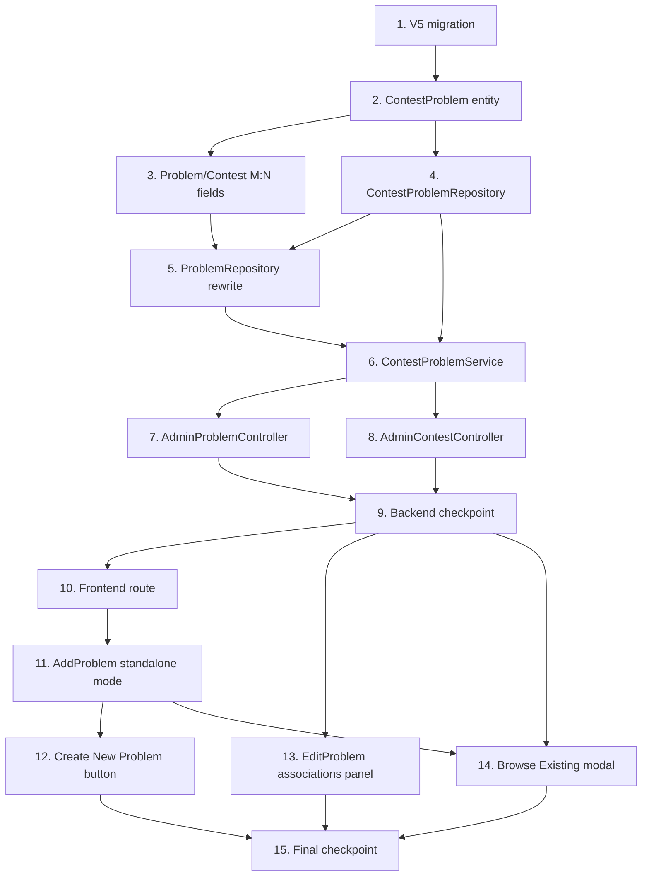

# Implementation Plan: Problem ↔ Contest Many-to-Many Refactor

## Overview

Convert the feature design into a series of prompts for a code-generation LLM
that will implement each step with incremental progress. Each prompt builds
on the previous prompts and ends with wiring things together. There should
be no hanging or orphaned code that is not integrated into a previous step.
The work is split into a database / migration phase, a backend phase
(entities, repositories, service, controllers), and a frontend phase
(routes, pages, modal). Optional sub-tasks marked with `*` can be skipped
for a faster MVP.

## Tasks

- [x] 1. Create the V5 Flyway migration for the M:N junction
  - Add a new file `src/main/resources/db/migration/V5__contest_problems_m2m.sql`.
  - Inside, create the `contest_problems` table with columns
    `contest_id BIGINT NOT NULL`, `problem_id BIGINT NOT NULL`,
    `display_order INTEGER NOT NULL DEFAULT 0`,
    `added_at TIMESTAMP NOT NULL DEFAULT NOW()`, primary key
    `(contest_id, problem_id)`, FK on `contest_id` referencing
    `contests(id) ON DELETE CASCADE`, FK on `problem_id` referencing
    `problems(id) ON DELETE CASCADE`, and index
    `idx_contest_problems_problem_id` on `problem_id`.
  - Add an idempotent backfill block:
    `INSERT INTO contest_problems (contest_id, problem_id, display_order, added_at)
     SELECT contest_id, id, 0, NOW() FROM problems WHERE contest_id IS NOT NULL
     ON CONFLICT (contest_id, problem_id) DO NOTHING;`
  - End the migration with
    `ALTER TABLE problems ALTER COLUMN contest_id DROP NOT NULL;`.
  - Wrap CREATE TABLE / CREATE INDEX in `IF NOT EXISTS` clauses and the
    constraint creation in a `DO $$ ... END $$` block guarded by
    `pg_constraint` lookups so the migration is safely re-runnable.
  - _Requirements: 1.1, 1.2, 1.3, 1.4, 1.5, 1.6, 2.1, 2.2, 2.3, 3.1, 3.2, 3.3_

- [x] 2. Add the ContestProblem JPA entity and composite key
  - [x] 2.1 Create `ContestProblemId.java`
    - Add a small `Serializable` class with two `Long` fields `contestId`
      and `problemId`, a no-arg constructor, an all-args constructor, and
      `equals`/`hashCode` derived from the pair (use Lombok `@Data` for
      brevity, matching the project's existing style).
    - Place it under `src/main/java/com/example/codecombat2026/entity/`.
    - _Requirements: 4.1_

  - [x] 2.2 Create `ContestProblem.java`
    - Add a JPA `@Entity` mapped to `contest_problems` with
      `@IdClass(ContestProblemId.class)` and Lombok `@Data`,
      `@NoArgsConstructor`, `@AllArgsConstructor`.
    - Declare two `@Id` columns `contestId` and `problemId`, plus
      `displayOrder` (default 0) and `addedAt` columns.
    - Add LAZY `@ManyToOne` relations to `Contest` and `Problem` joined
      on the same FK columns with `insertable=false, updatable=false`,
      annotated with `@JsonIgnore`.
    - Set `addedAt = LocalDateTime.now()` in `@PrePersist` if it is null,
      so service callers do not have to set it explicitly.
    - _Requirements: 4.1_

- [x] 3. Update the existing Problem and Contest entities
  - [x] 3.1 Add the M:N collection to `Problem.java`
    - Keep the existing `@ManyToOne contest` and `contestId` field intact
      (legacy, dual-written, never read by app code).
    - Add a new field
      `@ManyToMany @JoinTable(name = "contest_problems",
       joinColumns = @JoinColumn(name = "problem_id"),
       inverseJoinColumns = @JoinColumn(name = "contest_id"))
       @JsonIgnore List<Contest> contests = new ArrayList<>();`.
    - _Requirements: 4.3_

  - [x] 3.2 Add the inverse M:N collection to `Contest.java`
    - Add `@ManyToMany(mappedBy = "contests") @JsonIgnore List<Problem>
      problems = new ArrayList<>();`.
    - Document with a comment that mutation must go through
      `ContestProblemService` (so dual-write logic runs).
    - _Requirements: 4.3_

- [x] 4. Add the ContestProblemRepository
  - Create `ContestProblemRepository.java` under
    `src/main/java/com/example/codecombat2026/repository/` extending
    `JpaRepository<ContestProblem, ContestProblemId>`.
  - Declare:
    - `List<ContestProblem> findByContestIdOrderByDisplayOrderAscAddedAtAsc(Long contestId);`
    - `List<ContestProblem> findByProblemId(Long problemId);`
    - `boolean existsByContestIdAndProblemId(Long contestId, Long problemId);`
    - `@Modifying @Query("DELETE FROM ContestProblem cp WHERE cp.contestId = :cid AND cp.problemId = :pid") int deleteByContestIdAndProblemId(@Param("cid") Long cid, @Param("pid") Long pid);`
    - `long countByContestId(Long contestId);`
  - _Requirements: 4.2_

- [x] 5. Rewrite ProblemRepository to read through the junction
  - [x] 5.1 Replace `findByContestId` with a JPQL query that joins through
    `ContestProblem`
    - Annotate with `@Query("SELECT p FROM Problem p JOIN ContestProblem
      cp ON cp.problemId = p.id WHERE cp.contestId = :contestId ORDER BY
      cp.displayOrder ASC, cp.addedAt ASC")`.
    - Keep the method signature
      `List<Problem> findByContestId(@Param("contestId") Long contestId);`
      so all callers (`AdminProblemController.getProblemsByContest`,
      `ProblemService.getProblemsByContestId`) continue to compile and
      behave correctly.
    - _Requirements: 5.1, 5.2, 5.3, 9 (compatibility)_

  - [x] 5.2 Add `findAvailableForContest`
    - Add `@Query("SELECT p FROM Problem p WHERE p.id NOT IN (SELECT
      cp.problemId FROM ContestProblem cp WHERE cp.contestId =
      :contestId) AND (:level IS NULL OR p.level = :level) AND (:search
      IS NULL OR LOWER(p.title) LIKE LOWER(CONCAT('%', :search, '%')))
      ORDER BY p.id DESC")` returning `List<Problem>`.
    - _Requirements: 10.1, 10.2, 10.3, 10.4_

- [x] 6. Create ContestProblemService with attach / detach / list logic
  - [x] 6.1 Scaffold the service class
    - Create `ContestProblemService.java` under
      `src/main/java/com/example/codecombat2026/service/` annotated with
      `@Service` and `@Transactional` at method level where needed.
    - Inject `ContestProblemRepository`, `ProblemRepository`,
      `ContestRepository`, and `ProblemService` (for cache eviction).
    - _Requirements: 4.2_

  - [x] 6.2 Implement `attach(Long contestId, Long problemId)`
    - Validate both ids exist; on missing contest or problem throw
      `ResourceNotFoundException` so `GlobalExceptionHandler` returns 404.
    - If `existsByContestIdAndProblemId` is true, return the existing row
      via `findById(new ContestProblemId(...))` for idempotence.
    - Otherwise insert a new `ContestProblem(contestId, problemId, 0,
      LocalDateTime.now())` via `save`.
    - Load the problem; if `problem.getContestId() == null`, set
      `problem.setContest(contestRepository.getReferenceById(contestId))`
      and save (dual-write). Never overwrite a non-null legacy column.
    - Call `problemService.evictContestProblems(contestId)` and
      `problemService.evictProblem(problemId)`.
    - Annotate with `@Transactional`.
    - _Requirements: 7.1, 7.2, 7.3, 7.4, 7.5, 8.1, 8.2, 17.1, 17.3, 18.1_

  - [x] 6.3 Implement `detach(Long contestId, Long problemId)`
    - Call `deleteByContestIdAndProblemId`. If it returns 0, evict caches
      anyway (cheap) and return — idempotent no-op.
    - Otherwise load the problem; if `problem.getContestId() == contestId`,
      query `findByProblemId(problemId)` for remaining attachments. If
      empty, set `problem.setContest(null)`. If non-empty, pick the
      smallest remaining `contestId` and set
      `problem.setContest(contestRepository.getReferenceById(survivor))`.
    - Save the problem.
    - Evict `problems:contest:{contestId}` and `problem:{problemId}`.
    - Annotate with `@Transactional`.
    - _Requirements: 9.1, 9.2, 9.3, 9.4, 9.5, 17.2, 17.3, 18.2_

  - [x] 6.4 Implement `listProblemsForContest`, `listContestsForProblem`,
    and `findAvailable`
    - `listProblemsForContest(contestId)` simply delegates to
      `problemRepository.findByContestId(contestId)`.
    - `listContestsForProblem(problemId)` reads
      `findByProblemId(problemId)` from the junction repo, maps to
      `contestId`, and uses `contestRepository.findAllById(...)`. Throw
      `ResourceNotFoundException` if the problem itself does not exist.
    - `findAvailable(contestId, search, level)` delegates to
      `problemRepository.findAvailableForContest(contestId,
      blankToNull(search), blankToNull(level))`.
    - _Requirements: 10.1, 10.2, 10.3, 10.4, 11.1, 11.2_

  - [x] 6.5 Add `attachMany(Long contestId, List<Long> problemIds)`
    - Iterate `attach(contestId, pid)` inside a single `@Transactional`
      method so all attachments succeed or none do.
    - Return the list of resulting `ContestProblem` rows.
    - _Requirements: 7.1, 12.4, 17.3_

- [x] 7. Wire ContestProblemService into AdminProblemController
  - [x] 7.1 Add the standalone create endpoint
    - Add `@PostMapping public Problem createStandaloneProblem(@RequestBody
      Problem problem)` that mirrors the existing
      `createProblem(contestId, problem)` defaults (active=true,
      level=MEDIUM if blank) but does NOT set `problem.setContest(...)`.
    - Save through `problemRepository.save`. Do not insert any junction
      row.
    - Evict `problems:all` via `problemService.evictAllProblems()`.
    - _Requirements: 6.1, 6.2, 6.3, 6.4, 16_

  - [x] 7.2 Update the existing `POST /api/admin/problems/contest/{contestId}`
    to dual-write the junction
    - Inject `ContestProblemService`.
    - After `problemRepository.save(problem)` succeeds, call
      `contestProblemService.attach(contestId, saved.getId())` so the new
      problem appears in `contest_problems` immediately.
    - Existing cache eviction stays.
    - _Requirements: 8.3_

  - [x] 7.3 Add the reverse-lookup endpoint
    - Add `@GetMapping("/{problemId}/contests") public List<Contest>
      getContestsForProblem(@PathVariable Long problemId)` delegating to
      `contestProblemService.listContestsForProblem(problemId)`.
    - _Requirements: 11.1, 11.2, 16_

  - [x] 7.4 Confirm `DELETE /api/admin/problems/{id}` still works
    - No code change needed — the FK cascade defined in V5 takes care of
      junction rows. Verify via the integration test in task 12.2.
    - _Requirements: 15.2_

- [x] 8. Wire ContestProblemService into AdminContestController
  - [x] 8.1 Add `attach`, `detach`, and `available-problems` endpoints
    - `@PostMapping("/{contestId}/problems/{problemId}") public
      ContestProblem attachProblem(...)` → calls
      `contestProblemService.attach(...)`. Returns 200 with the row.
    - `@DeleteMapping("/{contestId}/problems/{problemId}") public
      ResponseEntity<Void> detachProblem(...)` → calls
      `contestProblemService.detach(...)`. Returns
      `ResponseEntity.noContent().build()`.
    - `@GetMapping("/{contestId}/available-problems") public
      List<Problem> getAvailableProblems(@PathVariable Long contestId,
      @RequestParam(required=false) String search,
      @RequestParam(required=false) String level)` →
      `contestProblemService.findAvailable(contestId, search, level)`.
    - _Requirements: 7.1–7.5, 9.1–9.5, 10.1–10.4, 16_

- [x] 9. Checkpoint — backend wiring complete
  - Compile (`mvn -q -DskipTests package`) and confirm the application
    boots locally with the existing dev DB. Run V5 and verify backfill
    behavior on a snapshot of production data if available.
  - Ensure all tests pass, ask the user if questions arise.
  - _Requirements: all of 1–11, 15–18_

- [x] 10. Frontend — register the standalone-create route
  - In `frontend/src/App.jsx`, add inside the admin-routes block:
    `<Route path="/admin/problems/new" element={<div className="p-8
    flex-1"><AdminRoute><AddProblem /></AdminRoute></div>} />` placed
    near the other `/admin/problems/*` routes.
  - _Requirements: 13.4_

- [x] 11. Frontend — make AddProblem.jsx work in standalone mode
  - [x] 11.1 Detect mode from `useParams`
    - In `frontend/src/pages/AddProblem.jsx`, treat
      `contestId === undefined` as standalone mode.
    - Replace the header label `Contest CC-{padStart}` with `New
      Standalone Problem` when in standalone mode.
    - Change the back-button target to `/admin/problems` in standalone
      mode (vs. `/admin/contests/${contestId}/problems` in contest mode).
    - _Requirements: 13.1, 13.2, 13.3_

  - [x] 11.2 Switch the submit URL based on mode
    - When standalone, send `await api.post('/admin/problems', data)`.
    - When contest-bound, keep the existing
      `await api.post(`/admin/problems/contest/${contestId}`, data)`.
    - On success, redirect standalone mode to
      `/admin/problems/${newProblemId}/edit` (so the admin can attach to
      contests via the EditProblem panel).
    - _Requirements: 6.1, 6.6, 13.1_

- [x] 12. Frontend — add "Create New Problem" button to AdminProblemManagement
  - In `frontend/src/pages/AdminProblemManagement.jsx`, add a button next
    to the existing search bar in the header that navigates to
    `/admin/problems/new` via `useNavigate`. Use the same minimal styling
    as the existing "+ Add Problem" button in `ManageContestProblems`
    (border `${C.secondary}`, monospace label).
  - _Requirements: 6.5_

- [x] 13. Frontend — Contest Associations panel in EditProblem.jsx
  - [x] 13.1 Fetch and render attached contests
    - On mount (after the existing `/problems/${id}` fetch), call
      `api.get(`/admin/problems/${id}/contests`)` and store the list in
      a `contests` state array.
    - Render a small panel below the existing form sections titled
      "Contest Associations" listing each contest's name and id with a
      "Detach" button.
    - _Requirements: 11.3_

  - [x] 13.2 Implement Detach action
    - On Detach click, confirm via existing modal pattern, then call
      `api.delete(`/admin/contests/${contestId}/problems/${id}`)`.
    - On 204, remove the contest from local state and show a success
      toast `"Detached from {contestName}"`.
    - _Requirements: 9.1, 14.2_

  - [x] 13.3 Implement "Attach to Contest" inline picker
    - Add a small dropdown (or inline picker) populated with all
      contests fetched from `api.get('/admin/contests')` filtered to
      exclude already-attached ones (compute on the fly from the
      `contests` state).
    - On selection, call `api.post(`/admin/contests/${cid}/problems/${id}`)`
      and on success append to the local list.
    - _Requirements: 7.1, 11.3_

- [x] 14. Frontend — Browse Existing modal in ManageContestProblems.jsx
  - [x] 14.1 Add the "Browse Existing Problems" button
    - In `frontend/src/pages/ManageContestProblems.jsx`, add a second
      action button alongside "+ Add Problem" labeled "Browse Existing".
    - Track `browseModalOpen` state.
    - _Requirements: 12.1_

  - [x] 14.2 Implement the modal UI
    - Reuse the existing `AnimatePresence` modal pattern (same as the
      delete modal).
    - Inside the modal, render a search input, a level filter row
      (`ALL`/`EASY`/`MEDIUM`/`HARD`), and a checklist of available
      problems.
    - Fetch `api.get(`/admin/contests/${id}/available-problems`,
      { params: { search: search || undefined, level: level === 'ALL' ?
      undefined : level } })` on open and on filter change. Debounce the
      search input by 300ms.
    - _Requirements: 12.2, 12.3_

  - [x] 14.3 Implement multi-select attach
    - Maintain a `Set` of selected problem ids.
    - On Confirm, iterate the set and call
      `api.post(`/admin/contests/${id}/problems/${pid}`)` for each.
    - When all settle, close the modal, call the existing `load()` to
      refresh the roster, and show a success toast.
    - _Requirements: 12.4, 12.5, 7.1_

  - [x] 14.4 Switch the Remove button to Detach
    - Change `confirmDelete` to call
      `api.delete(`/admin/contests/${id}/problems/${delModal.problemId}`)`
      instead of the current
      `api.delete(`/admin/problems/${delModal.problemId}`)`.
    - Update the modal copy from "Permanently remove ... from this
      contest" to "Detach ... from this contest. The problem will remain
      available in other contests and the standalone pool."
    - Update the success toast to `"Problem detached."`.
    - _Requirements: 14.1, 14.2_

- [x] 15. Final checkpoint — wire everything end-to-end
  - Boot the backend with V5 applied. Boot the frontend.
  - Manually walk through: create a standalone problem → navigate
    contest A's manage page → Browse Existing → attach the new problem →
    verify it appears in contest A's roster and on contest A's public
    detail page → attach to contest B → verify EditProblem's Contest
    Associations panel lists both → detach from A → verify it disappears
    from A but remains in B. Delete contest A and verify the problem
    still exists.
  - Ensure all tests pass, ask the user if questions arise.
  - _Requirements: 5.1, 5.2, 6.1, 6.5, 6.6, 7.1, 9.1, 9.3, 11.1, 11.3,
    12.1–12.5, 13.1–13.4, 14.1–14.3, 15.1, 15.3_

## Notes

- Tasks marked with `*` are optional and can be skipped for a faster MVP.
  No tasks are currently marked optional — every task above is required
  for production readiness.
- Property-based tests are intentionally omitted per the project's
  standing instruction. The 10 correctness properties documented in
  `design.md` are validated through targeted example tests inside the
  individual implementation tasks (e.g. attach idempotence is exercised
  by the attach implementation in task 6.2 and verified by manual
  walkthrough in task 15).
- A future `V6` migration will drop `problems.contest_id` once the
  application has been stable in production for one full release cycle.
  That migration is out of scope for this spec.

## Task Dependency Graph



The migration (T1) and the JPA mapping (T2–T3) are the foundation. The
repository layer (T4–T5) sits on top, and the service (T6) consumes both.
Controllers (T7–T8) wire HTTP endpoints. The backend checkpoint (T9) gates
all frontend work. The frontend route registration (T10) unblocks the
standalone-mode form (T11), which in turn unblocks the management button
(T12) and is consumed by the Browse Existing modal (T14). The Edit Problem
panel (T13) is independent of the standalone form and runs in parallel.
The final checkpoint (T15) integrates every prior task.

```json
{
  "waves": [
    { "wave": 1, "tasks": ["1"] },
    { "wave": 2, "tasks": ["2"] },
    { "wave": 3, "tasks": ["3", "4"] },
    { "wave": 4, "tasks": ["5"] },
    { "wave": 5, "tasks": ["6"] },
    { "wave": 6, "tasks": ["7", "8"] },
    { "wave": 7, "tasks": ["9"] },
    { "wave": 8, "tasks": ["10", "13"] },
    { "wave": 9, "tasks": ["11"] },
    { "wave": 10, "tasks": ["12", "14"] },
    { "wave": 11, "tasks": ["15"] }
  ]
}
```
