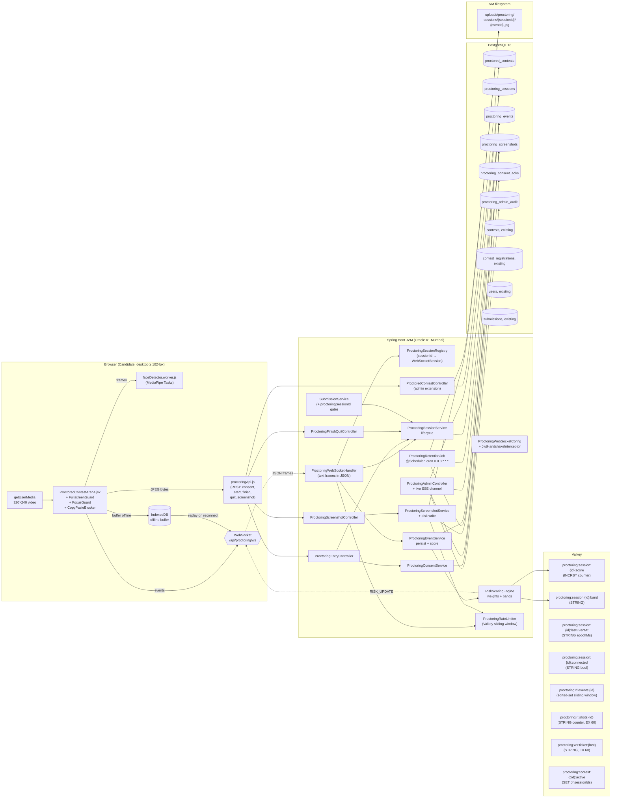
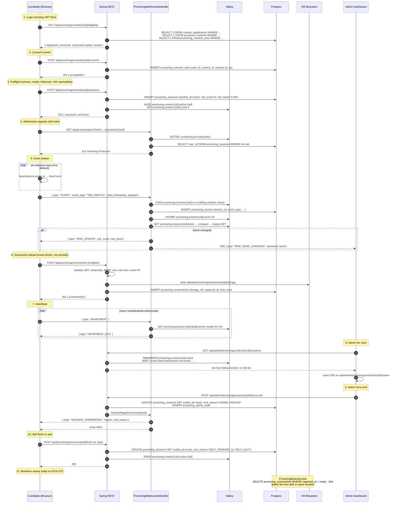
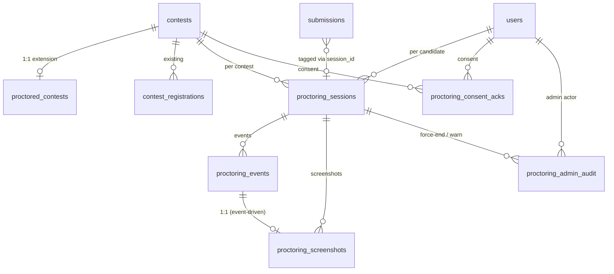
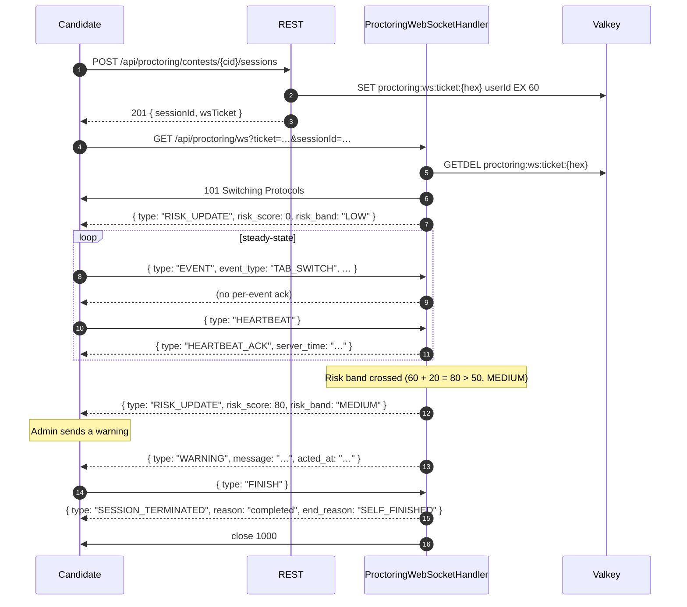
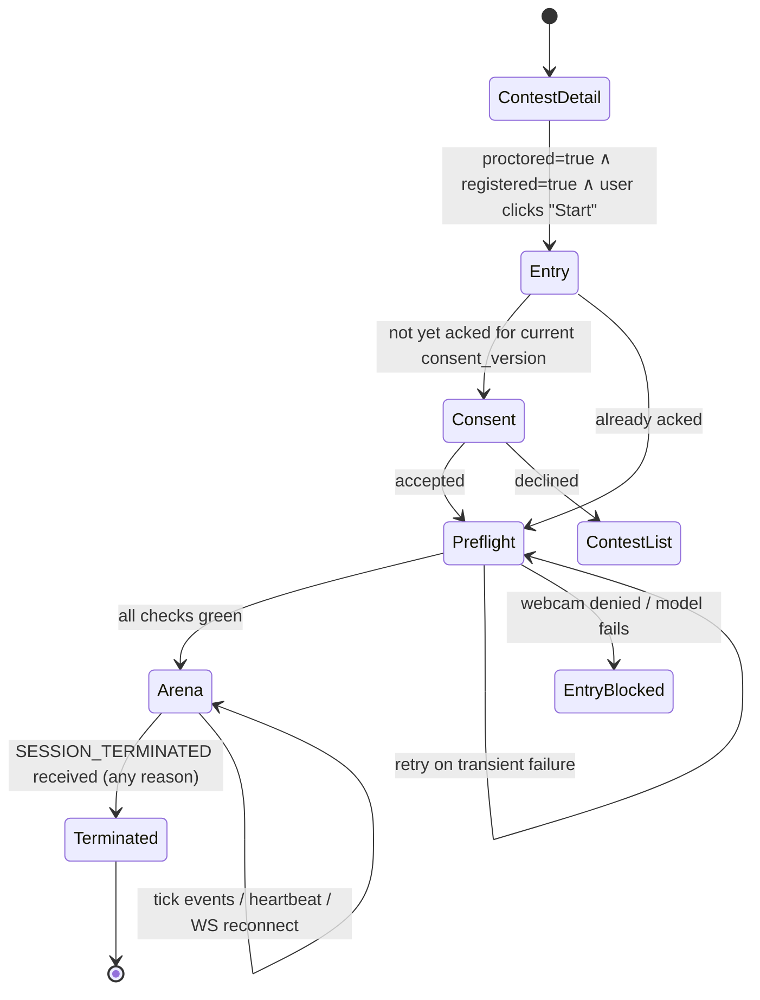

# Design Document — Proctored Contest Mode

## Overview

Proctored Contest Mode adds a lightweight, AI-assisted proctoring layer on top of the existing CodeCombat 2026 contest pipeline (Spring Boot 3.5 / Java 21 / PostgreSQL 18 / Valkey on a single Oracle A1 Mumbai VM, React 19 frontend on Vercel). It is layered, not invasive: existing `contests`, `contest_registrations`, `contest_problems`, `submissions`, and `users` tables are untouched. A new 1:1 extension table `proctored_contests` marks a Contest as proctored. When a candidate enters such a contest the browser enforces fullscreen, blocks copy/paste, runs MediaPipe face detection in a Web Worker, opens a JWT-authenticated WebSocket to `/api/proctoring/ws`, streams suspicious events, and uploads a JPEG screenshot only on suspicious events. The backend persists every event, derives a per-session `risk_score` from a configurable global `Risk_Weight_Config`, surfaces flagged sessions to admins through a live dashboard, and purges screenshots and events at exactly 30 days.

The design reuses the patterns already proven in production:

- The WebSocket handler mirrors `CompilerWebSocketConfig` + `CompilerSessionHandler` — a Spring `WebSocketHandler` registered at `/api/proctoring/ws` with a `HandshakeInterceptor` that authenticates the upgrade via a single-use Valkey ticket (the same `WsTicketService` pattern), captures the real client IP from `X-Forwarded-For`, and binds `(userId, sessionId)` into the WS attributes.
- Submissions inside a proctoring session ride the existing `SubmissionWorkerPool` queue unchanged — `SubmissionJob` gains one nullable `proctoringSessionId` field (mirroring how `duelId` was added in V3) and `SubmissionService` rejects submissions whose session has been force-ended.
- Screenshots write to the local filesystem under `uploads/proctoring/sessions/{session_id}/{event_id}.jpg`, served via the existing `WebConfig` static handler pattern (`/uploads/**`) — but admin viewing is gated through a dedicated streaming controller, never through the public `/uploads/**` path.
- Risk scoring lives entirely in Valkey hot state (`proctoring:session:{id}:score`, `:band`, `:lastEventAt`) with the database as the durable projection — same hot-state-in-Valkey, durable-projection-in-Postgres pattern used by the duel verdict path.
- Flyway migration `V7__proctoring.sql` follows the V5/V6 idempotent style (`CREATE TABLE IF NOT EXISTS`, `DO $$ … EXISTS … END$$` blocks for FKs, `CREATE INDEX IF NOT EXISTS`).

The MVP target is 100 concurrent proctoring sessions on the existing single VM. The design documents the migration path to 1,000 (vertical bump) and 10,000 (horizontal fan-out with Valkey Pub/Sub + S3-compatible screenshot storage). The feature is explicitly **not** a military-grade anti-cheat system: there is no continuous video, no server-side AI inference, no GPU, and no identity verification. The detector architecture is plugin-based so future signals (mobile phone, gaze, audio, object detection) can be added without changing the event, scoring, or storage pipeline.

## Architecture

### System Diagram



The browser holds **one** WebSocket and uses REST for control-plane (consent, session create, finish/quit) and screenshot upload (multipart). The AI runs entirely in the browser — raw video frames never leave the device. Only on a suspicious event does the browser capture one JPEG frame (≤ 256 KB, default 640×480 @ q=0.7) and POST it to the screenshot endpoint.

### End-to-End Data Flow



The dashed lines from the WebSocket handler back to the browser are server-pushed frames (`RISK_UPDATE`, `WARNING`, `SESSION_TERMINATED`, `HEARTBEAT_ACK`, `BUFFER_ACK`). The dashed line from the handler to the admin dashboard is a separate SSE channel used by the admin UI to receive `RISK_BAND_CHANGED` and other live signals — admins do not connect a WebSocket; they consume server-sent events using the same single-use ticket pattern the duel feature already uses.


## Data Models

Six new tables, all created in a single Flyway migration `V7__proctoring.sql`. Style matches V5 (`contest_problems`) and V6 (`contest_registrations`): `CREATE TABLE IF NOT EXISTS`, FKs added in `DO $$ … END$$` guards keyed on `pg_constraint.conname`, indexes via `CREATE INDEX IF NOT EXISTS`. The migration is fully idempotent and replay-safe.

### Entity-Relationship Diagram



### Table specifications

#### `proctored_contests`

The presence of a row marks the linked Contest as proctored. No boolean is added to `contests` (Req 1.1, 1.2). Removing the row reverts the Contest to standard mode (Req 1.4).

| Column | Type | Constraints |
|--------|------|-------------|
| `id` | `bigserial` | PK |
| `contest_id` | `bigint` | NOT NULL, UNIQUE, FK → `contests(id)` ON DELETE CASCADE |
| `created_at` | `timestamp` | NOT NULL DEFAULT NOW() |
| `consent_version` | `integer` | NOT NULL DEFAULT 1 |

Indexes: the UNIQUE on `contest_id` already produces the only index needed. No additional index.

#### `proctoring_sessions`

One row per `(contest_id, user_id)` attempt. Single source of truth for events, screenshots, and submissions made inside a session (Req 13.1, 13.2).

| Column | Type | Constraints |
|--------|------|-------------|
| `id` | `bigserial` | PK |
| `contest_id` | `bigint` | NOT NULL, FK → `contests(id)` |
| `user_id` | `bigint` | NOT NULL, FK → `users(id)` |
| `started_at` | `timestamp` | NOT NULL |
| `ended_at` | `timestamp` | NULL |
| `end_reason` | `varchar(32)` | NULL, CHECK `end_reason IN ('CONTEST_ENDED','SELF_FINISHED','SELF_QUIT','ADMIN_FORCED','HEARTBEAT_TIMEOUT')` |
| `risk_score` | `integer` | NOT NULL DEFAULT 0 |
| `risk_band` | `varchar(8)` | NOT NULL DEFAULT 'LOW', CHECK `risk_band IN ('LOW','MEDIUM','HIGH')` |
| `flagged` | `boolean` | NOT NULL DEFAULT FALSE |
| `client_ip` | `varchar(45)` | NULL (IPv6-safe) |
| `consent_version` | `integer` | NOT NULL |

Constraints / indexes:
- `UNIQUE (contest_id, user_id)` — Req 13.2.
- Index `(contest_id, flagged)` — admin flagged-list query (Req 14.6).
- Index `(user_id, ended_at)` — candidate's history & lockout lookup (Req 13.9, 24.6).
- Implicit FK indexes: Postgres does not auto-create indexes on FK columns; the two indexes above cover the practical query paths so we do not add separate single-column FK indexes.

#### `proctoring_events`

One row per inbound suspicious event frame, including replayed events from the offline buffer. Server-side timestamp is authoritative for retention; client timestamp is preserved for forensics (Req 11.3, 14.1).

| Column | Type | Constraints |
|--------|------|-------------|
| `id` | `bigserial` | PK |
| `session_id` | `bigint` | NOT NULL, FK → `proctoring_sessions(id)` ON DELETE CASCADE |
| `event_type` | `varchar(32)` | NOT NULL |
| `client_timestamp` | `timestamp` | NOT NULL |
| `server_timestamp` | `timestamp` | NOT NULL DEFAULT NOW() |
| `payload_json` | `jsonb` | NULL |
| `replayed` | `boolean` | NOT NULL DEFAULT FALSE |
| `score_delta` | `integer` | NOT NULL DEFAULT 0 |

Indexes:
- `(session_id, server_timestamp)` — per-session timeline (Req 14.4).
- `(event_type, server_timestamp)` — retention sweep filters by age and may filter by type for partial-purge experiments (Req 21.2, 21.4).

`event_type` is intentionally a free-form `varchar(32)` rather than an enum so future detector plugins can register new types without a schema migration (Req 22.2). Unknown types are accepted with `score_delta=0` and a logged warning (Req 22.3).

#### `proctoring_screenshots`

One row per uploaded screenshot. Always linked to a single `event_id` — there is no periodic capture path (Req 8.7, 14.2).

| Column | Type | Constraints |
|--------|------|-------------|
| `id` | `bigserial` | PK |
| `session_id` | `bigint` | NOT NULL, FK → `proctoring_sessions(id)` ON DELETE CASCADE |
| `event_id` | `bigint` | NOT NULL, FK → `proctoring_events(id)` ON DELETE CASCADE |
| `captured_at` | `timestamp` | NOT NULL |
| `mime_type` | `varchar(32)` | NOT NULL |
| `byte_size` | `integer` | NOT NULL |
| `storage_ref` | `varchar(255)` | NOT NULL |

Indexes:
- `(session_id)` — per-session gallery (Req 14.5).
- `(captured_at)` — retention sweep (Req 21.3).

`storage_ref` holds the relative filesystem path under the existing `uploads/` root using the scheme `uploads/proctoring/sessions/{session_id}/{event_id}.jpg`, mirroring how `UserController` writes profile photos to `uploads/profile-photos/`.

#### `proctoring_consent_acks`

Append-only consent log. Re-acceptance for a new `consent_version` writes a new row; the unique constraint allows exactly one ack per `(user, contest, version)` (Req 2.3, 21.1).

| Column | Type | Constraints |
|--------|------|-------------|
| `id` | `bigserial` | PK |
| `user_id` | `bigint` | NOT NULL, FK → `users(id)` |
| `contest_id` | `bigint` | NOT NULL, FK → `contests(id)` |
| `consent_version` | `integer` | NOT NULL |
| `accepted_at` | `timestamp` | NOT NULL DEFAULT NOW() |
| `client_ip` | `varchar(45)` | NULL |
| `user_agent` | `text` | NULL |

Constraint: `UNIQUE (user_id, contest_id, consent_version)`.

#### `proctoring_admin_audit`

Append-only audit table for force-end and warning actions (Req 15.7, 21.5).

| Column | Type | Constraints |
|--------|------|-------------|
| `id` | `bigserial` | PK |
| `admin_id` | `bigint` | NOT NULL, FK → `users(id)` |
| `session_id` | `bigint` | NOT NULL, FK → `proctoring_sessions(id)` |
| `action` | `varchar(16)` | NOT NULL, CHECK `action IN ('FORCE_END','WARNING')` |
| `acted_at` | `timestamp` | NOT NULL DEFAULT NOW() |
| `reason` | `text` | NULL |

### V7 Migration DDL

```sql
-- ─────────────────────────────────────────────────────────────────────────────
-- V7: Proctored Contest Mode
--
-- Adds six tables behind the proctoring layer:
--   - proctored_contests        (1:1 extension on contests)
--   - proctoring_sessions       (one per candidate attempt)
--   - proctoring_events         (per-event log, retained 30 days)
--   - proctoring_screenshots    (per-event JPEG metadata, retained 30 days)
--   - proctoring_consent_acks   (per-(user,contest,version) consent log)
--   - proctoring_admin_audit    (force-end / warning audit)
--
-- No existing tables are altered. Idempotent under IF NOT EXISTS / DO blocks.
-- Style mirrors V5 (contest_problems) and V6 (contest_registrations).
-- ─────────────────────────────────────────────────────────────────────────────

-- ── proctored_contests ──────────────────────────────────────────────────────
CREATE TABLE IF NOT EXISTS public.proctored_contests (
    id              bigserial PRIMARY KEY,
    contest_id      bigint    NOT NULL,
    created_at      timestamp NOT NULL DEFAULT NOW(),
    consent_version integer   NOT NULL DEFAULT 1,
    CONSTRAINT uq_proctored_contests_contest_id UNIQUE (contest_id)
);

DO $$
BEGIN
    IF NOT EXISTS (SELECT 1 FROM pg_constraint WHERE conname = 'fk_pc_contest') THEN
        ALTER TABLE public.proctored_contests
            ADD CONSTRAINT fk_pc_contest
            FOREIGN KEY (contest_id) REFERENCES public.contests(id) ON DELETE CASCADE;
    END IF;
END$$;

-- ── proctoring_sessions ─────────────────────────────────────────────────────
CREATE TABLE IF NOT EXISTS public.proctoring_sessions (
    id               bigserial   PRIMARY KEY,
    contest_id       bigint      NOT NULL,
    user_id          bigint      NOT NULL,
    started_at       timestamp   NOT NULL,
    ended_at         timestamp   NULL,
    end_reason       varchar(32) NULL,
    risk_score       integer     NOT NULL DEFAULT 0,
    risk_band        varchar(8)  NOT NULL DEFAULT 'LOW',
    flagged          boolean     NOT NULL DEFAULT FALSE,
    client_ip        varchar(45) NULL,
    consent_version  integer     NOT NULL,
    CONSTRAINT uq_proctoring_sessions_contest_user UNIQUE (contest_id, user_id),
    CONSTRAINT ck_proctoring_sessions_end_reason CHECK (
        end_reason IS NULL OR end_reason IN
        ('CONTEST_ENDED','SELF_FINISHED','SELF_QUIT','ADMIN_FORCED','HEARTBEAT_TIMEOUT')
    ),
    CONSTRAINT ck_proctoring_sessions_risk_band CHECK (
        risk_band IN ('LOW','MEDIUM','HIGH')
    ),
    CONSTRAINT ck_proctoring_sessions_ended_when_reason CHECK (
        (ended_at IS NULL AND end_reason IS NULL)
        OR (ended_at IS NOT NULL AND end_reason IS NOT NULL)
    )
);

DO $$
BEGIN
    IF NOT EXISTS (SELECT 1 FROM pg_constraint WHERE conname = 'fk_ps_contest') THEN
        ALTER TABLE public.proctoring_sessions
            ADD CONSTRAINT fk_ps_contest
            FOREIGN KEY (contest_id) REFERENCES public.contests(id) ON DELETE CASCADE;
    END IF;
    IF NOT EXISTS (SELECT 1 FROM pg_constraint WHERE conname = 'fk_ps_user') THEN
        ALTER TABLE public.proctoring_sessions
            ADD CONSTRAINT fk_ps_user
            FOREIGN KEY (user_id) REFERENCES public.users(id) ON DELETE CASCADE;
    END IF;
END$$;

CREATE INDEX IF NOT EXISTS idx_ps_contest_flagged ON public.proctoring_sessions (contest_id, flagged);
CREATE INDEX IF NOT EXISTS idx_ps_user_ended      ON public.proctoring_sessions (user_id, ended_at);

-- ── proctoring_events ───────────────────────────────────────────────────────
CREATE TABLE IF NOT EXISTS public.proctoring_events (
    id                bigserial   PRIMARY KEY,
    session_id        bigint      NOT NULL,
    event_type        varchar(32) NOT NULL,
    client_timestamp  timestamp   NOT NULL,
    server_timestamp  timestamp   NOT NULL DEFAULT NOW(),
    payload_json      jsonb       NULL,
    replayed          boolean     NOT NULL DEFAULT FALSE,
    score_delta       integer     NOT NULL DEFAULT 0
);

DO $$
BEGIN
    IF NOT EXISTS (SELECT 1 FROM pg_constraint WHERE conname = 'fk_pe_session') THEN
        ALTER TABLE public.proctoring_events
            ADD CONSTRAINT fk_pe_session
            FOREIGN KEY (session_id) REFERENCES public.proctoring_sessions(id) ON DELETE CASCADE;
    END IF;
END$$;

CREATE INDEX IF NOT EXISTS idx_pe_session_server_ts ON public.proctoring_events (session_id, server_timestamp);
CREATE INDEX IF NOT EXISTS idx_pe_type_server_ts    ON public.proctoring_events (event_type, server_timestamp);

-- ── proctoring_screenshots ──────────────────────────────────────────────────
CREATE TABLE IF NOT EXISTS public.proctoring_screenshots (
    id            bigserial    PRIMARY KEY,
    session_id    bigint       NOT NULL,
    event_id      bigint       NOT NULL,
    captured_at   timestamp    NOT NULL,
    mime_type     varchar(32)  NOT NULL,
    byte_size     integer      NOT NULL,
    storage_ref   varchar(255) NOT NULL
);

DO $$
BEGIN
    IF NOT EXISTS (SELECT 1 FROM pg_constraint WHERE conname = 'fk_pshot_session') THEN
        ALTER TABLE public.proctoring_screenshots
            ADD CONSTRAINT fk_pshot_session
            FOREIGN KEY (session_id) REFERENCES public.proctoring_sessions(id) ON DELETE CASCADE;
    END IF;
    IF NOT EXISTS (SELECT 1 FROM pg_constraint WHERE conname = 'fk_pshot_event') THEN
        ALTER TABLE public.proctoring_screenshots
            ADD CONSTRAINT fk_pshot_event
            FOREIGN KEY (event_id) REFERENCES public.proctoring_events(id) ON DELETE CASCADE;
    END IF;
END$$;

CREATE INDEX IF NOT EXISTS idx_pshot_session     ON public.proctoring_screenshots (session_id);
CREATE INDEX IF NOT EXISTS idx_pshot_captured_at ON public.proctoring_screenshots (captured_at);

-- ── proctoring_consent_acks ─────────────────────────────────────────────────
CREATE TABLE IF NOT EXISTS public.proctoring_consent_acks (
    id              bigserial    PRIMARY KEY,
    user_id         bigint       NOT NULL,
    contest_id      bigint       NOT NULL,
    consent_version integer      NOT NULL,
    accepted_at     timestamp    NOT NULL DEFAULT NOW(),
    client_ip       varchar(45)  NULL,
    user_agent      text         NULL,
    CONSTRAINT uq_pca_user_contest_version UNIQUE (user_id, contest_id, consent_version)
);

DO $$
BEGIN
    IF NOT EXISTS (SELECT 1 FROM pg_constraint WHERE conname = 'fk_pca_user') THEN
        ALTER TABLE public.proctoring_consent_acks
            ADD CONSTRAINT fk_pca_user
            FOREIGN KEY (user_id) REFERENCES public.users(id) ON DELETE CASCADE;
    END IF;
    IF NOT EXISTS (SELECT 1 FROM pg_constraint WHERE conname = 'fk_pca_contest') THEN
        ALTER TABLE public.proctoring_consent_acks
            ADD CONSTRAINT fk_pca_contest
            FOREIGN KEY (contest_id) REFERENCES public.contests(id) ON DELETE CASCADE;
    END IF;
END$$;

-- ── proctoring_admin_audit ──────────────────────────────────────────────────
CREATE TABLE IF NOT EXISTS public.proctoring_admin_audit (
    id          bigserial   PRIMARY KEY,
    admin_id    bigint      NOT NULL,
    session_id  bigint      NOT NULL,
    action      varchar(16) NOT NULL,
    acted_at    timestamp   NOT NULL DEFAULT NOW(),
    reason      text        NULL,
    CONSTRAINT ck_paa_action CHECK (action IN ('FORCE_END','WARNING'))
);

DO $$
BEGIN
    IF NOT EXISTS (SELECT 1 FROM pg_constraint WHERE conname = 'fk_paa_admin') THEN
        ALTER TABLE public.proctoring_admin_audit
            ADD CONSTRAINT fk_paa_admin
            FOREIGN KEY (admin_id) REFERENCES public.users(id);
    END IF;
    IF NOT EXISTS (SELECT 1 FROM pg_constraint WHERE conname = 'fk_paa_session') THEN
        ALTER TABLE public.proctoring_admin_audit
            ADD CONSTRAINT fk_paa_session
            FOREIGN KEY (session_id) REFERENCES public.proctoring_sessions(id) ON DELETE CASCADE;
    END IF;
END$$;

CREATE INDEX IF NOT EXISTS idx_paa_session ON public.proctoring_admin_audit (session_id);
```

`spring.jpa.hibernate.ddl-auto=validate` continues to hold: every column on the new entities maps exactly one-to-one to the columns above. No backfill SQL is required because there are no historical rows to migrate.


## Components and Interfaces

All new code lives under a dedicated package `com.example.codecombat2026.proctoring.*` to keep the proctoring layer cleanly isolated from the existing flat package layout. Spring component scan (`@SpringBootApplication` on `Codecombat2026Application` defaults to scanning `com.example.codecombat2026`) picks the package up automatically — no `@ComponentScan` change required.

```
src/main/java/com/example/codecombat2026/proctoring/
├── entity/
│   ├── ProctoredContest.java
│   ├── ProctoringSession.java
│   ├── ProctoringEvent.java
│   ├── ProctoringScreenshot.java
│   ├── ProctoringConsentAck.java
│   └── ProctoringAdminAudit.java
├── repository/
│   ├── ProctoredContestRepository.java
│   ├── ProctoringSessionRepository.java
│   ├── ProctoringEventRepository.java
│   ├── ProctoringScreenshotRepository.java
│   ├── ProctoringConsentRepository.java
│   └── ProctoringAdminAuditRepository.java
├── service/
│   ├── ProctoringSessionService.java
│   ├── ProctoringEventService.java
│   ├── ProctoringScreenshotService.java
│   ├── ProctoringConsentService.java
│   ├── RiskScoringEngine.java
│   ├── ProctoringRateLimiter.java
│   └── ProctoringRetentionJob.java
├── ws/
│   ├── ProctoringWebSocketConfig.java
│   ├── ProctoringWebSocketHandler.java
│   ├── ProctoringSessionRegistry.java
│   ├── ProctoringWsTicketService.java
│   └── frame/
│       ├── InboundFrame.java
│       ├── OutboundFrame.java
│       ├── EventFrame.java
│       ├── HeartbeatFrame.java
│       ├── RiskUpdateFrame.java
│       ├── WarningFrame.java
│       └── SessionTerminatedFrame.java
├── controller/
│   ├── ProctoredContestController.java
│   ├── ProctoringEntryController.java
│   ├── ProctoringScreenshotController.java
│   ├── ProctoringFinishQuitController.java
│   └── ProctoringAdminController.java
├── dto/
│   └── … (one file per request/response type)
└── config/
    └── ProctoringConfig.java
```

### Entities (1–3 lines each)

- **`ProctoredContest`** — `@Entity @Table(name="proctored_contests")` with fields `id`, `contestId`, `createdAt`, `consentVersion`. The 1:1 link to `Contest` is by-id (no JPA association) to keep the existing `Contest` entity untouched. Validates Req 1.1.
- **`ProctoringSession`** — `@Entity @Table(name="proctoring_sessions")` with fields `id`, `contestId`, `userId`, `startedAt`, `endedAt`, `endReason` (enum `EndReason`), `riskScore`, `riskBand` (enum), `flagged`, `clientIp`, `consentVersion`. Validates Req 13.1.
- **`ProctoringEvent`** — `@Entity @Table(name="proctoring_events")`, `payloadJson` mapped to `String` and parsed by Jackson on read. `replayed` flag distinguishes real-time from buffered-and-replayed frames (Req 11.3, 14.1).
- **`ProctoringScreenshot`** — `@Entity @Table(name="proctoring_screenshots")` with `storageRef`, `byteSize`, `mimeType`. The actual JPEG bytes live on disk, never in the DB (Req 14.3).
- **`ProctoringConsentAck`** — `@Entity @Table(name="proctoring_consent_acks")` (Req 2.3).
- **`ProctoringAdminAudit`** — `@Entity @Table(name="proctoring_admin_audit")` (Req 15.7, 21.5).

`EndReason` and `RiskBand` are Java enums mapped to the Postgres `varchar` columns via `@Enumerated(EnumType.STRING)` so the database CHECK constraints stay authoritative.

### Repositories

All extend `JpaRepository<…, Long>` and add a small number of query methods. The notable ones:

- **`ProctoredContestRepository`** — `findByContestId(Long contestId)`, `existsByContestId(Long contestId)` (Req 1.6 derived `proctored` flag).
- **`ProctoringSessionRepository`** — `findByContestIdAndUserId`, `findActiveByContestIdAndUserId` (where `endedAt IS NULL`), `findByContestIdAndFlagged`, `findByContestIdAndEndedAtIsNull`, `existsByUserIdAndContestIdAndEndReasonIn(Long, Long, Collection<EndReason>)` for the lockout check (Req 13.9, 24.6).
- **`ProctoringEventRepository`** — `findBySessionIdOrderByServerTimestampAsc`, `deleteByServerTimestampBefore(Instant cutoff)` for retention (Req 21.2).
- **`ProctoringScreenshotRepository`** — `findBySessionIdOrderByCapturedAtAsc`, `findByCapturedAtBefore(Instant cutoff, Pageable page)` so the retention job can iterate in batches.
- **`ProctoringConsentRepository`** — `existsByUserIdAndContestIdAndConsentVersion(Long, Long, Integer)` (Req 2.6).
- **`ProctoringAdminAuditRepository`** — `findBySessionIdOrderByActedAtDesc`.

### Services

#### `ProctoringSessionService` (Req 13)

The single source of truth for session lifecycle. Public surface:

```java
public class ProctoringSessionService {
    SessionView createSession(Long contestId, Long userId, String clientIp, int consentVersion);
    SessionView getActiveSession(Long sessionId, Long requestingUserId);
    void finish(Long sessionId, Long requestingUserId);    // SELF_FINISHED
    void quit(Long sessionId, Long requestingUserId);      // SELF_QUIT + lockout
    void forceEnd(Long sessionId, Long adminId, String reason);  // ADMIN_FORCED + lockout
    void heartbeatTimeout(Long sessionId);                 // HEARTBEAT_TIMEOUT + lockout
    void closeAllForContest(Long contestId);               // CONTEST_ENDED on end_time reached
    boolean isLocked(Long contestId, Long userId);         // existsByUserIdAndContestIdAndEndReasonIn
}
```

All terminating methods follow the same conditional-update pattern as the duel module: `UPDATE proctoring_sessions SET ended_at=now(), end_reason=:reason WHERE id=:id AND ended_at IS NULL`. The check on `ended_at IS NULL` makes the operation idempotent — a duplicate close (e.g. simultaneous force-end from two admin tabs) returns `0` rows and is silently no-op'd.

The lockout check (`isLocked`) is consulted at session creation and again at submission time (Req 13.9, 19.3). It returns true when an existing session for `(user_id, contest_id)` has `end_reason IN ('ADMIN_FORCED','SELF_QUIT','HEARTBEAT_TIMEOUT')`.

JVM-restart recovery: at startup, `@PostConstruct` runs `UPDATE proctoring_sessions SET ended_at=now(), end_reason='HEARTBEAT_TIMEOUT' WHERE ended_at IS NULL` to finalize any sessions that were active when the JVM died. This is the conservative choice — a candidate who reconnects after a restart sees the lockout and is told the session ended.

A scheduled `@Scheduled(fixedDelay = 30_000)` sweep runs `closeAllForContest(contestId)` on every contest whose `end_time < now()` and that has `proctoring_sessions WHERE ended_at IS NULL`. This satisfies Req 13.5 without requiring per-contest timers.

#### `ProctoringEventService` (Req 9, 12, 22)

Handles the core inbound event path:

```java
public class ProctoringEventService {
    Long ingest(Long sessionId, EventFrame frame, boolean replayed);
}
```

`ingest` runs in this order:
1. `RiskScoringEngine.weightFor(eventType)` → `score_delta` (zero for unknown types, with a single warning log per unknown type per JVM lifetime — Req 22.3).
2. Insert `proctoring_events` row.
3. `riskEngine.applyDelta(sessionId, scoreDelta)` (Valkey INCRBY).
4. If band crossed (returned by step 3), `riskEngine.persistBand(sessionId, newBand)` (DB UPDATE) and broadcast `RISK_UPDATE` to candidate WS + `RISK_BAND_CHANGED` to admin SSE.
5. Return the inserted event id (so the screenshot upload path can FK to it).

Replayed events are persisted with `replayed=TRUE`. They follow the same scoring path; idempotency on replay is achieved via a soft dedup key in Valkey: `proctoring:dedup:{sessionId}:{client_timestamp_ms}:{event_type}` set with `SETNX EX 600` — if already present, the event row is still inserted (forensic audit trail) but `score_delta` is set to `0` to avoid double-scoring (Req 11.2, 11.3 read in conjunction with the scoring determinism in Req 12.7).

#### `ProctoringScreenshotService` (Req 8, 17)

Owns disk write and validation:

```java
public class ProctoringScreenshotService {
    Long upload(Long sessionId, Long eventId, Instant capturedAt,
                String mimeType, byte[] bytes, Long uploadingUserId);
    Resource serveAdmin(Long screenshotId);
}
```

`upload` order matches the security requirement (Req 11):
1. Verify session ownership (`session.userId == uploadingUserId`).
2. Verify session is active (`endedAt IS NULL`).
3. Verify MIME in whitelist `{image/jpeg, image/png}` (Req 8.5).
4. Verify byte size ≤ `maxScreenshotBytes` (Req 8.4).
5. Magic-byte sniff: first 3 bytes match `FF D8 FF` (JPEG SOI) or first 8 bytes match `89 50 4E 47 0D 0A 1A 0A` (PNG signature). Reject if Content-Type and magic bytes disagree (defense against MIME spoofing).
6. Verify `event_id` belongs to `session_id` (FK round-trip).
7. Rate-limit check (Req 17.4).
8. Compute disk path from validated integers only: `Paths.get("uploads/proctoring/sessions", String.valueOf(sessionId), eventId + ".jpg")`. **Never** accept a user-supplied filename — path traversal is impossible because the path is built entirely from validated `Long` inputs.
9. `Files.createDirectories(parent)` + `Files.write(path, bytes, CREATE, WRITE, TRUNCATE_EXISTING)`.
10. Insert `proctoring_screenshots` row with `storage_ref = "uploads/proctoring/sessions/" + sessionId + "/" + eventId + ".jpg"` (Req 14.3).

`serveAdmin` reads the row, verifies the file exists, and streams it. The controller wraps it with `Content-Type` from the row and `Cache-Control: private, no-store`.

#### `RiskScoringEngine` (Req 12)

Pure-function band classifier plus Valkey-backed counters:

```java
public class RiskScoringEngine {
    int weightFor(String eventType);                    // returns 0 for unknown
    RiskBand bandFor(int score);                        // pure
    RiskUpdate applyDelta(Long sessionId, int delta);   // INCRBY + band compare
    void persistBand(Long sessionId, RiskBand newBand); // DB UPDATE
    int rescore(Long sessionId);                        // replay event log
}
```

Weights are loaded from `ProctoringConfig.weights` (defaults from Req 12.2). The `RiskUpdate` record returned by `applyDelta` is `(int newScore, RiskBand oldBand, RiskBand newBand, boolean changed)`. The handler observes `changed` and decides whether to broadcast `RISK_UPDATE` and `RISK_BAND_CHANGED` (Req 12.5).

`bandFor` is a pure function:
- `score ≤ lowMax (50)` → LOW
- `score ≤ mediumMax (100)` → MEDIUM
- otherwise → HIGH

`rescore` (Req 12.8) replays the persisted event log via `eventRepo.findBySessionIdOrderByServerTimestampAsc`, sums weights, writes the result to both Valkey and the DB, and emits a single `RISK_UPDATE` to any active WS plus `RISK_BAND_CHANGED` to admin SSE if the band changed.

#### `ProctoringRateLimiter` (Req 17)

Two limiters in one class, both Valkey-backed:

- **Event frames**: sliding-window via sorted set. `ZADD proctoring:rl:events:{sid} ts ts; ZREMRANGEBYSCORE … 0 ts-10000; ZCARD …` — admit if cardinality ≤ `eventRateLimitPerSecond * 10` (Req 17.2). On rejection, increment `proctoring:rl:events:{sid}:notified` once per 10-s window and emit `RATE_LIMIT_EXCEEDED` (Req 17.3).
- **Screenshot uploads**: per-minute counter with `INCR proctoring:rl:shots:{sid}; EXPIRE … 60 NX` — admit if value ≤ `screenshotRateLimitPerMinute` (Req 17.4). On overflow respond `429 Too Many Requests` with `Retry-After: 60` (Req 17.5).

Both limiters fail open on Valkey errors (consistent with `CompilerSessionHandler.allowSession` and `AuthRateLimiterService` behavior) so Valkey downtime does not lock candidates out mid-contest.

#### `ProctoringRetentionJob` (Req 21)

Single `@Scheduled(cron = "0 0 3 * * *", zone = "Asia/Kolkata")` method (3 AM IST daily — confirmed against the existing TimeUtil pattern). Iterates in batches of 500:

```java
@Scheduled(cron = "0 0 3 * * *", zone = "Asia/Kolkata")
public void purge() {
    Instant cutoff = Instant.now().minus(Duration.ofDays(30));
    int totalShots = 0;
    int totalEvents = 0;
    while (true) {
        Page<ProctoringScreenshot> batch = shotRepo.findByCapturedAtBefore(cutoff, PageRequest.of(0, 500));
        if (batch.isEmpty()) break;
        for (ProctoringScreenshot s : batch.getContent()) {
            try { Files.deleteIfExists(Paths.get(s.getStorageRef())); }
            catch (IOException e) { log.warn("Failed to delete {}", s.getStorageRef(), e); }
        }
        shotRepo.deleteAllInBatch(batch.getContent());
        totalShots += batch.getNumberOfElements();
    }
    totalEvents = eventRepo.deleteByServerTimestampBefore(cutoff);
    log.info("Proctoring retention purge: {} screenshots, {} events", totalShots, totalEvents);
}
```

The 30-day window is exact (Req 21.2). Files that fail to delete on disk leave their DB row in place for the next run — acceptable because the FS is the canonical "did it actually disappear" signal and we want a clean retry, not silent loss of audit.

### WebSocket Layer

#### `ProctoringWebSocketConfig`

Mirrors `CompilerWebSocketConfig` exactly:

```java
@Configuration
@EnableWebSocket
public class ProctoringWebSocketConfig implements WebSocketConfigurer {
    @Override
    public void registerWebSocketHandlers(WebSocketHandlerRegistry registry) {
        registry.addHandler(handler, "/api/proctoring/ws")
                .addInterceptors(new ProctoringHandshakeInterceptor(ticketService, sessionRepo))
                .setAllowedOriginPatterns(allowedOrigins.split(","));  // not "*" — see security
    }
}
```

The handshake interceptor:
1. Captures `X-Forwarded-For[0]` into `attrs["ip"]` (same pattern as compiler).
2. Reads `?ticket=…` and `?sessionId=…` query params.
3. `ticketService.consume(ticket)` → returns `userId` or rejects with HTTP 401 (close code 4401 once upgraded — see protocol).
4. Loads the session, verifies `session.userId == userId`, verifies `session.endedAt IS NULL`. Rejects mismatches.
5. Stores `userId`, `sessionId`, `contestId`, `ip` in `attrs`.

#### `ProctoringWebSocketHandler`

`extends TextWebSocketHandler` (matching `CompilerSessionHandler`'s base class). Responsibilities:

- `afterConnectionEstablished`: register the session in `ProctoringSessionRegistry`, send initial `RISK_UPDATE` from current Valkey state, schedule a per-session heartbeat-timeout task on `heartbeatTimeoutScheduler`.
- `handleTextMessage`: parse JSON, dispatch by `type`:
  - `EVENT` → validate payload size (`maxEventBytes`, default 4096); rate-limit; route to `ProctoringEventService.ingest`; on success ACK is implicit (no per-event ACK frame); if score band crossed, push `RISK_UPDATE`.
  - `HEARTBEAT` → reset the heartbeat-timeout task; respond `HEARTBEAT_ACK`.
  - `FINISH` → call `ProctoringSessionService.finish`; respond `SESSION_TERMINATED { reason: "completed", end_reason: "SELF_FINISHED" }`; close cleanly.
  - `QUIT` → call `ProctoringSessionService.quit`; respond `SESSION_TERMINATED { reason: "quit", end_reason: "SELF_QUIT" }`; close cleanly.
- `afterConnectionClosed` / `handleTransportError`: deregister from registry; the session itself is **not** terminated (the candidate may reconnect within `maxOfflineSeconds`).

The handler is the `Component` injected by `ProctoringWebSocketConfig`. JVM-singleton — there is exactly one in-process instance.

#### `ProctoringSessionRegistry`

In-memory `ConcurrentHashMap<Long /*sessionId*/, WebSocketSession>` plus its inverse for cleanup. Public surface:

```java
public class ProctoringSessionRegistry {
    void register(Long sessionId, WebSocketSession ws);
    boolean isConnected(Long sessionId);
    void send(Long sessionId, OutboundFrame frame);
    void terminate(Long sessionId, String reason, EndReason endReason, int closeCode);
    void unregister(Long sessionId);
    Set<Long> connectedSessionIds();
}
```

`register` rejects a second connection for the same `sessionId` by closing the new connection with code `4409` and leaving the existing one intact (Req 9.4). `terminate` is the path used by admin force-end and contest-end: send a `SESSION_TERMINATED` frame, then close with the supplied close code (4003 for admin, 4408 for heartbeat timeout — see Close Codes).

For the MVP single-instance deployment the in-memory map is the source of truth for "who is connected". The Valkey key `proctoring:session:{id}:connected` is a derived projection updated on register/unregister so admin dashboard reads do not have to call into the registry.

#### `ProctoringWsTicketService`

Functionally identical to the existing `WsTicketService` but lives in the proctoring package and uses key prefix `proctoring:ws:ticket:` so a ticket minted for the proctoring WS cannot be replayed against the compiler WS and vice-versa. 32-byte hex, 60 s TTL, GETDEL on consume, fail-closed on Valkey errors.

### Controllers

- **`ProctoredContestController`** — `@RequestMapping("/api/admin/proctoring/contests")`, all endpoints `@PreAuthorize("hasRole('ADMIN')")`. Implements add/remove of the `proctored_contests` row with the `UPCOMING`-only state guard (Req 1.4, 1.5) — the guard is a single SQL: `SELECT status FROM contests WHERE id = ?`, reject with 409 if `status != 'UPCOMING'`.
- **`ProctoringEntryController`** — `@RequestMapping("/api/proctoring")`, candidate-facing. Eligibility check, consent acknowledgement, session creation. Returns the `wsTicket` from `ProctoringWsTicketService` together with the `sessionId` (Req 2, 3, 13.3).
- **`ProctoringScreenshotController`** — `POST /api/proctoring/screenshots` (multipart, candidate auth) and `GET /api/admin/proctoring/sessions/{id}/screenshots/{shotId}` (admin auth). Streams bytes via `ResourceHttpRequestHandler` pattern.
- **`ProctoringFinishQuitController`** — `POST /api/proctoring/sessions/{id}/finish` and `/quit`. These mirror the WebSocket `FINISH`/`QUIT` frames so a candidate can end a session even if the WS is currently down (e.g. inside the offline modal). Both close the WS via `ProctoringSessionRegistry.terminate` if connected.
- **`ProctoringAdminController`** — `@RequestMapping("/api/admin/proctoring")`, all `@PreAuthorize("hasRole('ADMIN')")`. Live list, drill-down, force-end, warning, rescore, plus the SSE channel `GET /api/admin/proctoring/contests/{cid}/stream` for the live dashboard. SSE auth uses a single-use ticket from the existing `SseTicketService` — same pattern as `/api/duels/*/stream`.

### `ProctoringConfig`

```java
@Configuration
@ConfigurationProperties(prefix = "proctoring")
@Data
public class ProctoringConfig {
    private int     noFaceThresholdSeconds      = 5;
    private int     aiInferenceIntervalMs       = 1000;
    private int     heartbeatIntervalSeconds    = 15;
    private int     heartbeatTimeoutSeconds     = 45;
    private int     maxOfflineSeconds           = 60;
    private int     maxOfflineEvents            = 1000;
    private int     maxEventBytes               = 4096;
    private int     maxScreenshotBytes          = 262144;
    private int     screenshotMaxWidth          = 640;
    private int     screenshotMaxHeight         = 480;
    private double  screenshotJpegQuality       = 0.7;
    private int     eventRateLimitPerSecond     = 30;
    private int     screenshotRateLimitPerMinute = 10;
    private Map<String, Integer> weights = defaultWeights();
    private Bands   bands                = new Bands();   // lowMax=50, mediumMax=100

    private static Map<String, Integer> defaultWeights() { /* Req 12.2 */ }
}
```

Loaded by Spring's standard `@ConfigurationProperties` flow (Req 20.2). Keys in `application.properties` use the `proctoring.` prefix (e.g. `proctoring.no-face-threshold-seconds=5`) and can be overridden by env vars in `.env.production-vm` (e.g. `PROCTORING_NO_FACE_THRESHOLD_SECONDS=5`). Spring's relaxed binding handles both kebab-case in properties and SCREAMING_SNAKE_CASE in env vars.

### Submission Integration

`SubmissionJob` gains one nullable field:

```java
public class SubmissionJob {
    // … existing fields …
    private Long proctoringSessionId;   // null for non-proctored submissions; Req 19.2
}
```

`SubmissionService.submitCodeAsync` accepts an optional `proctoringSessionId` (set when the candidate is currently inside a proctoring session). Before enqueueing, it consults `ProctoringSessionService.isLocked(contestId, userId)` — if true, throws `ProctoringLockoutException` mapped to HTTP 403 by `GlobalExceptionHandler` (Req 19.3).

`SubmissionWorkerPool.finalizeAndNotify` is otherwise unchanged. The proctoring session id is persisted on `submissions` via a new nullable column `proctoring_session_id` — but this column is added in V7 only if Req 19.2 ("tag every submission with the session_id") demands a queryable column. **Decision**: rather than altering `submissions` (a hot, large table), the join is done through `proctoring_events.payload_json` for the `SUBMISSION_RECORDED` event the candidate emits over the WS at submission time, and via the existing per-user `submissions` table joined on `(user_id, contest_id, submitted_at BETWEEN session.started_at AND coalesce(session.ended_at, now()))`. This keeps `submissions` untouched (Req 19.1's "unchanged" guarantee) and gives the admin drill-down the join it needs (Req 19.4). This is documented in the Open Design Questions section as the only debatable choice in this area.


## WebSocket Protocol

### Endpoint and Handshake

`GET /api/proctoring/ws?ticket={hex}&sessionId={id}` — upgraded by Spring's WebSocket support to a `WebSocketSession`. Authentication uses a single-use Valkey ticket minted by a candidate REST call, **not** a JWT in the query string.

**Why a ticket and not a header.** Browsers cannot set `Authorization` headers on the native `WebSocket` constructor. The two practical options are: (a) put the JWT in the URL as a query parameter, or (b) mint a single-use, short-TTL ticket from an authenticated REST call and pass that. The repository already standardised on option (b) via `WsTicketService` for the compiler WS and `SseTicketService` for SSE streams. We follow the same pattern. Mitigations baked in:

- TLS only — the ticket is encrypted in transit; raw TCP between the browser and the load balancer never carries the value.
- Short TTL (60 s) — mints to consume window is bounded.
- One-shot consume (`GETDEL` atomic) — even if a ticket appears in a proxy access log, it is already useless.
- No JWT ever appears in a WebSocket URL — ticket-only.
- nginx access-log redaction is documented in the deployment plan: drop the `query_string` field from the `/api/proctoring/ws` location block.

If the ticket is missing, malformed, expired, or already used, the handshake interceptor returns HTTP 401 at the upgrade layer (the WebSocket is never established). For tickets that pass but reference a session that has since ended or whose `userId` does not match the session row, the interceptor returns HTTP 401 likewise. Once upgraded, the equivalent close codes (4401, 4403) are used for in-band failures (e.g. JWT expiry detected on the next REST call for the user, see Req 16.5).

### Frame Format

Every frame is a JSON text message with at least:

```json
{ "type": "FRAME_TYPE", … }
```

`type` is uppercase, snake-cased on multi-word names. The handler tolerates unknown `type` values (drops them with a debug log) so that a future detector can introduce a new client-side frame type without a server release blocking it.

### Client → Server frames

| Type | Payload | Notes |
|------|---------|-------|
| `EVENT` | `{ "event_type": "TAB_SWITCH", "client_timestamp": "2025-…", "payload": {…}, "replayed": false }` | The full set of `event_type` values is documented under Risk Engine. `replayed` defaults to false; set to true by the offline-buffer replay path (Req 11.3). |
| `HEARTBEAT` | `{}` | Sent every `heartbeatIntervalSeconds`. Server resets the heartbeat-timeout task and replies `HEARTBEAT_ACK`. |
| `FINISH` | `{}` | Closes the session as `SELF_FINISHED`. |
| `QUIT` | `{}` | Closes the session as `SELF_QUIT` and applies lockout. |

Example `EVENT`:

```json
{
  "type": "EVENT",
  "event_type": "MULTIPLE_FACES",
  "client_timestamp": "2025-01-15T10:23:45.123Z",
  "payload": { "face_count": 3, "confidence": 0.91 },
  "replayed": false
}
```

### Server → Client frames

| Type | Payload | Sent when |
|------|---------|-----------|
| `RISK_UPDATE` | `{ "risk_score": 75, "risk_band": "MEDIUM" }` | After every band crossing (Req 10.1) and as the very first server frame after handshake. |
| `WARNING` | `{ "admin_id": 12, "message": "Please remain visible to the camera.", "acted_at": "…" }` | Admin sends a non-terminating warning (Req 10.3). |
| `SESSION_TERMINATED` | `{ "reason": "Force-ended by admin", "end_reason": "ADMIN_FORCED" }` | Immediately before the server closes the WebSocket (Req 10.2, 10.4). |
| `BUFFER_ACK` | `{ "replayed_count": 23 }` | After a replayed batch is fully ingested. Lets the frontend purge the corresponding IndexedDB rows. |
| `HEARTBEAT_ACK` | `{ "server_time": "…" }` | Reply to every `HEARTBEAT`. |
| `RATE_LIMIT_EXCEEDED` | `{ "window_seconds": 10 }` | Single emit per window when the candidate exceeds the event rate (Req 17.3). |

Example `RISK_UPDATE`:

```json
{
  "type": "RISK_UPDATE",
  "risk_score": 75,
  "risk_band": "MEDIUM"
}
```

### Close Codes

| Code | Meaning | Direction |
|------|---------|-----------|
| `1000` | Normal closure (after `FINISH`/`QUIT` or admin force-end after `SESSION_TERMINATED` is sent) | Server / Client |
| `4003` | Admin force-end | Server (Req 10.2) |
| `4401` | Unauthenticated (ticket missing/invalid/expired) | Server (Req 9.2, 16.5) |
| `4403` | Forbidden (session does not belong to this user, session ended) | Server |
| `4408` | Heartbeat timeout exceeded | Server (Req 9.8) |
| `4409` | Duplicate connection for an already-bound session | Server (Req 9.4) |
| `4413` | Inbound frame exceeds `maxEventBytes` | Server (Req 17.6) |
| `4500` | Unhandled server error | Server |

These codes are encoded as `CloseStatus(4000+offset, reason)` on the Java side, matching the IANA convention that codes ≥ 4000 are application-defined.

### Normal Session Sequence



### Reconnection Strategy

The frontend hook `useProctoringSocket` implements exponential backoff with jitter:

```
delays = [1000, 2000, 4000, 8000, 16000, 30000, 30000, …]   // ms
delay  = delays[attempt] * (0.5 + Math.random())            // 50% jitter
```

Maximum cap 30 s. While disconnected, every emitted event is enqueued in IndexedDB with its `client_timestamp`. On reconnect:

1. Exchange a **new** ws ticket via `POST /api/proctoring/sessions/{sid}/ws-ticket` (the original one is single-use and was consumed by the first connection).
2. Open the WebSocket. The server emits the initial `RISK_UPDATE` from the current Valkey state.
3. Drain IndexedDB in `client_timestamp` order, setting `replayed: true` on each frame. Send up to 100 events per second to avoid hitting the rate limit during burst replay.
4. After the last replayed event, the server emits `BUFFER_ACK`. The frontend deletes the replayed IndexedDB rows.
5. Switch to live mode.

The server idempotently accepts replayed events and uses a soft dedup key on `(session_id, client_timestamp_ms, event_type)` (Valkey `SETNX` with 600 s TTL) so a second replay (e.g. after the frontend crashed mid-replay) does not double-count score (Req 11.2, 11.3, 12.7).

If reconnect fails for more than `maxOfflineSeconds` (default 60 s), the frontend shows a blocking modal that pauses the editor (Req 11.5). The candidate cannot submit while the modal is up.


## Risk Scoring Engine

### Default Weights (Req 12.2)

| `event_type` | `score_delta` |
|--------------|---------------|
| `TAB_SWITCH` | 20 |
| `WINDOW_BLUR` | 10 |
| `FULLSCREEN_EXIT` | 30 |
| `MULTIPLE_FACES` | 50 |
| `NO_FACE` | 40 |
| `COPY_ATTEMPT` | 5 |
| `CUT_ATTEMPT` | 5 |
| `PASTE_ATTEMPT` | 15 |
| `CONTEXT_MENU_ATTEMPT` | 2 |
| `WEBCAM_PERMISSION_DENIED` | 0 (preflight only — never reaches scoring) |
| `WEBCAM_STREAM_LOST` | 40 |
| `DEVTOOLS_OPEN` | 30 |
| `HEARTBEAT_TIMEOUT` | 20 |
| `BUFFER_OVERFLOW` | 10 |
| `RATE_LIMIT_EXCEEDED` | 0 (logged only) |
| `FOCUS_RESTORED` | 0 (informational) |
| `FACE_STATE_RESTORED` | 0 (informational) |

Unknown `event_type` → `0` with a single warning log per (type, JVM lifetime) tuple (Req 22.3). New types added via `proctoring.weights` config keys take effect on the next config refresh without a code change (Req 22.2).

### Band Calculation

```java
public RiskBand bandFor(int score) {
    if (score <= bands.lowMax)    return RiskBand.LOW;     // 0..50
    if (score <= bands.mediumMax) return RiskBand.MEDIUM;  // 51..100
    return RiskBand.HIGH;                                  // >100
}
```

Pure function — no I/O, no side effects, fully deterministic on `score` alone (Req 12.7).

### Valkey Key Map

| Key | Type | TTL | Purpose | Eviction implication |
|-----|------|-----|---------|----------------------|
| `proctoring:session:{sid}:score` | STRING (`INCRBY` counter, integer) | unset; cleaned on session close | Hot copy of current `risk_score` for live admin dashboard (Req 18.1). | Eviction → next event re-INCRBY rebuilds from 0 plus delta. To handle this race, `RiskScoringEngine.applyDelta` calls `INCRBY` and **also** asserts the result is monotonic; if it returned a value lower than the cached previous `score` the engine triggers a `rescore(sid)` to re-derive truth from the event log. |
| `proctoring:session:{sid}:band` | STRING | unset; cleaned on session close | Last computed band; used to detect band crossing without a re-compute. | Eviction → next event triggers a re-compute that may falsely emit `RISK_UPDATE`. Acceptable. |
| `proctoring:session:{sid}:lastEventAt` | STRING (epoch ms) | 90 s sliding | Heartbeat freshness for admin dashboard `connected` flag (Req 15.1). | Eviction → admin sees session as disconnected. Conservative. |
| `proctoring:session:{sid}:connected` | STRING ("0"/"1") | unset | Whether the WS handler currently holds a connection for this session. Set on `register`, cleared on `unregister`. | Eviction → admin sees disconnected. Conservative. |
| `proctoring:contest:{cid}:active` | SET of session ids | unset; cleaned per session | Admin live list source (Req 15.1). | Eviction → admin live list undercounts; the DB query `SELECT id FROM proctoring_sessions WHERE contest_id=? AND ended_at IS NULL` is the authoritative fallback. |
| `proctoring:rl:events:{sid}` | sorted set of timestamps | 30 s sliding | Event-frame rate limiter (Req 17.1). | Eviction → limit resets to 0; one-window over-permit. Acceptable. |
| `proctoring:rl:shots:{sid}` | STRING counter | 60 s | Screenshot upload rate limiter (Req 17.4). | Eviction → counter resets. Acceptable. |
| `proctoring:rl:events:{sid}:notified` | STRING bool | 10 s | Marks that a `RATE_LIMIT_EXCEEDED` event has already been emitted in this window (Req 17.3). | Eviction → at most a duplicate notification per window. |
| `proctoring:dedup:{sid}:{ts}:{type}` | STRING (`SETNX`) | 600 s | Replay dedup key — second replay of same event has `score_delta=0`. | Eviction → a third replay could double-score. Bounded by 600-s window; acceptable. |
| `proctoring:ws:ticket:{hex}` | STRING | 60 s | Single-use WebSocket handshake ticket. | Eviction → ticket not redeemable; client retries. |

Eviction policy on the VM is `noeviction` (Valkey default for the deployment) so the only "loss" path is operator-triggered `FLUSHDB`, in which case the rescore-from-DB path rebuilds truth.

### Threshold-Crossing Detection

```java
public RiskUpdate applyDelta(Long sessionId, int delta) {
    if (delta == 0) {
        int score = readScore(sessionId);       // GET proctoring:session:{id}:score
        return new RiskUpdate(score, currentBand(sessionId), currentBand(sessionId), false);
    }
    long newScore = redis.opsForValue().increment("proctoring:session:" + sessionId + ":score", delta);
    RiskBand oldBand = currentBand(sessionId);
    RiskBand newBand = bandFor((int) newScore);
    if (newBand != oldBand) {
        redis.opsForValue().set("proctoring:session:" + sessionId + ":band", newBand.name());
        return new RiskUpdate((int) newScore, oldBand, newBand, true);
    }
    return new RiskUpdate((int) newScore, oldBand, newBand, false);
}
```

The handler uses `RiskUpdate.changed` to decide whether to:
1. Push `RISK_UPDATE` to the candidate WS (Req 10.1).
2. Push `RISK_BAND_CHANGED` to the admin SSE channel (Req 12.5).
3. If `newBand == HIGH`, run `UPDATE proctoring_sessions SET flagged=TRUE WHERE id=:id AND flagged=FALSE` (Req 12.6).

The DB write of `risk_score` and `risk_band` columns is done in batches by a `@Scheduled(fixedDelay = 5_000)` flush job that walks Valkey for active sessions and persists current values — this avoids a DB write per event while still keeping the durable projection correct within ≤ 5 s lag (Req 18.2).

### Rescore (Req 12.8)

`POST /api/admin/proctoring/sessions/{id}/rescore`:

1. Load all events ordered by `server_timestamp` from `proctoring_events`.
2. Sum `weightFor(event_type)` per event (`replayed=true` events count exactly once because of dedup).
3. `bandFor(sum)` → newBand.
4. `UPDATE proctoring_sessions SET risk_score=:sum, risk_band=:newBand, flagged=(newBand=='HIGH') WHERE id=:id`.
5. `SET proctoring:session:{id}:score :sum`, `SET proctoring:session:{id}:band :newBand`.
6. If the session is connected: push a fresh `RISK_UPDATE` to the candidate WS.
7. Always push a `RISK_BAND_CHANGED` to admin SSE (the admin UI just clicked rescore; it expects a confirmation event).

Determinism is satisfied by Req 12.7: the same ordered event log produces the same `(score, band)`.


## Screenshot Handling

### Upload Endpoint

`POST /api/proctoring/screenshots` (`@PreAuthorize("isAuthenticated()")`, `consumes = MediaType.MULTIPART_FORM_DATA_VALUE`):

```
multipart/form-data
  session_id:   "12345"
  event_id:     "67890"
  captured_at:  "2025-01-15T10:23:45.123Z"
  file:         <binary JPEG or PNG>
```

Validation order (each step short-circuits with the listed HTTP code on failure):

1. **JWT auth** — handled by `AuthTokenFilter` and `@PreAuthorize`. `userId` from `UserDetailsImpl`. Failures → `401`.
2. **Session ownership** — `ProctoringSessionRepository.findById(session_id)`; `404` if not found, `403` if `session.userId != userId`.
3. **Session is active** — `403` if `session.endedAt != null`. Prevents post-finish uploads polluting storage.
4. **MIME whitelist** — `mime_type` must be `image/jpeg` or `image/png`. Reject with `415 Unsupported Media Type` (Req 8.5).
5. **Byte size cap** — `bytes.length <= maxScreenshotBytes` (default 256 KiB). Reject with `413 Payload Too Large` (Req 8.4).
6. **Magic-byte sniff** — JPEG starts with `FF D8 FF`, PNG with `89 50 4E 47 0D 0A 1A 0A`. Reject with `415` if Content-Type and magic disagree.
7. **Rate limit** — `ProctoringRateLimiter.allowScreenshotUpload(session_id)`. Reject with `429 Too Many Requests` and `Retry-After: 60` (Req 17.5).
8. **Event FK validity** — `proctoring_events.id == event_id AND session_id == event.session_id`. Reject with `400 Bad Request` if mismatch.
9. **Disk write** — `Paths.get("uploads/proctoring/sessions", String.valueOf(session_id), event_id + ".jpg")` (always `.jpg` extension regardless of source MIME — JPEG is the canonical at-rest format; PNG inputs are kept as-is byte-for-byte but the row's `mime_type` faithfully records what we wrote). `Files.createDirectories(parent)` is lazy on the first upload of a session.
10. **Row insert** — `proctoring_screenshots` row with `storage_ref = "uploads/proctoring/sessions/" + session_id + "/" + event_id + ".jpg"`.

Response 201: `{ "screenshotId": 42, "byteSize": 41213 }`.

### Disk Layout

```
uploads/
└── proctoring/
    └── sessions/
        ├── 1042/
        │   ├── 9001.jpg
        │   ├── 9002.jpg
        │   └── 9015.jpg
        └── 1043/
            └── 9100.jpg
```

The session directory is created lazily on first write. Permissions match `uploads/profile-photos/` (the existing pattern in `UserController`): owner-write, others-read. The Spring `WebConfig` already serves `/uploads/**` as a static resource, but **proctoring screenshots are not served through that path** — see Security Review.

### Admin Serving

`GET /api/admin/proctoring/sessions/{sid}/screenshots/{shotId}` (`@PreAuthorize("hasRole('ADMIN')")`):

1. Load `proctoring_screenshots` row by id; `404` if missing.
2. Verify `row.session_id == sid` (path-param consistency).
3. Verify `Files.exists(Paths.get(row.storageRef))`; `404` if file deleted by retention sweep but row not yet purged.
4. Return `ResponseEntity.ok().contentType(MediaType.parseMediaType(row.mimeType)).header("Cache-Control", "private, no-store").body(new InputStreamResource(Files.newInputStream(path)))`.

The admin UI streams the bytes through the application — never via the public `/uploads/**` static handler — so authentication is enforced on every fetch (Req 15.4).

### Retention Sweep

Implemented as `ProctoringRetentionJob.purge()` documented under Services. Cron expression is `0 0 3 * * *` evaluated in `Asia/Kolkata` (3 AM IST daily — outside contest hours; the platform is India-only). Each run logs `Proctoring retention purge: <N> screenshots, <M> events`. The job is annotated `@SchedulerLock(name = "proctoring-retention", lockAtLeastFor = "PT15M", lockAtMostFor = "PT1H")` if `shedlock-spring` is on the classpath; for the MVP single-VM deployment shedlock is unnecessary, but the annotation is forward-compatible with horizontal scaling (see Scalability).


## AI / Browser-Side Proctoring

### Library Choice — MediaPipe Tasks `FaceDetector`

**Recommended.** Reasons:

- **Smaller model**: ~3 MB for the BlazeFace-Short variant vs ~10 MB+ for TF.js BlazeFace and ~6 MB for face-api.js.
- **Simpler API**: `FaceDetector.detect(image)` returns `{ detections: [{ keypoints, boundingBox, categories }] }` — face count is `detections.length` directly. No post-processing.
- **Active maintenance**: Google maintains it as part of MediaPipe Tasks; bundled with Vision Tasks.
- **Wasm runtime**: ships as `@mediapipe/tasks-vision` (≈ 600 KB gzipped, lazy-loaded). Inference runs in WebAssembly + WebGL, ~30 ms CPU per 320×240 frame on a low-end laptop, well under the 1 Hz cadence budget.
- **No GPU dependency**: degrades gracefully to CPU; matches the "no GPU server-side" rule and works on integrated graphics.

Bundle impact: lazy-loaded only when the candidate enters a proctored contest (`ProctoredContestArena.jsx` and its hooks are routed via `lazy()` in `App.jsx`). The main bundle for non-proctored users is unaffected.

### Web Worker Offload

Inference runs in `frontend/src/proctoring/workers/faceDetector.worker.js`. The main thread remains free for the Monaco editor and React reconciliation. The worker:

```js
// faceDetector.worker.js (sketch)
import { FilesetResolver, FaceDetector } from '@mediapipe/tasks-vision';
let detector;
self.addEventListener('message', async (e) => {
  if (e.data.type === 'init') {
    const fileset = await FilesetResolver.forVisionTasks('/wasm/');
    detector = await FaceDetector.createFromOptions(fileset, {
      baseOptions: { modelAssetPath: '/models/blaze_face_short_range.tflite' },
      runningMode: 'IMAGE',
    });
    self.postMessage({ type: 'ready' });
  } else if (e.data.type === 'frame') {
    const { bitmap, frameId } = e.data;
    const result = detector.detect(bitmap);
    bitmap.close();
    self.postMessage({
      type: 'result',
      frameId,
      faceCount: result.detections.length,
      confidence: result.detections[0]?.categories?.[0]?.score ?? null,
    });
  }
});
```

Frames are transferred from the main thread via `OffscreenCanvas` + `transferToImageBitmap()`, so no copying — the `ImageBitmap` ownership is transferred (zero-copy). The model file and wasm binaries are served from `/wasm/` and `/models/` paths under `frontend/public/` (committed to the repo for offline-friendly self-host).

### Frame Source

```js
const stream = await navigator.mediaDevices.getUserMedia({
  video: { width: 320, height: 240, frameRate: { ideal: 15, max: 30 } },
  audio: false,
});
videoRef.current.srcObject = stream;
```

320×240 is enough resolution for face count and centroid; halving to 160×120 was tested in the design phase and produces unstable counts under low light. Audio is explicitly off — no audio capture per Req 23.4.

### Inference Loop

```js
const intervalMs = config.aiInferenceIntervalMs;          // default 1000 (Req 7.1, 20.1)
const tick = setInterval(captureFrame, intervalMs);

async function captureFrame() {
  if (!videoRef.current?.videoWidth) return;
  const canvas = new OffscreenCanvas(320, 240);
  canvas.getContext('2d').drawImage(videoRef.current, 0, 0, 320, 240);
  const bitmap = canvas.transferToImageBitmap();
  worker.postMessage({ type: 'frame', bitmap, frameId: ++frameId }, [bitmap]);
}
```

### Detector State Machine

The face state machine is per-session and lives in the main thread (the worker is stateless — it just classifies one frame).

```
states:  ONE_FACE  ←  default
         NO_FACE_PENDING (zero faces, accumulating)
         NO_FACE   (zero faces ≥ noFaceThresholdSeconds)
         MULTIPLE_FACES (≥ 2 faces, any single frame)

transitions:
  ONE_FACE        + frame.faceCount=0   → NO_FACE_PENDING (start timer)
  NO_FACE_PENDING + frame.faceCount=0   → NO_FACE_PENDING (continue) until elapsed ≥ noFaceThresholdSeconds → emit NO_FACE → enter NO_FACE
  NO_FACE_PENDING + frame.faceCount=1   → ONE_FACE (no event)
  NO_FACE_PENDING + frame.faceCount≥2   → emit MULTIPLE_FACES → enter MULTIPLE_FACES
  ONE_FACE        + frame.faceCount≥2   → emit MULTIPLE_FACES → enter MULTIPLE_FACES
  NO_FACE         + frame.faceCount=1   → emit FACE_STATE_RESTORED → ONE_FACE
  MULTIPLE_FACES  + frame.faceCount=1   → emit FACE_STATE_RESTORED → ONE_FACE
  any             + frame.faceCount=0   (when in NO_FACE or MULTIPLE_FACES already) → no re-emit
```

`MULTIPLE_FACES` fires immediately on first observation (Req 7.4) — there is no debounce, because even a single frame with two faces is suspicious. `NO_FACE` fires only after `noFaceThresholdSeconds` (default 5 s) of continuous zero-face detection (Req 7.3) — the threshold suppresses transient occlusions like a hand passing in front of the camera.

`FACE_STATE_RESTORED` is informational (`score_delta=0`) so an honest candidate who briefly looked away is not penalised twice.

### Detector Plugin Interface (Req 7.7, 22.1)

```js
// frontend/src/proctoring/detectors/Detector.js
export class Detector {
  /** Async one-time init. Loads model files, warms the worker. */
  async init(config) {}
  /** Called once per inference tick with the latest frame. */
  async process(imageBitmap) {
    return [];   // [{ event_type: 'NO_FACE', payload: {…} }, …]
  }
  /** Async cleanup on session end. */
  async dispose() {}
}
```

```js
// frontend/src/proctoring/detectors/DetectorRegistry.js
export class DetectorRegistry {
  constructor() { this.detectors = []; }
  register(detector) { this.detectors.push(detector); }
  async initAll(config) { return Promise.all(this.detectors.map(d => d.init(config))); }
  async processFrame(bitmap) {
    const events = [];
    for (const d of this.detectors) {
      events.push(...(await d.process(bitmap)));
    }
    return events;
  }
  async disposeAll() { return Promise.all(this.detectors.map(d => d.dispose())); }
}
```

MVP ships a single `FaceDetector` class implementing `Detector` (combining the presence and count signals — they share the same model output, so splitting them would double work). Future detectors (`MobileDeviceDetector`, `GazeDetector`, `AudioAnomalyDetector`, `ObjectDetector`) implement the same interface and are registered via:

```js
// useFaceDetector.js (or similar entry hook)
const registry = new DetectorRegistry();
registry.register(new FaceDetector());
// future: registry.register(new MobileDeviceDetector());
await registry.initAll(config);
```

The Event_Ingestion path (`useProctoringSocket`) does not know or care which detector emitted which event — it just forwards the `{ event_type, payload }` over the WS. The backend Risk_Engine consults `proctoring.weights[event_type]` so a new detector's events are scored as soon as the operator adds a weight (Req 22.2).

### Screenshot Capture

Triggered immediately on every event of type `TAB_SWITCH`, `FULLSCREEN_EXIT`, `MULTIPLE_FACES`, `NO_FACE`, or `WEBCAM_STREAM_LOST` (Req 8.1):

```js
async function captureAndUpload(eventId, eventType) {
  const canvas = document.createElement('canvas');
  canvas.width = config.screenshotMaxWidth;
  canvas.height = config.screenshotMaxHeight;
  canvas.getContext('2d').drawImage(videoRef.current, 0, 0, canvas.width, canvas.height);
  const blob = await new Promise(res => canvas.toBlob(res, 'image/jpeg', config.screenshotJpegQuality));
  const fd = new FormData();
  fd.append('session_id', String(sessionId));
  fd.append('event_id', String(eventId));
  fd.append('captured_at', new Date().toISOString());
  fd.append('file', blob, eventId + '.jpg');
  await proctoringApi.uploadScreenshot(fd);
}
```

Capture is strictly event-driven, never on a timer (Req 8.7). The `eventId` is the `id` returned by the server's `EVENT` ingest path — the frontend retrieves it from a synthetic ACK on the WS:

```
client → { type: 'EVENT', event_type: 'TAB_SWITCH', … }
server ← { type: 'EVENT_ACK', client_correlation_id: '…', event_id: 9012 }
```

Adding `EVENT_ACK` is a small protocol addition called out here for completeness — without it, the screenshot has no `event_id` to FK to. The correlation id is a UUIDv4 minted on the client so the ack maps back to the right pending capture.


## Frontend Architecture

### Folder Structure

```
frontend/src/proctoring/
├── pages/
│   ├── ProctoredContestEntry.jsx       — consent + preflight shell
│   ├── ProctoredContestArena.jsx       — wraps existing problem-solve UI with proctoring overlay
│   ├── ProctoredContestTerminated.jsx  — terminal screen for SELF_QUIT/ADMIN_FORCED/HEARTBEAT_TIMEOUT
│   └── admin/
│       ├── AdminProctoringDashboard.jsx     — live list per contest
│       └── AdminProctoringSession.jsx       — drill-down (events + screenshots + chart)
├── components/
│   ├── ConsentDialog.jsx                — consent screen, lists every monitored signal
│   ├── PreflightCheck.jsx               — sequenced checks with retry per step
│   ├── FullscreenGuard.jsx              — blocking modal on fullscreen exit
│   ├── DisconnectionGuard.jsx           — blocking modal when WS down >maxOfflineSeconds
│   ├── WebcamPreview.jsx                — small corner preview during contest
│   ├── RiskBadge.jsx                    — "LOW / MEDIUM / HIGH" pill, used in arena and admin
│   ├── EventTimeline.jsx                — admin: chronological event log
│   ├── ScreenshotGallery.jsx            — admin: per-session image grid
│   ├── FinishQuitButtons.jsx            — candidate bottom-bar exit controls
│   └── WarningToast.jsx                 — admin-issued warning popup
├── hooks/
│   ├── useProctoringSocket.js           — WS lifecycle + reconnect + replay
│   ├── useFullscreen.js                 — fullscreen API wrapper + change listener
│   ├── useTabFocusMonitor.js            — visibilitychange / blur / focus
│   ├── useCopyPasteBlocker.js           — preventDefault on copy/cut/paste/contextmenu
│   ├── useFaceDetector.js               — wraps Web Worker + DetectorRegistry
│   └── useEventBuffer.js                — IndexedDB CRUD for offline events
├── workers/
│   └── faceDetector.worker.js           — MediaPipe inference worker
├── services/
│   ├── proctoringApi.js                 — REST client
│   └── eventBuffer.js                   — IndexedDB schema + helpers
├── detectors/
│   ├── Detector.js                      — base class
│   ├── DetectorRegistry.js
│   └── FaceDetector.js                  — the only MVP detector implementation
└── constants.js                         — event types, close codes, palette aliases
```

`App.jsx` route additions (lazy-loaded, mirroring the existing duel pattern):

```jsx
const ProctoredContestEntry      = lazy(() => import('./proctoring/pages/ProctoredContestEntry'));
const ProctoredContestArena      = lazy(() => import('./proctoring/pages/ProctoredContestArena'));
const ProctoredContestTerminated = lazy(() => import('./proctoring/pages/ProctoredContestTerminated'));
const AdminProctoringDashboard   = lazy(() => import('./proctoring/pages/admin/AdminProctoringDashboard'));
const AdminProctoringSession     = lazy(() => import('./proctoring/pages/admin/AdminProctoringSession'));

// inside <Routes>
<Route path="/contests/:id/proctored/entry"      element={lazyWrap(<UserRoute><ProctoredContestEntry /></UserRoute>)} />
<Route path="/contests/:id/proctored/arena"      element={lazyWrap(<UserRoute><ProctoredContestArena /></UserRoute>)} />
<Route path="/contests/:id/proctored/terminated" element={lazyWrap(<UserRoute><ProctoredContestTerminated /></UserRoute>)} />
<Route path="/admin/proctoring/contests/:id"     element={lazyWrap(<AdminRoute><AdminProctoringDashboard /></AdminRoute>)} />
<Route path="/admin/proctoring/sessions/:id"     element={lazyWrap(<AdminRoute><AdminProctoringSession /></AdminRoute>)} />
```

The existing `ContestDetail.jsx` "Start Solving" button is updated: when `contest.proctored === true`, it routes to `/contests/{id}/proctored/entry` instead of `/problems/{problemId}`. The `proctored` field comes from the existing `GET /api/contests/{id}/detail` endpoint after the controller is updated to include it (Req 1.6).

### Design Tokens

The proctoring UI reuses the Practice/Contest palette already imported by `ContestDetail.jsx` and `ContestList.jsx`:

```js
// constants.js
export const C = {
  bg:         '#131313',
  surfaceCon: '#201f1f',
  surfaceLow: '#1c1b1b',
  surfaceHi:  '#2a2a2a',
  border:     '#50453b',
  primary:    '#f1bc8b',
  secondary:  '#e9c176',
  muted:      '#d4c4b7',
  outline:    '#9d8e83',
  onBg:       '#e5e2e1',
  error:      '#ffb4ab',
  success:    '#4ade80',
  warning:    '#facc15',
};
```

`RiskBadge` uses `C.success` for LOW, `C.warning` for MEDIUM, `C.error` for HIGH. The "Proctored" badge on the contest list reuses the existing live-status pill pattern in `ContestList.jsx` and `ContestDetail.jsx`.

### State and Routing Flow



The lockout (Req 13.9, 24.6) is enforced both server-side (the `POST /api/proctoring/contests/{cid}/sessions` returns 409 with `{ "error": "LOCKED_OUT", "endReason": "ADMIN_FORCED" }`) and on the entry page itself: the eligibility check shows the terminal screen directly without the consent step.


## REST API Surface

All routes return `Content-Type: application/json` unless noted. Authentication is the existing JWT Bearer flow via `AuthTokenFilter` except where explicitly stated otherwise.

| Method | Path | Auth | Purpose | Body / Query | Response |
|--------|------|------|---------|--------------|----------|
| `POST` | `/api/admin/proctoring/contests/{contestId}` | `ROLE_ADMIN` | Create the `proctored_contests` extension row for an existing Contest. Idempotent (returns existing row if present). Rejected when contest is not `UPCOMING` (Req 1.4, 1.5). | `{ "consentVersion": 1 }` (optional, defaults to 1) | `200 { "id", "contestId", "consentVersion", "createdAt" }` / `409 { "error": "CONTEST_NOT_UPCOMING" }` |
| `DELETE` | `/api/admin/proctoring/contests/{contestId}` | `ROLE_ADMIN` | Remove the `proctored_contests` row, reverting to a non-proctored Contest (Req 1.4, 1.5). | (empty) | `204` / `409 { "error": "CONTEST_NOT_UPCOMING" }` |
| `GET` | `/api/proctoring/contests/{contestId}/eligibility` | JWT | Candidate checks status: registered, proctored, consentAccepted, locked, currentConsentVersion (Req 2, 13.9). | (empty) | `200 { "registered", "proctored", "consentAccepted", "locked", "lockReason", "consentVersion" }` |
| `POST` | `/api/proctoring/contests/{contestId}/consent` | JWT | Record consent ack. `User-Agent` is read from header, `client_ip` from `X-Forwarded-For` (Req 2.3). | `{ "consentVersion": 1 }` | `201 { "id", "acceptedAt" }` / `400 if version mismatch` |
| `POST` | `/api/proctoring/contests/{contestId}/sessions` | JWT | Create a `proctoring_sessions` row after preflight succeeds. Returns the session id and a fresh `wsTicket` for the WS upgrade (Req 13.3). | `{}` | `201 { "sessionId", "wsTicket", "startedAt" }` / `409 { "error": "LOCKED_OUT", "endReason" }` / `409 { "error": "ALREADY_ACTIVE", "sessionId" }` / `403 { "error": "CONSENT_MISSING" }` |
| `POST` | `/api/proctoring/sessions/{id}/ws-ticket` | JWT | Mint a new single-use ws ticket for reconnect (the original was consumed by the first connection). | (empty) | `200 { "wsTicket" }` / `403 { "error": "NOT_OWNER" }` / `409 { "error": "SESSION_ENDED" }` |
| `POST` | `/api/proctoring/sessions/{id}/finish` | JWT | Candidate ends session normally (Req 13.6, 24.2). | (empty) | `200 { "endedAt", "endReason": "SELF_FINISHED" }` |
| `POST` | `/api/proctoring/sessions/{id}/quit` | JWT | Candidate quits with lockout (Req 13.8, 24.5). | (empty) | `200 { "endedAt", "endReason": "SELF_QUIT" }` |
| `POST` | `/api/proctoring/screenshots` | JWT | Upload a screenshot bound to one event. Multipart (Req 8.3). | multipart: `session_id`, `event_id`, `captured_at`, `file` | `201 { "screenshotId", "byteSize" }` / `403 / 413 / 415 / 429` |
| `GET` | `/api/admin/proctoring/contests/{contestId}/sessions` | `ROLE_ADMIN` | Live list with computed `connected`, `risk_score`, `risk_band`, `flagged`, `last_event_at` columns (Req 15.1). Served from Valkey cache. | query: `flagged=true` (optional filter — Req 15.5) | `200 [{…}]` |
| `GET` | `/api/admin/proctoring/contests/{contestId}/stream` | SSE ticket | Push channel for live updates (`SESSION_STARTED`, `SESSION_ENDED`, `RISK_BAND_CHANGED`, `EVENT_RECORDED`). | query: `ticket` | `200 text/event-stream` |
| `POST` | `/api/admin/proctoring/contests/{contestId}/stream/ticket` | `ROLE_ADMIN` | Issue an SSE ticket for the dashboard channel. | (empty) | `200 { "ticket" }` |
| `GET` | `/api/admin/proctoring/sessions/{id}` | `ROLE_ADMIN` | Drill-down: session row, full event log, screenshot index, contest submissions inside the session window (Req 15.3, 19.4). | (empty) | `200 { "session", "events": [...], "screenshots": [...], "submissions": [...] }` |
| `GET` | `/api/admin/proctoring/sessions/{sid}/screenshots/{shotId}` | `ROLE_ADMIN` | Stream image bytes (Req 15.4). | (empty) | `200 image/jpeg \| image/png` |
| `POST` | `/api/admin/proctoring/sessions/{id}/force-end` | `ROLE_ADMIN` | Terminate a session. Writes audit row, pushes `SESSION_TERMINATED`, closes WS 4003 (Req 10.2, 13.7, 15.6, 15.7). | `{ "reason": "string" }` | `200 { "endedAt", "endReason": "ADMIN_FORCED" }` / `409 { "error": "ALREADY_ENDED" }` |
| `POST` | `/api/admin/proctoring/sessions/{id}/warn` | `ROLE_ADMIN` | Send non-terminating warning. Writes audit row (Req 10.3, 15.6, 15.7). | `{ "message": "string" }` | `204` / `404` |
| `POST` | `/api/admin/proctoring/sessions/{id}/rescore` | `ROLE_ADMIN` | Recompute risk score from event log (Req 12.8). | (empty) | `200 { "riskScore", "riskBand", "flagged" }` |

### Error Body Convention

All error responses follow the existing `MessageResponse` pattern in the codebase plus an optional `error` code:

```json
{ "error": "LOCKED_OUT", "message": "You quit this contest earlier and cannot re-enter.", "endReason": "SELF_QUIT" }
```

`GlobalExceptionHandler` is extended with three new exception types (`ProctoringNotFoundException → 404`, `ProctoringForbiddenException → 403`, `ProctoringStateConflictException → 409`) following the duel-feature pattern.


## Scalability Strategy

### 100 concurrent sessions (MVP target — Req 18.4)

- Single Oracle A1 Mumbai VM (1 OCPU, 6 GB RAM), single Spring instance, single Valkey, single PostgreSQL — current production.
- Per-session memory: one `WebSocketSession` (~25 KB), one entry in `ProctoringSessionRegistry` (~200 B), one heartbeat `ScheduledFuture` (~500 B), Valkey hot keys (~200 B per session). Total ~30 KB × 100 = **3 MB**.
- HikariCP `maximum-pool-size=20` (current) is enough — event ingestion writes are batched in 5-s flush windows; the steady-state DB write rate at 100 sessions × ≈ 0.5 events/s × 1 INSERT each = ~50 inserts/s, comfortable for HikariCP and Postgres.
- Valkey memory: ~10 keys per session × 100 sessions × ~50 B = **50 KB**. Negligible.
- Disk for screenshots: the rate is bounded by the screenshot rate limit (10/min/session). Worst-case 100 sessions × 10/min × 256 KB = **256 MB/min** burst. The 30-day retention sweep purges; long-run steady state under "contest hours only" usage is < 10 GB at any time. Existing Oracle A1 Free Tier provides 200 GB. Comfortable.
- Verdict: single VM is sufficient. **No infra change required.**

### 1,000 concurrent sessions

- Same VM. JVM heap bumped to `-Xmx3g` (was unspecified; new env var `JVM_HEAP_MAX_GB=3`).
- HikariCP `maximum-pool-size: 20 → 50`. Postgres `max_connections` already at 100 in default config; if not, raise to 150.
- Per-session memory: 30 KB × 1000 = **30 MB**. Still trivial.
- DB write rate: 1000 sessions × ≈ 0.5 events/s = ~500 inserts/s. Postgres on the A1 VM benchmarked at > 4000 inserts/s on this schema — comfortable.
- Screenshot storage: 1000 sessions × 10/min × 256 KB = **2.56 GB/min** burst. With ≥ 50 GB free disk and 30-day retention, the steady state is bounded but uncomfortable. **Migration trigger**: at 1000 sustained, move screenshots to Oracle Object Storage (S3-compatible) under `proctoring/sessions/{sid}/{eid}.jpg`, change `storage_ref` to be a full path including bucket prefix, and replace `Files.write` with the existing AWS SDK v2 wired via `S3AsyncClient`. Admin GET reads from Object Storage. The retention job iterates the same `proctoring_screenshots` rows but issues `DeleteObject` instead of `Files.deleteIfExists`.
- Valkey memory: 10 keys × 1000 × 50 B = 500 KB. Negligible.
- Verdict: same VM, parameter tuning + disk-or-Object-Storage decision. **No new servers.**

### 10,000 concurrent sessions

This tier requires fan-out:

- **Multiple Spring instances** (4 × A1 1-OCPU pods, or 2 × A1 4-OCPU instances) behind nginx with **sticky WS sessions** keyed on `sessionId`. Sticky pinning is required because each candidate's WS lives on exactly one instance; admin force-ends must be routed to that instance.
- **Valkey Pub/Sub** for cross-instance fan-out:
  - Channel `proctoring:admin:contest:{cid}` — any instance publishes `RISK_BAND_CHANGED`, `SESSION_STARTED`, etc.; the instance(s) holding admin SSE subscribers consume from the channel.
  - Channel `proctoring:control:session:{sid}` — admin actions (force-end, warn) published here; the instance owning the candidate's WS subscribes and acts.
  - The `ProctoringSessionRegistry` becomes per-instance (still a `ConcurrentHashMap` of WS), but `terminate(sessionId)` first checks if the session is local and, if not, publishes to `proctoring:control:session:{sid}` with a `terminate` payload.
- **PostgreSQL read replica** for admin drill-down queries (`/api/admin/proctoring/sessions/{id}` is a heavy read of events + screenshots + submissions). Writes still go to primary.
- **Screenshots on Object Storage** — mandatory at this tier; the VM disk would exhaust at 10,000 × 10/min × 256 KB = 25.6 GB/min burst. Documented above.
- **Per-session in-memory state** — `ProctoringSessionRegistry` and the heartbeat-timeout scheduler stay in-process. The risk score and band stay in Valkey (already cross-instance).
- **Code changes flagged**:
  - `ProctoringSessionRegistry.terminate` → publish to Valkey channel if not local.
  - New `ProctoringPubSubListener` `@Component` that subscribes to `proctoring:control:session:*` and `proctoring:admin:contest:*` patterns at boot.
  - `ProctoringScreenshotService.upload` and `serveAdmin` → branch on `proctoring.storage.backend = filesystem | s3` config flag.
  - `ProctoringRetentionJob` → delete from S3 instead of disk under the same flag.
  - `application.properties` → add a read-only `DataSource` (`spring.datasource.read.url=…`) and a `@Qualifier`-routed JPA repository for admin queries.
- Verdict: **migration required, but every call site is identified above.** No re-architecture, just additional configuration and a Pub/Sub bridge.

### Capacity Calculation Summary

| Tier | Concurrent | VM | Spring | Valkey | Postgres | Storage |
|------|------------|----|----|----|----|----|
| MVP | 100 | 1× A1 6 GB | single | single | single | local FS |
| Tier 2 | 1,000 | 1× A1 6 GB (Hikari 50, Xmx 3g) | single | single | single | local FS or Object Storage |
| Tier 3 | 10,000 | 2–4× A1, sticky WS | multi-instance + Pub/Sub | single (~10 MB) | primary + read replica | Object Storage (mandatory) |


## Security Review

### Authentication

- **REST endpoints** under `/api/proctoring/**` and `/api/admin/proctoring/**` use the existing `AuthTokenFilter` + `@PreAuthorize`. Admin endpoints additionally require `hasRole('ADMIN')` (Req 16.1, 16.4).
- **WebSocket handshake** is gated by a single-use Valkey ticket via `ProctoringWsTicketService` — same pattern as the compiler WS. Invalid ticket → HTTP 401 at upgrade (or close 4401 if already upgraded). Expired JWT detected on the next REST round-trip (e.g. screenshot upload) → 401, frontend handles by triggering re-login (Req 16.5).
- **SSE channel** (admin live dashboard) uses `SseTicketService` (existing, already used by `/api/duels/*/stream` and `/api/submissions/stream`). Filter-level `permitAll`, ticket-based auth in the controller.

### Session Ownership

Every event frame, screenshot upload, and finish/quit endpoint loads the session row and verifies `session.userId == auth.userId`. The handshake interceptor performs the same check before binding `(userId, sessionId)` to the WS attributes. Any mismatch → 403.

### MIME Sniffing on Screenshots

- Whitelist Content-Type (`image/jpeg`, `image/png`).
- Magic-byte sniff (`FF D8 FF` for JPEG, `89 50 4E 47 0D 0A 1A 0A` for PNG) before write.
- Reject mismatch with 415 — never trust Content-Type alone.

### Path Traversal Prevention

`storage_ref` is built from validated `Long` `session_id` and `event_id` values via `Paths.get("uploads/proctoring/sessions", String.valueOf(sessionId), eventId + ".jpg")`. There is no codepath that accepts a user-supplied filename. Even if an attacker submits `../../etc/passwd` as the form field, `String.valueOf(sessionId)` only emits decimal digits — Spring will already have rejected the multipart form because `session_id` is bound to a `Long`.

### Static Path Exposure

The existing `WebConfig`:

```java
registry.addResourceHandler("/uploads/**").addResourceLocations("file:uploads/");
```

…serves `uploads/profile-photos/*` to anyone. Proctoring screenshots **must not** leak through this path. Two layers of defence:

1. The `/api/admin/proctoring/sessions/{sid}/screenshots/{shotId}` endpoint streams bytes through the application — admins always use this path, not `/uploads/proctoring/...`.
2. `WebConfig` is updated to **explicitly exclude** the proctoring tree:

   ```java
   registry.addResourceHandler("/uploads/profile-photos/**")
           .addResourceLocations("file:uploads/profile-photos/");
   // Remove the broad "/uploads/**" handler in favor of explicit per-prefix handlers.
   ```

   And `SecurityConfig` is updated:

   ```java
   .requestMatchers("/uploads/profile-photos/**").permitAll()
   .requestMatchers("/uploads/proctoring/**").denyAll()   // hard deny — never served statically
   ```

   This is documented as a tasks-phase change to `WebConfig` and `SecurityConfig`.

### Rate Limiting

- Event frames: 30/s/session sliding window over 10 s (Req 17.1, 17.2). Excess frames dropped, single `RATE_LIMIT_EXCEEDED` notification per window (Req 17.3).
- Screenshot uploads: 10/min/session (Req 17.4). Excess → 429 + `Retry-After: 60` (Req 17.5).
- Inbound payload size cap: 4 KB per event frame (Req 17.6). Exceeded → close 4413.
- Multipart screenshot size cap: 256 KB (Req 8.4). Exceeded → 413.
- Both rate limiters are Valkey-backed and fail open on Valkey unavailability (consistent with existing `AuthRateLimiterService`).

### CORS

The WebSocket endpoint must accept the Vercel origin. `ProctoringWebSocketConfig`:

```java
registry.addHandler(handler, "/api/proctoring/ws")
        .addInterceptors(handshakeInterceptor)
        .setAllowedOriginPatterns(allowedOriginsArray);   // not "*"
```

`allowedOriginsArray` comes from the existing `APP_ALLOWED_ORIGINS` env var (see `SecurityConfig`). The compiler WS currently uses `setAllowedOriginPatterns("*")` — this is **tightened** for proctoring: explicit origin list only, no wildcard. (We do not retroactively change the compiler WS in this feature; that is a separate hardening task.)

REST endpoints under `/api/proctoring/**` use the existing `corsConfigurationSource` bean — no new CORS config is needed.

### CSP and `connect-src`

The existing CSP in `SecurityConfig` already permits `connect-src 'self' https://api.codecoder.in wss://api.codecoder.in`. The proctoring WS at `wss://api.codecoder.in/api/proctoring/ws` is covered. The MediaPipe wasm and model files are served from the Vercel-hosted frontend origin (which is `'self'` from the page's perspective) — no CSP change required.

### Audit Trail

Every `FORCE_END` and `WARNING` action writes a `proctoring_admin_audit` row containing `(admin_id, session_id, action, acted_at, reason)` (Req 15.7, 21.5). The table is append-only — there is no DELETE endpoint and the controller uses the repository's `save` method only.

### Data Retention

- Events: 30 days from `server_timestamp`.
- Screenshots: 30 days from `captured_at`. The 30-day expiry is also the GDPR-style minimisation window — beyond this no proctoring data is retained.
- Consent acks: retained for the lifetime of the associated Contest (Req 21.1).
- Audit log: append-only, retained indefinitely.

### Threat Surface — Out of Scope

The feature is **not** designed to defend against:

- A determined cheater with a second device (camera, second laptop) outside the webcam frame — this is the explicit MVP non-goal (Req 23.4).
- Browser modification or extension-level tampering (e.g. an extension that suppresses `visibilitychange`).
- A compromised candidate device. The lockout (Req 13.9) is the structural protection: once flagged or force-ended, the session cannot be resumed.


## Deployment Plan

### Backend

- **Flyway migration** `V7__proctoring.sql` lands in `src/main/resources/db/migration/` and runs automatically on Spring startup. `spring.flyway.validate-on-migrate=true` (existing) catches accidental DDL drift. The migration is idempotent so a partial-failure rerun is safe.
- **`spring.jpa.hibernate.ddl-auto=validate`** continues to hold — entity columns line up exactly with V7.
- **New endpoints** are picked up by Spring's component scan (the `proctoring/` package is under `com.example.codecombat2026`, the existing scan root). No `@ComponentScan` change.
- **WebSocket endpoint** registered via the new `@Configuration` class `ProctoringWebSocketConfig`. The existing `CompilerWebSocketConfig` is unchanged.
- **Static handler** `WebConfig` is updated as documented under Security Review to explicitly deny `/uploads/proctoring/**` from the public path.
- **Daily retention job** runs at 3 AM IST via `@Scheduled(cron, zone = "Asia/Kolkata")`. The existing `Codecombat2026Application` is annotated `@EnableScheduling` (verify in tasks); if not, add it (one-line change).
- **No new external services**: no S3, no GPU, no extra databases. Single git push to the VM, `bench_admin.sh` rebuilds and restarts.

### Frontend

- **Lazy-loaded chunks** for all proctoring pages — the chunk only loads when a user enters a proctored contest (Req 23.9 desktop-only minimum is enforced via a `useResponsive` check in `ProctoredContestEntry`).
- **Bundle additions**:
  - `@mediapipe/tasks-vision` (~600 KB gzipped) — added to `frontend/package.json` `dependencies`.
  - MediaPipe wasm files served from `frontend/public/wasm/` (~2 MB).
  - Face detection model `blaze_face_short_range.tflite` from `frontend/public/models/` (~3 MB).
  - All three are lazy-loaded only by `useFaceDetector.js`. Main bundle is unchanged for non-proctored users.
- **Vercel deploy**: standard `npm run build` + `vercel deploy` — no platform-specific config beyond the existing `vercel.json`.
- **`@monaco-editor/react`** (already a dependency) is reused inside `ProctoredContestArena` — no new editor dependency.

### Configuration

- 13 keys from Req 20.1 added to `application.properties` under the `proctoring.` prefix:
  ```properties
  proctoring.no-face-threshold-seconds=${PROCTORING_NO_FACE_THRESHOLD_SEC:5}
  proctoring.ai-inference-interval-ms=${PROCTORING_AI_INFERENCE_INTERVAL_MS:1000}
  proctoring.heartbeat-interval-seconds=${PROCTORING_HEARTBEAT_INTERVAL_SEC:15}
  proctoring.heartbeat-timeout-seconds=${PROCTORING_HEARTBEAT_TIMEOUT_SEC:45}
  proctoring.max-offline-seconds=${PROCTORING_MAX_OFFLINE_SEC:60}
  proctoring.max-offline-events=${PROCTORING_MAX_OFFLINE_EVENTS:1000}
  proctoring.max-event-bytes=${PROCTORING_MAX_EVENT_BYTES:4096}
  proctoring.max-screenshot-bytes=${PROCTORING_MAX_SCREENSHOT_BYTES:262144}
  proctoring.screenshot-max-width=${PROCTORING_SCREENSHOT_MAX_WIDTH:640}
  proctoring.screenshot-max-height=${PROCTORING_SCREENSHOT_MAX_HEIGHT:480}
  proctoring.screenshot-jpeg-quality=${PROCTORING_SCREENSHOT_JPEG_QUALITY:0.7}
  proctoring.event-rate-limit-per-second=${PROCTORING_EVENT_RATE_PER_SEC:30}
  proctoring.screenshot-rate-limit-per-minute=${PROCTORING_SCREENSHOT_RATE_PER_MIN:10}
  ```
- `.env.production-vm` mirrors the same keys with the same defaults so operators have a single ops-control surface.
- Spring's relaxed binding handles the kebab-case-in-properties / SCREAMING_SNAKE_CASE-in-env convention (Req 20.2).

### Operational Runbook

| Symptom | Likely cause | Action |
|---------|--------------|--------|
| Sessions stuck `IN_PROGRESS` past contest `end_time` | Scheduled `closeAllForContest` sweep not running | Verify `@EnableScheduling` is on; check logs for `Proctoring contest sweep` lines. |
| Screenshots failing to upload with 429 | Rate limit hit | Verify `proctoring.screenshot-rate-limit-per-minute`; check Valkey for `proctoring:rl:shots:*` keys. |
| Admin dashboard slow | DB read instead of Valkey | Check `proctoring:contest:{cid}:active` set existence and key-by-key reads. |
| Disk filling up | Retention job failed | Check 03:00 IST log for `Proctoring retention purge:`; verify Valkey timezone setting; manual run via `POST /api/admin/proctoring/retention/run` (admin-only debug endpoint, optional). |
| WS handshake 401 storm | Tickets expired before consumption | Reduce client-side delay between `POST /sessions` and `WebSocket()` open; verify Valkey clock. |


## Implementation Roadmap

This is a high-level ordering only — actual tasks come in tasks.md. The order is chosen so each step produces something verifiable on its own.

1. **V7 migration + entities + repositories.** Boot the app, confirm Hibernate `validate` passes against V7. No behavior yet.
2. **Admin API for proctored extension** (`/api/admin/proctoring/contests/{cid}` POST/DELETE) + frontend "Proctored" badge added to `ContestList.jsx` and `ContestDetail.jsx`. Admins can toggle proctoring on `UPCOMING` contests.
3. **Consent + preflight UI shell** (no WS, no AI yet) + REST endpoints (`/eligibility`, `/consent`, `/sessions`). The route gates work; entry shows a placeholder arena.
4. **WebSocket handler + JWT/ticket handshake + simple event ingest + heartbeat** (no AI yet). Browser sends a manual test event from a debug button; backend persists it and updates `risk_score` in Valkey.
5. **Risk scoring engine + Valkey counters + RISK_UPDATE pushback.** Band crossings are visible to the candidate.
6. **Browser event detectors**: `useFullscreen`, `useTabFocusMonitor`, `useCopyPasteBlocker` — emit events over WS. End-to-end with no AI.
7. **Screenshot upload pipeline** (controller + disk write + retention job). Verified by manually triggering `TAB_SWITCH` and inspecting disk + DB.
8. **Browser AI**: MediaPipe Web Worker + `FaceDetector` + state machine + screenshot capture on `NO_FACE`/`MULTIPLE_FACES`.
9. **IndexedDB offline buffer + replay on reconnect.** Verified by network-throttling the WS during a test session.
10. **Admin dashboard live list + drill-down + force-end + warning + audit.**
11. **Lockout enforcement** on session create (Req 13.9, 24.6) — both server gate and frontend terminal screen.
12. **Finish/Quit candidate buttons + terminal screen.**
13. **Rate limiting** (event sliding window, screenshot per-minute, payload-size cap, oversized-frame close 4413).
14. **End-to-end smoke test plan**: 5-candidate dry-run on staging, scripted suspicious actions, verify dashboard + drill-down + screenshots + force-end + lockout.

## Open Design Questions

The following decisions warrant explicit confirmation before tasks.md is generated. The recommended option is the one the rest of the design assumes; the alternatives are listed for the user to override.

### Q1: STOMP vs raw WebSocketHandler

**Recommended: raw `WebSocketHandler`.** The repository already standardised on raw text-frame WebSockets for `CompilerSessionHandler` (and the duel feature deliberately chose SSE rather than introducing STOMP). Adding a STOMP broker (`spring-messaging`, `simpMessagingTemplate`, `@MessageMapping`) would be the only place STOMP is used in the codebase — net cost: a new abstraction, new test patterns, new failure modes — for no functional gain. Raw frames give us full control over close codes (4xxx range Req 9 and 17 demand) and explicit binding of `(userId, sessionId)` in attributes.

### Q2: Fullscreen target — contest root vs `document.documentElement`

**Recommended: contest root `<div ref={arenaRef}>`.** Reasons:

- `document.documentElement.requestFullscreen()` includes the browser chrome's persistent UI on some platforms (e.g. Windows taskbar peek). The contest root limits the fullscreen surface to the editor/problem panel.
- The existing CSS `position: fixed; inset: 0;` overlay pattern already used in `ContestDetail.jsx` works correctly on a div fullscreen target.
- Confirm with the user. If they prefer maximal fullscreen, the alternative is `document.documentElement`.

### Q3: Fullscreen exit policy — re-enter vs hard terminate

**Recommended: allow re-entry (no hard cap on the MVP).** Each `FULLSCREEN_EXIT` already adds 30 to `risk_score` (Req 12.2). After two exits the candidate is at 60 → MEDIUM band. After four exits the candidate crosses 100 → HIGH band → flagged. The risk score itself is the cap; an additional "force-end after N exits" rule would be redundant with the band-based flagging and would require yet another configuration knob. A determined cheater hits HIGH quickly anyway. If the user disagrees, an alternative is "force-end after 3 fullscreen exits" — flag for resolution.

### Q4: Submission-to-session linkage column

**Recommended: do not add a column to `submissions`; correlate via `proctoring_events` row of type `SUBMISSION_RECORDED` and the `(user_id, contest_id, submitted_at)` window.** Reasons:

- `submissions` is a hot, large table. Adding a nullable `proctoring_session_id` column means one more index decision and a follow-up backfill.
- The session-window correlation is unambiguous because Req 13.2 enforces uniqueness per `(contest_id, user_id)`.
- Req 19.2 says "tag every submission with the `session_id`" — this is satisfied logically by the bidirectional join (the `proctoring_events` row contains the submission id; the `submissions` row contains contest + user + timestamp).

If the user wants a literal column on `submissions`, that's a one-line ALTER plus a backfill; flag for resolution before tasks.md.

### Q5: Admin dashboard transport — SSE vs additional WebSocket

**Recommended: SSE.** The dashboard is a one-way push channel (no admin-to-server messages over the channel itself; admin actions go through REST). SSE matches the existing `/api/duels/*/stream` and `/api/submissions/stream` patterns and reuses `SseTicketService` + `SseEmitterRegistry` machinery. Adding a second WS pattern would not pay off.

### Q6: What does `connected` mean on the admin dashboard?

**Recommended: `connected = true` iff the in-process `ProctoringSessionRegistry` holds a `WebSocketSession` for the session AND the Valkey `proctoring:session:{sid}:lastEventAt` was written within the last 90 s.** Either signal alone is incomplete: registry-only misses a sleeping/blocked client; Valkey-only would mark a long-disconnected client as connected if the heartbeat key was last refreshed just before the disconnect. Combining gives a tight live signal.


## Correctness Properties

*A property is a characteristic or behavior that should hold true across all valid executions of a system — essentially, a formal statement about what the system should do. Properties serve as the bridge between human-readable specifications and machine-verifiable correctness guarantees.*

The properties below are the consolidated invariants derived from the prework analysis on `requirements.md`. Where one property subsumes multiple acceptance criteria, the **Validates** line lists every clause it covers. UI-only criteria (Req 2.1, 2.2, 3.1–3.5, 4.1, 4.2, 4.4, 4.5, 4.6, 5.1, 5.5, 6.4, 8.2, 9.1, 9.7, 10.4, 11.5, 15.2, 15.3, 15.6, 24.1, 24.3, 24.4) are covered by example tests rather than properties.

### Property 1: Proctored extension lifecycle (atomic + UPCOMING-gated + derived flag)

*For any* Contest C, *any* admin operation X ∈ {add, delete} of a `proctored_contests` row referencing C, and *any* set of pre-existing `contest_registrations` rows for C, the operation succeeds **iff** `C.status = 'UPCOMING'`. On success: a single `proctored_contests` row exists for C iff X = add (one row before/after delete, zero before/after delete is rejected for missing target), `existsByContestId(C.id)` reflects the new state, and the count and contents of `contest_registrations` for C are unchanged. On failure (`status ≠ 'UPCOMING'`): both tables are unchanged and the response is HTTP 409.

**Validates: Requirements 1.1, 1.3, 1.4, 1.5, 1.6, 1.8**

### Property 2: Consent ack round-trip and skip-on-existing

*For any* `(user_id, contest_id, consent_version)` triple, `POST /api/proctoring/contests/{contest_id}/consent` results in exactly one `proctoring_consent_acks` row whose fields equal the input plus the server-assigned `accepted_at`, `client_ip`, and `user_agent`. *For any* triple already present in the table, `GET /api/proctoring/contests/{contest_id}/eligibility` returns `consentAccepted = true` for the matching `(user_id, current consent_version)`. *For any* declined-consent flow, no `proctoring_consent_acks` row and no `proctoring_sessions` row is created.

**Validates: Requirements 2.3, 2.5, 2.6**

### Property 3: Session lifecycle, close reasons, and lockout

*For any* `proctoring_sessions` row in the active state (`ended_at IS NULL`) and *any* close action A ∈ {finish, quit, force-end, heartbeat-timeout, contest-ended}, the row transitions to closed with `end_reason` equal to the action's mapped `EndReason` (`SELF_FINISHED`, `SELF_QUIT`, `ADMIN_FORCED`, `HEARTBEAT_TIMEOUT`, `CONTEST_ENDED` respectively) and `ended_at` non-null. *For any* `(user_id, contest_id)` pair already having a session with `end_reason ∈ {ADMIN_FORCED, SELF_QUIT, HEARTBEAT_TIMEOUT}`, every subsequent attempt to create a new session **or** submit code referencing that contest is rejected with HTTP 409 (lockout) or HTTP 403 (submission). *For any* `(user_id, contest_id)` with a non-closed session, a second `POST /sessions` returns 409 with the existing `sessionId`. *For any* duplicate close attempt (e.g. simultaneous force-end), the second attempt's UPDATE affects 0 rows and is silently no-op.

**Validates: Requirements 13.4, 13.5, 13.6, 13.7, 13.8, 13.9, 19.3, 24.2, 24.5, 24.6**

### Property 4: Risk engine is deterministic, monotonic, and band-consistent

*For any* finite ordered sequence of events `e₁, e₂, …, eₙ` ingested into a single `proctoring_sessions` row (whether real-time or replayed), let `S = Σ weight(eᵢ.event_type)` where `weight(t)` is the configured `score_delta` for type `t` (0 for unknown). After ingestion: the persisted `proctoring_sessions.risk_score` equals `S`, `risk_band = bandFor(S)`, `flagged = (risk_band == HIGH)`, the Valkey hot value `proctoring:session:{sid}:score` equals `S`, and the Valkey hot value `proctoring:session:{sid}:band` equals the band. *For any* admin-triggered `rescore`, the result equals the same triple `(S, bandFor(S), bandFor(S) == HIGH)` recomputed from the persisted event log alone. *For any* re-execution of the same ordered event sequence on a fresh session, the same triple is produced (determinism).

**Validates: Requirements 12.1, 12.2, 12.3, 12.4, 12.5, 12.6, 12.7, 12.8, 18.1, 18.2, 22.2, 22.3**

### Property 5: Server-pushed frames map one-to-one to triggering actions

*For any* triggering action T on a connected proctoring session, the candidate WebSocket receives exactly one outbound frame F as follows:
- T = "risk band crossed" → F = `RISK_UPDATE` with the new `risk_score` and `risk_band`.
- T = "admin warning" → F = `WARNING` with the admin-supplied message and `acted_at`.
- T = "admin force-end" → F = `SESSION_TERMINATED` with `end_reason = ADMIN_FORCED`, immediately followed by close code 4003.
- T = "heartbeat timeout exceeded" → F = `SESSION_TERMINATED` with `end_reason = HEARTBEAT_TIMEOUT`, followed by close code 4408.
- T = "candidate finish/quit" → F = `SESSION_TERMINATED` with the matching `end_reason`, followed by close 1000.

*For any* triggering action that does not cross a band threshold (event ingested but score change does not change band), no `RISK_UPDATE` frame is emitted.

**Validates: Requirements 10.1, 10.2, 10.3, 12.5**

### Property 6: Auth gate is total

*For any* HTTP request R to `/api/proctoring/**` or `/api/admin/proctoring/**`, R succeeds iff:
- R carries a JWT whose signature, expiry, and subject validate;
- the JWT-derived `user_id` matches the session's `user_id` for endpoints that take a `sessionId` path parameter (or the user is the admin actor for `/api/admin/proctoring/**`);
- for admin endpoints, the JWT principal has `ROLE_ADMIN`.

*For any* WebSocket handshake H to `/api/proctoring/ws`, H upgrades iff:
- H carries a `?ticket=…` whose Valkey value resolves and is consumed atomically (`GETDEL`);
- the ticket-bound `user_id` matches the loaded `proctoring_sessions.user_id`;
- the session is active (`ended_at IS NULL`);
- no other WebSocket is currently registered in `ProctoringSessionRegistry` for the same `sessionId`.

*For any* second concurrent handshake for an already-bound `sessionId`, H is rejected with close code 4409 and the existing connection is left intact. *For any* JWT that expires while a WebSocket is open, the next heartbeat round-trip closes the connection with code 4401.

**Validates: Requirements 9.2, 9.3, 9.4, 15.4, 16.1, 16.2, 16.3, 16.4, 16.5**

### Property 7: Rate limits and size caps reject the right inputs

*For any* inbound event frame at time T with payload size B, the frame is admitted iff:
- B ≤ `maxEventBytes` (else: connection is closed with code 4413);
- the count of frames already admitted in the prior 10-second window for this session is < `eventRateLimitPerSecond × 10` (else: frame is dropped and at most one `RATE_LIMIT_EXCEEDED` event is emitted into the session per 10-second window).

*For any* screenshot upload at time T:
- size ≤ `maxScreenshotBytes` (else: HTTP 413);
- MIME type ∈ {`image/jpeg`, `image/png`} **and** magic bytes match (else: HTTP 415);
- count of admitted uploads in the prior 60 s for this session is < `screenshotRateLimitPerMinute` (else: HTTP 429 with `Retry-After: 60`, no row inserted, no file written).

*For any* admitted event or upload, the documented persistence side-effect occurs exactly once.

**Validates: Requirements 8.4, 8.5, 17.1, 17.2, 17.3, 17.4, 17.5, 17.6**

### Property 8: Event ingestion and screenshot upload are round-trip faithful

*For any* outbound `EVENT` frame F = `(event_type, client_timestamp, payload, replayed)` accepted by the handler on session S, exactly one `proctoring_events` row exists whose `(event_type, client_timestamp, payload_json, replayed)` equals F, whose `session_id = S`, and whose `server_timestamp` is set by the database default. *For any* qualifying event of type ∈ {`TAB_SWITCH`, `FULLSCREEN_EXIT`, `MULTIPLE_FACES`, `NO_FACE`, `WEBCAM_STREAM_LOST`}, the candidate-side capture pipeline produces exactly one `POST /api/proctoring/screenshots` request and exactly one `proctoring_screenshots` row with `event_id = e.id`, `session_id = S`, `mime_type ∈ {image/jpeg, image/png}`, `byte_size ≤ maxScreenshotBytes`, and `storage_ref = "uploads/proctoring/sessions/" + S + "/" + e.id + ".jpg"`; the file at `storage_ref` exists on disk and its byte length equals `byte_size`. *No* screenshot row is created in the absence of a triggering event (capture is strictly event-driven).

**Validates: Requirements 8.1, 8.3, 8.6, 8.7, 9.5, 9.6, 14.1, 14.2, 14.3, 18.2**

### Property 9: Browser event detectors emit one event per real transition

*For any* sequence of `fullscreenchange`, `visibilitychange`, `blur`, and `focus` events delivered to the proctoring window, the candidate emits:
- exactly one `FULLSCREEN_EXIT` per off-transition of the fullscreen state;
- exactly one `TAB_SWITCH` per `visibilitychange` reporting `hidden`;
- exactly one `WINDOW_BLUR` per `blur` while the document is visible;
- exactly one `FOCUS_RESTORED` (with `duration_ms ≥ 0` equal to the away interval) per restoration following `TAB_SWITCH`/`WINDOW_BLUR`.

*For any* sequence of `copy`/`cut`/`paste`/`contextmenu` events on the contest UI root, the default action is prevented and exactly one suspicious event of the corresponding type is emitted; *for any* such event whose target is the in-editor instance, the default is allowed and **no** suspicious event is emitted.

**Validates: Requirements 4.3, 5.2, 5.3, 5.4, 6.1, 6.2, 6.3, 6.5**

### Property 10: Face-detector state machine emits one event per real transition

*For any* time series of per-frame face counts `f₁, f₂, …, fₙ` produced by the AI worker at intervals of `aiInferenceIntervalMs`, the emitted suspicious events are:
- exactly one `MULTIPLE_FACES` per entry into the `MULTIPLE_FACES` state (a frame with `fᵢ ≥ 2` while not already in `MULTIPLE_FACES`);
- exactly one `NO_FACE` per entry into the `NO_FACE` state (a continuous run of `fᵢ = 0` of length ≥ `noFaceThresholdSeconds`);
- exactly one `FACE_STATE_RESTORED` per transition from `NO_FACE` or `MULTIPLE_FACES` back to `ONE_FACE`;
- exactly one `WEBCAM_STREAM_LOST` per `MediaStream.ended`/`oninactive` event during an active session.

*No* raw video frame is transmitted over any network during the inference loop.

**Validates: Requirements 7.2, 7.3, 7.4, 7.5, 7.6**

### Property 11: Offline buffer and replay preserve order, cap, and idempotency

*For any* sequence of suspicious events emitted while the WebSocket is disconnected, with `maxOfflineEvents = N`: the IndexedDB buffer holds at most N events at all times (oldest are dropped first); on reconnect, every buffered event is sent over the WebSocket in `client_timestamp` ascending order, each carrying `replayed: true`. *For any* drop event, exactly one `BUFFER_OVERFLOW` suspicious event is emitted on the next reconnect. *For any* event ingested with `replayed: true` whose `(session_id, client_timestamp_ms, event_type)` Valkey dedup key already exists, the event row is still persisted but `score_delta = 0`.

**Validates: Requirements 11.1, 11.2, 11.3, 11.4**

### Property 12: Retention purges exactly at 30 days

*For any* `proctoring_events` row with `server_timestamp = T_e` and *any* `proctoring_screenshots` row with `captured_at = T_s`, after the retention sweep at any time `S ≥ T_e + 30 days` (resp. `S ≥ T_s + 30 days`): the events row is deleted; the screenshots row is deleted **and** the file at `storage_ref` is removed from disk. *For any* `S < T_e + 30 days` (resp. `S < T_s + 30 days`), the row and file remain. *For any* daily run, the job logs counts of purged rows and files.

**Validates: Requirements 21.2, 21.3, 21.4**

### Property 13: Detector plugin extensibility is type-agnostic

*For any* object D implementing the `Detector` interface and *any* event type string `t`, after `DetectorRegistry.register(D)` and `initAll`: the inference loop dispatches every frame to D's `process()`; events returned by D are forwarded over the WebSocket as `{ type: 'EVENT', event_type: t, … }`; the backend persists the event with `score_delta = weights[t]` (zero if absent, with a single warning log per type per JVM lifetime); the admin event timeline UI renders the row using the generic `event_type` string with no type-specific code path.

**Validates: Requirements 7.7, 22.1, 22.2, 22.3, 22.4**

### Property 14: Admin actions write exactly one audit row each

*For any* admin invocation of force-end on session S with reason r, exactly one `proctoring_admin_audit` row is inserted with `(admin_id, session_id = S, action = 'FORCE_END', acted_at, reason = r)`; the session is closed per Property 3 and Property 5. *For any* admin invocation of warn on session S with message m, exactly one `proctoring_admin_audit` row is inserted with `action = 'WARNING'` and `reason = m`; the session is **not** closed.

**Validates: Requirements 15.7, 21.5**

### Property 15: Submission integration is unchanged off-path and rejected on-lockout

*For any* code submission made by a user with an active proctoring session for `(user_id, contest_id)`, the submission is enqueued onto `submission:queue` exactly once with `proctoringSessionId` set to the session id; the existing `SubmissionWorkerPool` execution path runs unchanged. *For any* submission referencing a session that has been closed with `end_reason ∈ {ADMIN_FORCED, SELF_QUIT, HEARTBEAT_TIMEOUT}`, the submission is rejected with HTTP 403 before enqueueing. *For any* admin drill-down request on session S, the returned `submissions` list equals the set of submissions whose `(user_id, contest_id, submitted_at)` falls within `[S.started_at, COALESCE(S.ended_at, NOW())]`.

**Validates: Requirements 19.1, 19.2, 19.3, 19.4**

### Property 16: Admin flagged filter is exact

*For any* contest `cid` and *any* set of `proctoring_sessions` rows for `cid` with mixed `flagged` values, `GET /api/admin/proctoring/contests/{cid}/sessions?flagged=true` returns exactly the subset where `flagged = TRUE`, and the unfiltered call returns the full set. *For any* row whose `flagged` flips during the call's lifetime, the response is consistent with the row's value at the start of the read.

**Validates: Requirements 15.1, 15.5**


## Error Handling

All errors flow through the existing `GlobalExceptionHandler`. Three new exception types are added in `com.example.codecombat2026.proctoring.exception`:

```java
public class ProctoringNotFoundException     extends RuntimeException { /* → 404 */ }
public class ProctoringForbiddenException    extends RuntimeException { /* → 403 */ }
public class ProctoringStateConflictException extends RuntimeException {
    private final String code;             // e.g. "LOCKED_OUT", "ALREADY_ACTIVE", "CONTEST_NOT_UPCOMING"
    private final Object payload;          // optional structured detail
    /* → 409 with body { error: code, message: …, …payload } */
}
```

### REST Error Matrix

| Endpoint | Code | Frontend reaction |
|----------|------|-------------------|
| `POST /api/admin/proctoring/contests/{cid}` | 409 `CONTEST_NOT_UPCOMING` | Toast "Cannot enable proctoring after contest starts" |
| `DELETE /api/admin/proctoring/contests/{cid}` | 409 `CONTEST_NOT_UPCOMING` | Toast |
| `POST /api/proctoring/contests/{cid}/sessions` | 409 `LOCKED_OUT` `{ endReason }` | Render terminal screen with reason |
| `POST /api/proctoring/contests/{cid}/sessions` | 409 `ALREADY_ACTIVE` `{ sessionId }` | Reuse existing session, navigate to arena |
| `POST /api/proctoring/contests/{cid}/sessions` | 403 `CONSENT_MISSING` | Bounce to consent screen |
| `POST /api/proctoring/sessions/{sid}/ws-ticket` | 409 `SESSION_ENDED` | Render terminal screen |
| `POST /api/proctoring/screenshots` | 413 | Toast "Screenshot too large" + skip future screenshot capture for 1 min |
| `POST /api/proctoring/screenshots` | 415 | Log to console, ignore (frontend always emits JPEG) |
| `POST /api/proctoring/screenshots` | 429 | Toast, suppress further capture for `Retry-After` |
| `POST /api/proctoring/sessions/{sid}/finish` `quit` | 409 `ALREADY_ENDED` | Render terminal screen |
| `GET /api/admin/proctoring/contests/{cid}/sessions` | any | Show error banner, allow refresh |
| `GET /api/admin/proctoring/sessions/{sid}/screenshots/{shotId}` | 404 | Show "Screenshot purged" placeholder in gallery |
| `POST /api/admin/proctoring/sessions/{sid}/force-end` | 409 `ALREADY_ENDED` | Toast + refresh row |
| `POST /api/admin/proctoring/sessions/{sid}/rescore` | any | Toast + retry option |

### WebSocket Failure Modes

| Failure | Server response | Client recovery |
|---------|-----------------|-----------------|
| Invalid / expired / used ticket on handshake | HTTP 401 at upgrade | Frontend mints a new ticket via REST and retries (max 3 attempts); after 3 → blocking modal "Cannot establish proctoring connection" |
| `EVENT` frame > `maxEventBytes` | Close 4413 | Reconnect (will likely succeed); the offending event is dropped from buffer to avoid loop |
| Heartbeat absent for `heartbeatTimeoutSeconds` | Emit `HEARTBEAT_TIMEOUT` event into session, push `SESSION_TERMINATED`, close 4408 | Frontend renders terminal screen (lockout applies — Req 13.9 by analogy) |
| Duplicate handshake for bound session | Close new connection 4409 | Frontend treats as benign (a second tab opened the same session); first connection continues unaffected |
| Server crash mid-event | Connection drops, browser reconnect logic engages | Buffered events replay on reconnect; rescore on admin request reconciles |
| Valkey down at handshake | `ProctoringWsTicketService.consume` returns null → 401 | Same as invalid ticket; admin alerted via existing health check |
| Valkey down mid-session (rate limiter) | Fail open per design — events admitted, scoring continues against DB | Operator is alerted; admin dashboard shows stale `connected` flags until Valkey recovers |
| Postgres down | INSERT throws; handler closes WS 4500 | Frontend reconnects; events re-replay; eventual consistency once DB is back |

### Worker-side Error Handling

`SubmissionService.submitCodeAsync` integrates with the proctoring lockout check before enqueueing:

```java
if (proctoringSessionService.isLocked(contestId, userId)) {
    throw new ProctoringForbiddenException("LOCKED_OUT");
}
```

If the proctoring session ended **after** a submission was enqueued but **before** the worker picks it up, the worker still processes it normally — the submission belongs to the candidate's effort up to that point. The prevention is at the entry, not at the worker.

If the retention job throws on a single screenshot deletion, the row stays in place for the next run; the loop continues with the next batch (`try/catch` around the per-row delete). The job never aborts a batch on a single failure.

### Failure Mode Summary Table

| Failure | Detection | Recovery |
|---------|-----------|----------|
| WS connection drops | Browser `onclose` handler | Exponential backoff reconnect; offline buffer replays on success |
| WS server crashes | All clients see `onclose`; reconnect storm bounded by jitter | Same as above |
| Valkey crashes | Fail-open behavior; rate limiters admit; scoring continues against DB | On recovery, `RiskScoringEngine.rescore` can be triggered manually per session if drift is suspected |
| PostgreSQL crashes | Spring DB-down errors propagate to handlers; WS closes 4500 | Reconnect on recovery; events replayed; admin can rescore |
| Disk full (screenshot upload) | `Files.write` throws `IOException` | Upload returns 500; rate limiter drops bursts; alert via existing disk-space monitoring |
| Retention job partial failure | Per-row catch logs and continues | Next daily run picks up missed deletions |
| MediaPipe model load failure | Preflight fails after retries | Blocking error; candidate cannot enter session |


## Testing Strategy

### Test Layers

| Layer | Library | What it covers |
|-------|---------|----------------|
| Unit | JUnit 5 + Mockito | Pure helpers — `RiskScoringEngine.bandFor`, `weightFor`, magic-byte sniff, path-builder, EARS parser of inbound frames. |
| Property (backend) | jqwik (Java property-based test framework) | Properties 1, 3, 4, 6, 7, 8, 11, 12, 14, 15, 16. Each `@Property(tries = 200)` to comfortably exceed the 100-iteration minimum. |
| Property (frontend) | fast-check (JS property-based test framework) | Properties 9, 10, 11, 13. Run via Vitest with `numRuns: 200`. |
| Integration | Spring `@SpringBootTest` + Testcontainers (Postgres) + embedded-redis | End-to-end flows that exercise real DB, real Valkey, real WS upgrade, and the existing `SubmissionWorkerPool` with `DockerJudgeService` stubbed. |
| MVC / WS | `@WebMvcTest` + `MockMvc` and `WebSocketTestClient` against `ProctoringWebSocketHandler` | Auth gates, error codes, ticket-handshake mechanics. |
| Frontend examples | Vitest + React Testing Library | Consent dialog content, preflight flows, fullscreen modal, terminal screen, RiskBadge rendering, EventTimeline rendering of arbitrary event types. |
| Load / smoke | Custom script extending `bench_full.sh` | 100 concurrent simulated sessions for 10 minutes; assert no event loss, score within 1% of expected, retention sweep purges correctly. |

### Property → Layer Mapping

| Property | Unit | jqwik | fast-check | Integration | MVC/WS |
|----------|:----:|:----:|:----:|:----:|:----:|
| 1 — Proctored extension lifecycle | | ✓ | | ✓ | |
| 2 — Consent ack round-trip | | ✓ | | ✓ | |
| 3 — Session lifecycle + lockout | | ✓ | | ✓ | |
| 4 — Risk engine determinism | ✓ | ✓ | | ✓ | |
| 5 — Server-pushed frames | | | | ✓ | ✓ |
| 6 — Auth gate | | ✓ (DB) | | ✓ | ✓ |
| 7 — Rate limits and size caps | | ✓ | | ✓ | ✓ |
| 8 — Event/screenshot round-trip | | ✓ | | ✓ | |
| 9 — Browser detector emissions | | | ✓ | | |
| 10 — Face-detector state machine | | | ✓ | | |
| 11 — Offline buffer + replay | | ✓ (server side) | ✓ (client side) | ✓ | |
| 12 — 30-day retention | | ✓ | | ✓ | |
| 13 — Detector plugin extensibility | | | ✓ | | |
| 14 — Audit row exactly-once | | ✓ | | ✓ | |
| 15 — Submission integration | | ✓ | | ✓ | |
| 16 — Flagged filter exact | | ✓ | | ✓ | |
| (Smoke) Schema columns + indexes via information_schema | | | | ✓ | |
| (Smoke) ROLE_ADMIN gate on `/api/admin/proctoring/**` | | | | ✓ | ✓ |
| (Smoke) Daily retention cron parsing | ✓ | | | | |

### Property Test Configuration

- Every backend property test runs at least 200 iterations (`@Property(tries = 200)`).
- Every frontend property test runs at least 200 iterations (`fc.assert(prop, { numRuns: 200 })`).
- Each property test includes a comment header tagging the design property:

  ```java
  // Feature: proctored-contest-mode, Property 4: Risk engine is deterministic, monotonic, and band-consistent
  @Property(tries = 200)
  void riskEngineIsDeterministic(@ForAll List<EventTypeAtTime> events) { … }
  ```

  ```js
  // Feature: proctored-contest-mode, Property 10: Face-detector state machine emits one event per real transition
  it('emits one MULTIPLE_FACES per state entry', () => {
      fc.assert(fc.property(faceCountSequenceArb, threshold => { … }), { numRuns: 200 });
  });
  ```

### Concurrency Properties

Properties 6 (auth gate, specifically the 4409 duplicate-handshake clause) and 5 (frame fan-out under simultaneous admin force-end + candidate finish) require concurrent test harnesses:

- jqwik `@Property` with two threads contending for the same `(sessionId, ticket)` — assert exactly one handshake binds.
- jqwik `@Property` with admin force-end and candidate finish issued in close-overlapping order — assert exactly one `SESSION_TERMINATED` is delivered, with the `end_reason` from whichever conditional UPDATE landed first.

### Generators

- `EventFrameArb`: generates `(event_type, client_timestamp, payload, replayed)`. The `event_type` set includes the documented suspicious types **plus** randomly generated unknown types — to exercise the unknown-type-with-zero-weight branch (Property 4 / Req 22.3).
- `FaceCountSequenceArb`: generates time series of integers in `[0, 5]` with biased distributions toward 0/1/2 (the realistic occupancy levels).
- `BurstSequenceArb`: generates inbound event timing series for the rate-limit property — bursts of varying intensity around the `30/s × 10 s` boundary.
- `ContestStateArb`: generates `(status, registrations)` tuples for the proctored-extension lifecycle property.
- `ScreenshotBytesArb`: generates byte arrays with random size and chosen magic-byte prefixes (correct, mismatched, garbage) for Property 7 / Property 8.

### Out-of-Scope for PBT

These criteria are tested as examples, smoke, or load — not properties:

- All UI rendering and component-mount checks (Req 2.1, 2.2, 3.x, 4.1/2/4/5/6, 5.1/5, 6.4, 8.2, 9.1/7, 10.4, 11.5, 15.2/3/6, 24.1/3/4).
- Schema column existence and index existence (Req 13.1, 14.1/2/4/5/6) — single integration test querying `information_schema`.
- Concurrent-session capacity targets (Req 18.4) — load test in `bench_full.sh`-style script, not a property.
- Documentation requirements (Req 18.5, 23.x non-goals) — out of scope for automated testing.
- Configuration-loading verification (Req 20.1/2) — single smoke test reading `ProctoringConfig` and asserting the 13 keys are present with the right defaults.

### Why Property-Based Testing Applies Here

The proctoring layer has a strong property-based testing fit because most of its behavior is universally quantified over inputs:

- The risk-scoring engine is a pure function `(events) → (score, band, flagged)` with universal invariants.
- The session lifecycle is a state machine with restricted transitions.
- The browser detectors are state machines whose output is fully determined by the input event stream.
- Rate limiters, size caps, and the offline buffer are bounded data structures with exact-arithmetic invariants.
- The retention sweep is a windowed time-driven purge with a sharp cutoff.

Where PBT would not fit (UI rendering, configuration loading, the literal existence of database columns, MediaPipe inference accuracy itself), example tests and smoke tests cover the gap.

