# CodeCombat 2026 Database Schema & ER Diagram

This document contains the detailed database entity-relationship (ER) diagram for **CodeCombat 2026**. The diagram is grouped into logical modules (User Management, Contests & Problems, Live Duel system, and Real-time Proctoring system) to help you understand the database schema and foreign key relationships.

---

## 1. Entity-Relationship Diagram (ERD)

```mermaid
erDiagram
    %% ==========================================
    %% USER & AUTH MANAGEMENT MODULE
    %% ==========================================
    USERS {
        bigint id PK
        varchar email UK
        boolean enabled
        varchar full_name
        varchar password
        varchar username UK
        integer total_points
    }
    
    ROLES {
        bigint id PK
        varchar name
    }

    USER_ROLES {
        bigint user_id PK, FK
        bigint role_id PK, FK
    }

    PASSWORD_RESET_TOKENS {
        bigint id PK
        timestamp expiry_date
        varchar token UK
        boolean used
        bigint user_id FK
    }

    USER_PHOTOS {
        bigint id PK
        varchar photo_url
        timestamp uploaded_at
        bigint user_id FK, UK
    }

    %% ==========================================
    %% PROBLEMS & CONTESTS MODULE
    %% ==========================================
    CONTESTS {
        bigint id PK
        boolean active
        text description
        timestamp end_time
        varchar name
        timestamp start_time
        varchar status
    }

    PROBLEMS {
        bigint id PK
        boolean active
        text constraints
        bigint contest_id FK "Deprecated"
        text description
        text example1
        text example2
        text example3
        text images
        text input_format
        integer memory_limit
        text output_format
        double_precision time_limit
        varchar title
        varchar level
    }

    CONTEST_PROBLEMS {
        bigint contest_id PK, FK
        bigint problem_id PK, FK
        timestamp created_at
    }

    CONTEST_REGISTRATIONS {
        bigint id PK
        bigint contest_id FK
        bigint user_id FK
        timestamp registered_at
    }

    CODE_SNIPPETS {
        bigint id PK
        timestamp created_at
        varchar language
        text solution_template
        timestamp updated_at
        bigint problem_id FK, UK
    }

    SUBMISSIONS {
        bigint id PK
        text code
        text error_message
        varchar language
        varchar problem_name
        integer score
        varchar status
        timestamp submitted_at
        text test_case_details
        integer test_cases_passed
        double_precision time_consumed
        integer total_test_cases
        varchar user_name
        varchar user_roll
        bigint contest_id FK
        bigint problem_id FK
        bigint user_id FK
        boolean is_test_run
    }

    USER_PROBLEM_SOLVED {
        bigint id PK
        bigint user_id FK, UK
        bigint problem_id FK, UK
        timestamp solved_at
        integer points_earned
    }

    %% ==========================================
    %% LIVE DUEL SYSTEM MODULE
    %% ==========================================
    DUEL_MATCHES {
        uuid match_id PK
        bigint user_a_id FK
        bigint user_b_id FK
        bigint problem_id FK
        varchar status
        varchar outcome
        bigint winner_user_id FK
        timestamp started_at
        timestamp ended_at
        timestamp created_at
        varchar difficulty
        integer time_limit_sec
    }

    DUEL_SUBMISSIONS {
        bigint submission_id PK, FK
        uuid match_id FK
        boolean is_first_ac
    }

    DUEL_ELIGIBLE_PROBLEMS {
        bigint problem_id PK, FK
        timestamp added_at
        bigint added_by FK
    }

    %% ==========================================
    %% REAL-TIME PROCTORING SYSTEM MODULE
    %% ==========================================
    PROCTORED_CONTESTS {
        bigint contest_id PK, FK
        timestamp created_at
    }

    PROCTORING_SESSIONS {
        bigint id PK
        bigint contest_id FK
        bigint user_id FK
        timestamp started_at
        timestamp ended_at
        varchar end_reason
        integer risk_score
        varchar risk_band
        boolean flagged
        varchar client_ip
        integer consent_version
        integer resume_count
    }

    PROCTORING_EVENTS {
        bigint id PK
        bigint session_id FK
        varchar event_type
        timestamp client_timestamp
        timestamp server_timestamp
        jsonb payload_json
        boolean replayed
        integer score_delta
        varchar client_correlation_id UK
    }

    PROCTORING_SCREENSHOTS {
        bigint id PK
        bigint session_id FK
        bigint event_id FK
        varchar file_path
        timestamp captured_at
        timestamp uploaded_at
        timestamp deleted_at
    }

    PROCTORING_CONSENT_ACKS {
        bigint id PK
        bigint contest_id FK
        bigint user_id FK
        integer consent_version
        timestamp acked_at
        varchar client_ip
    }

    PROCTORING_ADMIN_AUDIT {
        bigint id PK
        bigint session_id FK
        bigint admin_id FK
        varchar action_type
        varchar reason
        timestamp audited_at
    }

    %% ==========================================
    %% RELATIONSHIPS (FOREIGN KEYS)
    %% ==========================================
    
    %% User Management Links
    USERS ||--o{ USER_ROLES : "has roles"
    ROLES ||--o{ USER_ROLES : "links to"
    USERS ||--o{ PASSWORD_RESET_TOKENS : "requests"
    USERS ||--o| USER_PHOTOS : "uploads"

    %% Contest & Problems Links
    CONTESTS ||--o{ CONTEST_PROBLEMS : "includes"
    PROBLEMS ||--o{ CONTEST_PROBLEMS : "belongs to"
    CONTESTS ||--o{ CONTEST_REGISTRATIONS : "registers"
    USERS ||--o{ CONTEST_REGISTRATIONS : "enrolls"
    PROBLEMS ||--o{ CODE_SNIPPETS : "defines"
    
    %% Solved & Submissions Links
    USERS ||--o{ SUBMISSIONS : "writes"
    PROBLEMS ||--o{ SUBMISSIONS : "evaluates"
    CONTESTS ||--o{ SUBMISSIONS : "groups"
    USERS ||--o{ USER_PROBLEM_SOLVED : "completes"
    PROBLEMS ||--o{ USER_PROBLEM_SOLVED : "marked solved"

    %% Duel Mode Links
    USERS ||--o{ DUEL_MATCHES : "sits in seat A"
    USERS ||--o{ DUEL_MATCHES : "sits in seat B"
    USERS ||--o{ DUEL_MATCHES : "wins match"
    PROBLEMS ||--o{ DUEL_MATCHES : "used in duel"
    DUEL_MATCHES ||--o{ DUEL_SUBMISSIONS : "gathers"
    SUBMISSIONS ||--o| DUEL_SUBMISSIONS : "links"
    PROBLEMS ||--|| DUEL_ELIGIBLE_PROBLEMS : "made eligible"
    USERS ||--o{ DUEL_ELIGIBLE_PROBLEMS : "approved by"

    %% Proctoring System Links
    CONTESTS ||--o| PROCTORED_CONTESTS : "secures"
    CONTESTS ||--o{ PROCTORING_SESSIONS : "controls"
    USERS ||--o{ PROCTORING_SESSIONS : "takes contest under monitoring"
    PROCTORING_SESSIONS ||--o{ PROCTORING_EVENTS : "logs anomalies"
    PROCTORING_SESSIONS ||--o{ PROCTORING_SCREENSHOTS : "captures evidence"
    PROCTORING_EVENTS ||--o{ PROCTORING_SCREENSHOTS : "annotates events"
    CONTESTS ||--o{ PROCTORING_CONSENT_ACKS : "requires"
    USERS ||--o{ PROCTORING_CONSENT_ACKS : "acknowledges terms"
    PROCTORING_SESSIONS ||--o{ PROCTORING_ADMIN_AUDIT : "monitors audits"
    USERS ||--o{ PROCTORING_ADMIN_AUDIT : "performed by admin"
```

---

## 2. Table Column Description Reference

Below is a reference index mapping the tables to their primary role in CodeCombat 2026:

### User & Authorization
*   `users`: Core account data, username/email verification, total accumulated contest points.
*   `roles`: User roles (`ROLE_USER` for candidates, `ROLE_ADMIN` for system operators).
*   `user_roles`: Many-to-many junction mapping roles to users.
*   `password_reset_tokens`: Stores ephemeral tokens used for secure self-service password recovery flow.
*   `user_photos`: Profile pictures linked to candidate records.

### Core Problems & Contests
*   `contests`: Coding contests scheduling information, state management (`UPCOMING`, `LIVE`, `ENDED`).
*   `problems`: Individual coding problems, constraints, limits (memory/time), test descriptions.
*   `contest_problems`: Junction table allowing problems to belong to multiple contests (Many-to-Many).
*   `contest_registrations`: Maps which candidate is registered to which contest.
*   `code_snippets`: Starter code and template execution harnesses per language (Java, Python, C++, C, JS) for problems.
*   `submissions`: The code submitted by users, containing run metrics (time/memory consumed) and judge results.
*   `user_problem_solved`: Persistent tracking of unique problem successes and corresponding points earned.

### Live Duel Arena
*   `duel_matches`: Match tracking between two candidates, holding progress state, seat arrangements, difficulty parameters, and final winner.
*   `duel_submissions`: Junction tagging standard submission rows as duel submissions to bypass normal cache updates and handle duel adjudications.
*   `duel_eligible_problems`: Custom set of problems qualified to be pulled for live duels.

### Proctoring & Integrity Monitoring
*   `proctored_contests`: Flag table indicating if a contest requires real-time screen/face tracking.
*   `proctoring_sessions`: Active session for a candidate in a proctored contest. Tracks risk parameters (`risk_score`, `risk_band`, `flagged`).
*   `proctoring_events`: Logs anomalous window, tab, mouse, or facial changes during the contest.
*   `proctoring_screenshots`: Paths to uploaded screenshots containing evidence of candidate activities.
*   `proctoring_consent_acks`: Records the candidate's agreement to the terms of the proctored contest.
*   `proctoring_admin_audit`: Tracks manual administrative interventions (e.g. force-closing a candidate's session).
